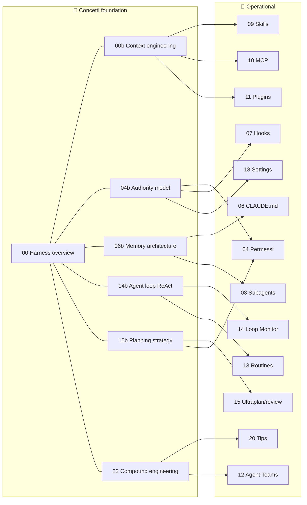

# README-NAVIGATION — Wayfinding system

> 📍 **Ti aiutiamo a trovare cio' che cerchi nella repo.** Questa pagina e' l'indice multi-prospettiva: 3 quick start path, mappa visuale concetti, indice IMPACT, indice persone, glossario.

Per il README master e l'indice tradizionale → [README.md](./README.md).

> 🚀 **Vuoi partire subito? Vai a [docs/QUICKSTART.md](./docs/QUICKSTART.md)** — primi 60 minuti dall'install al primo `/loop` funzionante.
> 🎯 **Hai gia' una persona in mente? Vai a [examples/personas/](./examples/personas/)** — 8 template `.claude/` pronti.

---

## 🚀 Quick start: 3 percorsi per profilo

### Percorso A — Beginner (90 min)
Sei nuovo a Claude Code. Vuoi capire cos'e' e iniziare a usarlo bene.

| Step | Doc | Tempo |
|---|---|---|
| 1 | [00 — Harness overview](./docs/00-harness-overview.md) — capire cosa stai usando | 15 min |
| 2 | [01 — Snapshot](./docs/01-snapshot.md) — versione, modelli, surface | 5 min |
| 3 | [02 — CLI installazione](./docs/02-cli-installazione.md) — install + primi comandi | 15 min |
| 4 | [03 — Slash commands](./docs/03-slash-commands.md) — vocabolario base | 10 min |
| 5 | [04 — Modalita' permessi](./docs/04-modalita-permessi.md) — sandbox, plan mode | 15 min |
| 6 | [06 — CLAUDE.md & memory](./docs/06-claude-md-memory.md) — il tuo primo CLAUDE.md | 15 min |
| 7 | [21 — Guide per target user § Beginner](./docs/21-guide-target-user.md#1-beginner--non-coder) | 15 min |

### Percorso B — Dev intermedio (3 ore)
Sai gia' usare Claude Code. Vuoi alzare il livello: skill, hooks, MCP, workflow team.

| Step | Doc | Tempo |
|---|---|---|
| 1 | [00b — Context engineering](./docs/00b-context-engineering.md) | 15 min |
| 2 | [06b — Memory architecture](./docs/06b-memory-architecture.md) | 15 min |
| 3 | [07 — Hooks](./docs/07-hooks.md) | 25 min |
| 4 | [08 — Subagents](./docs/08-subagents.md) | 20 min |
| 5 | [09 — Skills](./docs/09-skills.md) | 25 min |
| 6 | [10 — MCP](./docs/10-mcp.md) | 20 min |
| 7 | [11 — Plugins & marketplace](./docs/11-plugins-marketplace.md) | 15 min |
| 8 | [14 — `/loop` & Monitor](./docs/14-loop-monitor.md) | 15 min |
| 9 | [15 — Ultraplan & Ultrareview](./docs/15-ultraplan-ultrareview.md) | 15 min |
| 10 | [20 — Tips & best practices](./docs/20-tips-best-practices.md) | 15 min |

### Percorso C — Harness engineer (6 ore)
Vuoi padroneggiare tutto. Architetto, tech lead, AI/ML eng.

Leggi tutti i Percorsi A + B, poi:

| Step | Doc | Tempo |
|---|---|---|
| 1 | [04b — Authority model](./docs/04b-authority-model.md) | 30 min |
| 2 | [12 — Agent teams](./docs/12-agent-teams.md) | 25 min |
| 3 | [13 — Routines cloud](./docs/13-routines-cloud.md) | 30 min |
| 4 | [14b — Agent loop ReAct](./docs/14b-agent-loop-react.md) | 30 min |
| 5 | [15b — Planning strategy](./docs/15b-planning-strategy.md) | 25 min |
| 6 | [16 — Headless & Agent SDK](./docs/16-headless-agent-sdk.md) | 30 min |
| 7 | [18 — Settings & auth](./docs/18-settings-auth.md) | 25 min |
| 8 | [22 — Compound engineering](./docs/22-compound-engineering.md) | 30 min |
| 9 | [19 — Changelog](./docs/19-changelog.md) (scan) | 20 min |
| 10 | [23 — Glossario](./docs/23-glossario.md) (riferimento) | 10 min |

---

## 🗺️ Mappa visuale: concetti foundation → capitoli operational

---

## 🧭 Indice per pilastro IMPACT

Cerca per **componente harness** invece che per feature:

### I — Intent (cosa l'agent deve fare)
- [00 Harness overview](./docs/00-harness-overview.md) sez. 0.4 — Intent in IMPACT
- [06 CLAUDE.md & memory](./docs/06-claude-md-memory.md) — Intent persistente
- [15b Planning strategy](./docs/15b-planning-strategy.md) — Intent capture esplicito

### M — Memory (cosa l'agent ricorda)
- [06 CLAUDE.md & memory](./docs/06-claude-md-memory.md) — reference operational
- [06b Memory architecture](./docs/06b-memory-architecture.md) — 5 layer di memory
- [00b Context engineering](./docs/00b-context-engineering.md) — Auto-memory + caching

### P — Planning (come l'agent progetta prima di agire)
- [04 Modalita' permessi § Plan mode](./docs/04-modalita-permessi.md#42-plan-mode)
- [15 Ultraplan & Ultrareview](./docs/15-ultraplan-ultrareview.md) — Cloud planning
- [15b Planning strategy](./docs/15b-planning-strategy.md) — Quando pianificare

### A — Authority (cosa l'agent puo' / non puo' fare)
- [04 Modalita' permessi](./docs/04-modalita-permessi.md) — permission rules + sandbox
- [04b Authority model](./docs/04b-authority-model.md) — 4 layer di Authority
- [07 Hooks](./docs/07-hooks.md) — Layer 3 deterministico
- [18 Settings & auth](./docs/18-settings-auth.md) — Layer 4 managed enterprise

### C — Control flow (come l'agent esegue il loop)
- [14 `/loop` e Monitor](./docs/14-loop-monitor.md) — reference operational
- [14b Agent loop ReAct](./docs/14b-agent-loop-react.md) — pattern teorico
- [13 Routines cloud](./docs/13-routines-cloud.md) — Control flow in cloud
- [07 Hooks](./docs/07-hooks.md) — Lifecycle injection

---

## 👥 Indice per persona

Vai direttamente alla guida per il tuo profilo professionale:

| Persona | Sezione | Plan consigliato |
|---|---|---|
| Beginner / Non-coder | [21 § 1](./docs/21-guide-target-user.md#1-beginner--non-coder) | Pro |
| Solo developer / Indie hacker | [21 § 2](./docs/21-guide-target-user.md#2-solo-developer--indie-hacker) | Max |
| Senior backend (con team) | [21 § 3](./docs/21-guide-target-user.md#3-senior-backend-developer-con-team) | Team |
| Frontend / Full-stack | [21 § 4](./docs/21-guide-target-user.md#4-frontend--full-stack-developer) | Pro/Max |
| DevOps / SRE | [21 § 5](./docs/21-guide-target-user.md#5-devops--sre) | Team/Enterprise |
| Tech lead / Architect | [21 § 6](./docs/21-guide-target-user.md#6-tech-lead--architect) | Team/Enterprise |
| AI/ML engineer | [21 § 7](./docs/21-guide-target-user.md#7-aiml-engineer) | Max/Team |
| Legacy stack maintainer | [21 § 8](./docs/21-guide-target-user.md#8-legacy-stack-maintainer) | Team/Enterprise |

---

## 📚 Cerca per termine

Vai al [glossario](./docs/23-glossario.md) per definizioni concise di 35+ termini con cross-link ai capitoli dove appaiono.

Termini piu' cercati:
- [Agent](./docs/23-glossario.md#agent) · [Harness](./docs/23-glossario.md#harness) · [IMPACT](./docs/23-glossario.md#impact) · [ReAct](./docs/23-glossario.md#react)
- [Authority](./docs/23-glossario.md#authority) · [Memory](./docs/23-glossario.md#memory) · [Planning](./docs/23-glossario.md#planning) · [Control flow](./docs/23-glossario.md#control-flow)
- [Auto mode](./docs/23-glossario.md#auto-mode) · [Sandbox](./docs/23-glossario.md#sandbox) · [Hook](./docs/23-glossario.md#hook) · [Skill](./docs/23-glossario.md#skill)
- [`/loop`](./docs/23-glossario.md#loop) · [Monitor tool](./docs/23-glossario.md#monitor-tool) · [`/ultraplan`](./docs/23-glossario.md#ultraplan) · [`/ultrareview`](./docs/23-glossario.md#ultrareview)
- [Routines](./docs/23-glossario.md#routines) · [Compound engineering](./docs/23-glossario.md#compound-engineering) · [Context engineering](./docs/23-glossario.md#context-engineering)

---

## 📊 Tutti i capitoli (per badge)

### 📘 Concettuale (foundation)
- [00 Harness overview](./docs/00-harness-overview.md)
- [00b Context engineering](./docs/00b-context-engineering.md)
- [04b Authority model](./docs/04b-authority-model.md)
- [06b Memory architecture](./docs/06b-memory-architecture.md)
- [14b Agent loop ReAct](./docs/14b-agent-loop-react.md)
- [15b Planning strategy](./docs/15b-planning-strategy.md)
- [22 Compound engineering](./docs/22-compound-engineering.md)

### 🔧 Operational
- [01 Snapshot](./docs/01-snapshot.md)
- [02 CLI installazione](./docs/02-cli-installazione.md)
- [03 Slash commands](./docs/03-slash-commands.md)
- [04 Modalita' permessi](./docs/04-modalita-permessi.md)
- [05 Fast mode + 1M context](./docs/05-fast-mode-1m-context.md)
- [06 CLAUDE.md & memory](./docs/06-claude-md-memory.md)
- [07 Hooks](./docs/07-hooks.md)
- [08 Subagents](./docs/08-subagents.md)
- [09 Skills](./docs/09-skills.md)
- [10 MCP](./docs/10-mcp.md)
- [11 Plugins & marketplace](./docs/11-plugins-marketplace.md)
- [12 Agent teams](./docs/12-agent-teams.md)
- [13 Routines cloud](./docs/13-routines-cloud.md)
- [14 `/loop` & Monitor](./docs/14-loop-monitor.md)
- [15 Ultraplan & Ultrareview](./docs/15-ultraplan-ultrareview.md)
- [16 Headless & Agent SDK](./docs/16-headless-agent-sdk.md)
- [17 IDE & surface](./docs/17-ide-surface.md)
- [18 Settings & auth](./docs/18-settings-auth.md)

### 🚀 Workflow
- [21 Guide per target user](./docs/21-guide-target-user.md)

### 📚 Riferimento
- [19 Changelog](./docs/19-changelog.md)
- [20 Tips & best practices](./docs/20-tips-best-practices.md)
- [23 Glossario](./docs/23-glossario.md)

---

← Torna al [README](./README.md)
