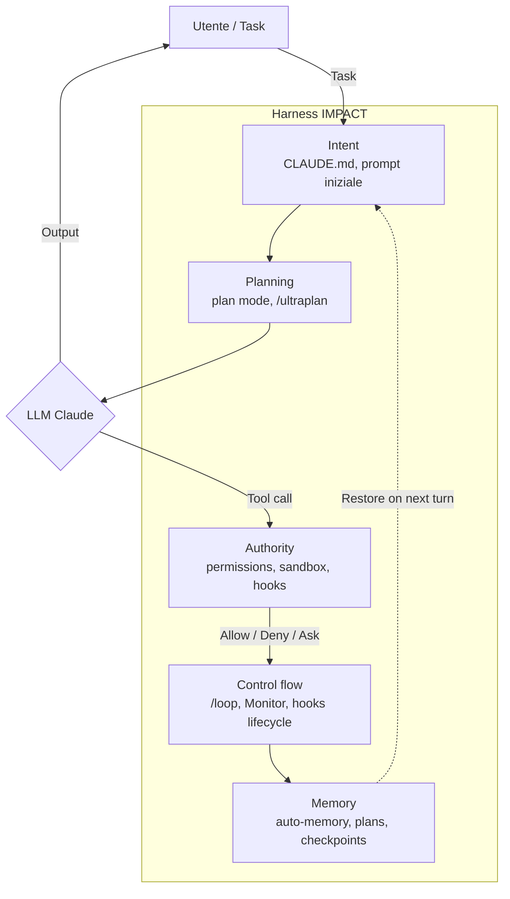

# Claude Code — Guida (5 maggio 2026)

> Reference completa di Claude Code (CLI, IDE, Web, Desktop, SDK) curata da [Boosha AI](https://boosha.it).
> Ultimo aggiornamento: **5 maggio 2026, 07:00 CEST**.
> Versione CLI di riferimento: **v2.1.128** · Modello default **Sonnet 4.6** · Premium **Opus 4.7 + xhigh** (Max plan).

> 🆕 **Novita' aprile 2026 (F4)**: integrato il case study **Kora team Every** (compound engineering applicato), **filosofia vibe-to-agentic**, **workflow operativi storici** (worktree script, Friday refactor, bug investigation), **Conductor + Ralph community pattern**. Nuova [Quick Start 60 min](./docs/QUICKSTART.md) + 8 [template `.claude/` per persona](./examples/personas/).
> 👉 **Nuovo a Claude Code?** Inizia da [docs/QUICKSTART.md](./docs/QUICKSTART.md) (60 min) o [README-NAVIGATION.md](./README-NAVIGATION.md) per il percorso adatto al tuo profilo.
> 🤖 **Automazione daily**: ogni giorno alle 07:00 Europe/Rome una routine cloud aggiorna la sezione "What's new today" (vedi sotto). Setup: [`automations/daily-whats-new/`](./automations/daily-whats-new/).

## What's new today (2026-05-05)

> _Aggiornamento automatico dalle 07:00 Europe/Rome. Vedi [archive](./docs/whats-new-archive.md) per i giorni precedenti._

> Nessuna novita' significativa nelle ultime 24 ore. Prossimo aggiornamento domani 07:00.

---

## Cos'e' Claude Code

Strumento di sviluppo AI di Anthropic che opera come agente autonomo: legge, scrive, modifica codice, esegue comandi, naviga il filesystem, parla con tool esterni via [MCP](./docs/10-mcp.md). Lanciato il **24 febbraio 2025** come research preview, GA il **22 maggio 2025**, oggi disponibile su 8 surface.

| Surface | Come si attiva |
|---|---|
| Terminal CLI | `claude` |
| Desktop app | macOS / Windows / Windows ARM64 (multi-session redesign mar 2026) |
| VS Code / Cursor | Estensione `vscode:extension/anthropic.claude-code` |
| JetBrains | Plugin marketplace |
| Web | [claude.ai/code](https://claude.ai/code) |
| Slack | `/install-slack-app` |
| Mobile | iOS app + Remote Control (Android via web) |
| GitHub Actions / GitLab CI/CD | `/install-github-app` |

---

## Concetti foundation {#concetti-foundation}

> Prima di tuffarti nelle feature, capisci cosa stai usando. **Claude Code e' un agent harness completo** — un'incarnazione del paradigma "Agent = LLM + Harness" formalizzato da Mitchell Hashimoto a febbraio 2026.

### Mental model: il framework IMPACT

### 7 capitoli concettuali (📘)

| Capitolo | Cosa copre |
|---|---|
| [📘 00 — Harness overview](./docs/00-harness-overview.md) | Cos'e' un agent harness, IMPACT framework, 8 componenti, case study |
| [📘 00b — Context engineering](./docs/00b-context-engineering.md) | Da prompt a context: tipi, tecniche, anti-pattern |
| [📘 04b — Authority model](./docs/04b-authority-model.md) | 4 layer di Authority: permission rules, sandbox, hooks, managed |
| [📘 06b — Memory architecture](./docs/06b-memory-architecture.md) | 5 layer di memory: CLAUDE.md, rules, auto-memory, checkpoints, plans |
| [📘 14b — Agent loop & ReAct](./docs/14b-agent-loop-react.md) | Pattern ReAct (Yao 2022), come Claude Code implementa il loop |
| [📘 15b — Planning strategy](./docs/15b-planning-strategy.md) | Spettro plan→ultraplan→batch, quando salire/scendere |
| [📘 22 — Compound engineering](./docs/22-compound-engineering.md) | Pattern moltiplicativi: optimization + resilience + scaling |

E come reference:
- [📚 23 — Glossario](./docs/23-glossario.md) — 35+ termini con cross-link

> 💡 Ogni capitolo operational (`docs/01-21`) ha ora una sezione **"Cosa e' concettualmente"** che inquadra la feature nel framework IMPACT con link al deep-dive concettuale.

---

## Master Claude Code — Field Guide

> Mappa rapida ispirata al format "Master Claude for Free" di [Ruben Hassid](https://ruben.substack.com/). Ogni voce porta a un documento di approfondimento o a un post di riferimento. Numeri solo come ancore, non rappresentano un ordine prescrittivo.

### Setup + Fondamenti

| # | Voce | 1-liner | Vai a |
|---|---|---|---|
| 01 | **Snapshot prodotto** | Versione, modelli, surface, pricing, roadmap | [docs/01](./docs/01-snapshot.md) |
| 02 | **Installazione e CLI** | Install + comandi + flag + env vars | [docs/02](./docs/02-cli-installazione.md) |
| 03 | **Slash commands** | 60+ comandi built-in e bundled skills | [docs/03](./docs/03-slash-commands.md) |
| 04 | **CLAUDE.md > prompting** | "Configura, non promptare" — context persistente | [docs/06](./docs/06-claude-md-memory.md) |
| 05 | **Sandbox + permessi** | OS-level isolation, plan mode, auto mode | [docs/04](./docs/04-modalita-permessi.md) |

### Apps + Feature

| # | Voce | 1-liner | Vai a |
|---|---|---|---|
| 06 | **Skills** (`SKILL.md`) | Workflow ricorrenti come `/comandi` | [docs/09](./docs/09-skills.md) |
| 07 | **Hooks** | 28 eventi del lifecycle, 5 handler | [docs/07](./docs/07-hooks.md) |
| 08 | **MCP** | Server, transport, channels, registry | [docs/10](./docs/10-mcp.md) |
| 09 | **Plugins & Marketplace** | 101+ plugin ufficiali, LSP, integrazioni | [docs/11](./docs/11-plugins-marketplace.md) |
| 10 | **Subagents** | Explore, Plan, custom, forking | [docs/08](./docs/08-subagents.md) |

### Cloud + Workflow

| # | Voce | 1-liner | Vai a |
|---|---|---|---|
| 11 | **Routines** | Cloud automation con schedule + API + GitHub triggers | [docs/13](./docs/13-routines-cloud.md) |
| 12 | **`/loop` + Monitor tool** | Automazione intra-sessione, push-based, self-pacing | [docs/14](./docs/14-loop-monitor.md) |
| 13 | **`/ultraplan` + `/ultrareview`** | Planning e review multi-agent in cloud | [docs/15](./docs/15-ultraplan-ultrareview.md) |
| 14 | **Agent Teams** | Coordinamento multi-istanza con task list condivisa | [docs/12](./docs/12-agent-teams.md) |
| 15 | **Headless + Agent SDK** | CLI `-p`, SDK Python/TS, GitHub Actions | [docs/16](./docs/16-headless-agent-sdk.md) |

### Modelli + Performance

| # | Voce | 1-liner | Vai a |
|---|---|---|---|
| 16 | **Opus 4.7 + xhigh** | Max plan, ragionamento esteso, adaptive thinking | [docs/05](./docs/05-fast-mode-1m-context.md) |
| 17 | **Fast mode Opus 4.6** | 2.5x latenza ridotta, stessa qualita' | [docs/05](./docs/05-fast-mode-1m-context.md) |
| 18 | **1M context GA** | Codebase intero in single request | [docs/05](./docs/05-fast-mode-1m-context.md) |
| 19 | **Auto mode** | Classifier-based permission decision | [docs/04](./docs/04-modalita-permessi.md) |
| 20 | **Computer use** | Click UI, validate native apps end-to-end | [docs/17](./docs/17-ide-surface.md) |

### Mindset + Tip operative

| # | Voce | 1-liner | Source |
|---|---|---|---|
| 21 | **Setup vanilla > custom** | "CC works great out of the box" | [@bcherny](https://x.com/bcherny/status/2007179832300581177) |
| 22 | **Full task context upfront** | Goal + constraints + acceptance al primo turno | [@_catwu](https://x.com/_catwu/status/2044808536790847693) |
| 23 | **Verifica feedback loop** | "Give Claude a way to verify its work, 2-3x quality" | [@bcherny](https://x.com/bcherny/status/2007179861115511237) |
| 24 | **Output style "Explanatory"** | Claude spiega il *perche'* dietro le scelte | [@bcherny](https://x.com/bcherny/status/2017742759218794768) |
| 25 | **Parallel worktrees** | 3-5 worktrees in parallelo come productivity unlock | [@bcherny](https://x.com/bcherny/status/2017742743125299476) |
| 26 | **`/btw` per side query** | Domande laterali senza interrompere il flow | [@trq212](https://x.com/trq212/status/2031506296697131352) |
| 27 | **Spec-based dev** | Spec minimale + AskUserQuestionTool + nuova sessione | [@trq212](https://x.com/trq212/status/2005315275026260309) |

### Riferimenti

| # | Voce | Vai a |
|---|---|---|
| 28 | **Settings & Auth** | [docs/18](./docs/18-settings-auth.md) |
| 29 | **IDE & altre surface** | [docs/17](./docs/17-ide-surface.md) |
| 30 | **Changelog feb 2025 → apr 2026** | [docs/19](./docs/19-changelog.md) |
| 31 | **Tips & best practices** | [docs/20](./docs/20-tips-best-practices.md) |
| 32 | **Guide per target user** | [docs/21](./docs/21-guide-target-user.md) |

---

## Highlights generali di Claude Code

| Categoria | In un'idea | Vai a |
|---|---|---|
| **8 surface** | Stesso engine su CLI, Desktop, VS Code, JetBrains, Web, Slack, Mobile, CI/CD | [docs/17](./docs/17-ide-surface.md) |
| **Customizability** | Hooks + Skills + Plugins + LSPs + MCPs + Agents + Status lines + Output styles | [@bcherny](https://x.com/bcherny/status/2021699851499798911) |
| **Context engineering** | CLAUDE.md hierarchy + auto-memory + path-specific rules + import @ | [docs/06](./docs/06-claude-md-memory.md) |
| **Cloud automation** | Routines (schedule + API + GitHub) eseguibili senza laptop acceso | [docs/13](./docs/13-routines-cloud.md) |
| **Multi-agent review** | `/ultrareview` con fleet specialisti + verification agent | [docs/15](./docs/15-ultraplan-ultrareview.md) |
| **Cross-device** | Remote Control: parti CLI, continui da telefono | [docs/17](./docs/17-ide-surface.md) |
| **Sandboxed by default** | OS-level isolation (Seatbelt, bubblewrap) + filesystem/network rules | [docs/04](./docs/04-modalita-permessi.md) |
| **1M context GA** | Sonnet 4.6 + Opus 4.6 a pricing standard | [docs/05](./docs/05-fast-mode-1m-context.md) |
| **Open standards** | MCP donato a Linux Foundation, Skills compatibile con [agentskills.io](https://agentskills.io) | [docs/10](./docs/10-mcp.md) |
| **Headless first-class** | Print mode, structured outputs, Agent SDK Python/TS, distributed tracing | [docs/16](./docs/16-headless-agent-sdk.md) |

---

## Highlights post-15 febbraio 2026

| Data | Novita' | Documento |
|---|---|---|
| 7 feb 2026 | Fast mode Opus 4.6 (research preview) | [05](./docs/05-fast-mode-1m-context.md) |
| 13 mar 2026 | 1M context GA Opus/Sonnet 4.6 | [05](./docs/05-fast-mode-1m-context.md) |
| 24 mar 2026 (w13) | **Auto mode** + Computer use Desktop + PowerShell tool | [04](./docs/04-modalita-permessi.md) |
| 30 mar 2026 (w14) | **`/ultrareview`** + Computer use CLI | [15](./docs/15-ultraplan-ultrareview.md) |
| 6-10 apr 2026 (w15) | **`/ultraplan`** + **Monitor tool** + `/loop` self-pacing + `/team-onboarding` + `/autofix-pr` | [14](./docs/14-loop-monitor.md), [15](./docs/15-ultraplan-ultrareview.md) |
| 14 apr 2026 | **Routines** GA in research preview + Desktop redesign multi-session | [13](./docs/13-routines-cloud.md) |
| 16 apr 2026 | **Opus 4.7 + xhigh effort** + `/effort` slider + `/ultrareview` GA | [05](./docs/05-fast-mode-1m-context.md), [15](./docs/15-ultraplan-ultrareview.md) |
| 23 apr 2026 | v2.1.119 — Vim visual mode, custom themes, hooks `mcp_tool` | [19](./docs/19-changelog.md) |

---

## Indice della guida (completo, 29 capitoli)

> Legenda: 📘 Concettuale · 🔧 Operational · 🚀 Workflow · 📚 Riferimento

### Concetti foundation (📘)
- [📘 00 — Harness overview](./docs/00-harness-overview.md)
- [📘 00b — Context engineering](./docs/00b-context-engineering.md)

### Fondamenta {#fondamenta}
1. [🔧 01 — Snapshot prodotto](./docs/01-snapshot.md) — versione, modelli, surface, pricing, roadmap
2. [🔧 02 — CLI installazione](./docs/02-cli-installazione.md) — install, comandi, env vars, diagnostica
3. [🔧 03 — Slash commands](./docs/03-slash-commands.md) — 60+ comandi built-in e bundled skills

### Workflow e modalita' {#workflow}
4. [🔧 04 — Modalita' permessi, Sandbox, Checkpoints](./docs/04-modalita-permessi.md)
- [📘 04b — Authority model](./docs/04b-authority-model.md) — 4 layer di Authority
5. [🔧 05 — Fast mode, 1M context, Opus 4.7](./docs/05-fast-mode-1m-context.md)
6. [🔧 06 — CLAUDE.md, rules, auto-memory](./docs/06-claude-md-memory.md)
- [📘 06b — Memory architecture](./docs/06b-memory-architecture.md) — 5 layer di memory

### Estensibilita' {#estensibilita}
7. [🔧 07 — Hooks](./docs/07-hooks.md) — 28 eventi, 5 handler
8. [🔧 08 — Subagents](./docs/08-subagents.md) — Explore, Plan, custom
9. [🔧 09 — Skills](./docs/09-skills.md) — SKILL.md, allowed-tools, paths
10. [🔧 10 — MCP](./docs/10-mcp.md) — server, transport, channels
11. [🔧 11 — Plugins & Marketplace](./docs/11-plugins-marketplace.md)
12. [🔧 12 — Agent Teams](./docs/12-agent-teams.md) — sperimentale

### Cloud e automazione {#cloud}
13. [🔧 13 — Routines (cloud)](./docs/13-routines-cloud.md) — schedule + API + GitHub triggers
14. [🔧 14 — `/loop` e Monitor tool](./docs/14-loop-monitor.md)
- [📘 14b — Agent loop & ReAct](./docs/14b-agent-loop-react.md) — pattern teorico
15. [🔧 15 — Ultraplan & Ultrareview](./docs/15-ultraplan-ultrareview.md)
- [📘 15b — Planning strategy](./docs/15b-planning-strategy.md) — quando pianificare

### Integrazione e produzione {#integrazione}
16. [🔧 16 — Headless & Agent SDK](./docs/16-headless-agent-sdk.md) — CLI `-p`, SDK Python/TS
17. [🔧 17 — IDE e altre surface](./docs/17-ide-surface.md) — VS Code, JetBrains, Desktop, Web, Slack, Remote Control
18. [🔧 18 — Settings & Authentication](./docs/18-settings-auth.md)

### Riferimenti {#riferimenti}
19. [📚 19 — Changelog completo (feb 2025 → apr 2026)](./docs/19-changelog.md) — 7 fasi, post-mortem
20. [📚 20 — Tips & best practices](./docs/20-tips-best-practices.md)
21. [🚀 21 — Guide per target user](./docs/21-guide-target-user.md) — 8 percorsi
- [📘 22 — Compound engineering](./docs/22-compound-engineering.md) — pattern moltiplicativi
- [📚 23 — Glossario](./docs/23-glossario.md) — 35+ termini con cross-link

---

## Post X di riferimento

[posts/](./posts/) raccoglie i post X principali del team Claude Code (Boris Cherny, Cat Wu, Noah Zweben, Thariq, Alistair, account ufficiali, ecosistema developer come @rauchg e @swyx) che documentano feature, tips e annunci. Ogni post e' citato con URL originale e contesto.

- [posts/bcherny.md](./posts/bcherny.md) — Boris Cherny, creator Claude Code (~46 post: tip thread, hidden features, drop di feature)
- [posts/catwu.md](./posts/catwu.md) — Cat Wu, PM Claude Code (~13 post: annunci di prodotto)
- [posts/noahzweben.md](./posts/noahzweben.md) — Noah Zweben, PM engineer (~9 post: drop tecnici)
- [posts/trq212.md](./posts/trq212.md) — Thariq, engineer (~14 post: lessons + nuove feature)
- [posts/claudeai-claudedevs.md](./posts/claudeai-claudedevs.md) — account ufficiali Anthropic (~22 post)
- [posts/alistaiir.md](./posts/alistaiir.md) — Alistair, Anthropic engineer (Monitor tool, easter eggs)
- [posts/ecosistema.md](./posts/ecosistema.md) — @rauchg, @swyx, @transitive_bs, @ClaudeCodeLog (community + changelog non ufficiale)

---

## Skills curate

[skills/](./skills/) contiene 76 skill curate (raccolta originale del 15 febbraio 2026, ancora valide). Categorie: bio-research, customer-support, data, doc-coauthoring, enterprise-search, finance, ecc.

> Per skill aggiornate aprile 2026, vedi [marketplace community](./docs/11-plugins-marketplace.md).

---

## Risorse di ricerca

[`_research/`](./_research/) contiene i dossier di ricerca:
- `dossier-docs.md` — documentazione ufficiale code.claude.com (~64KB)
- `dossier-x-engineers.md` — post X di @noahzweben + @trq212
- `dossier-x-product.md` — post X di @_catwu + @ClaudeDevs + @bcherny + @claudeai
- `dossier-x-extended.md` — 76 post X aggiuntivi (Boris tip thread, ClaudeCodeLog, Alistair, ecosistema)
- `dossier-features.md` — feature specifiche post-15 feb (Routines, /loop, Monitor, /ultraplan, /ultrareview, Excalidraw skill)
- `dossier-changelog-completo.md` — changelog Feb 2025 → Mar 2026 (Fase 1 → Fase 6)
- `dossier-ruben-hassid.md` — Ruben Hassid Substack ultimi 3 mesi + decifratura infografica "Master Claude for Free"
- `dossier-target-user.md` — 8 personas con setup + workflow + casi d'uso flagship

---

## Archive

[`archive/docs-pre-feb2026/`](./archive/docs-pre-feb2026/) contiene la struttura precedente della repo (snapshot 15 feb 2026), preservata per riferimento storico. Vedi il [README archive](./archive/docs-pre-feb2026/README.md) per il mapping completo dei contenuti integrati.

## Examples

[`examples/personas/`](./examples/personas/) contiene 8 cartelle template `.claude/` (CLAUDE.md + settings.json + skill + hook esempio) configurate per le 8 persona di [docs/21](./docs/21-guide-target-user.md). Copia la cartella della tua persona nel tuo progetto come punto di partenza.

---

## Risorse ufficiali

- Sito: https://claude.com/claude-code
- Docs: https://code.claude.com/docs/
- Changelog: https://code.claude.com/docs/en/changelog
- Weekly what's new: https://code.claude.com/docs/en/whats-new
- GitHub: https://github.com/anthropics/claude-code
- Plugin marketplace ufficiale: https://claude.com/plugins
- Help Center release notes: https://support.claude.com/en/articles/12138966-release-notes

---

## Licenza & contributi

Questa repo e' una **guida didattica** mantenuta da [Boosha AI](https://boosha.it). I contenuti citano ogni fonte (docs ufficiali, post X) per consentire deep-dive autonomo.

Per segnalazioni / aggiornamenti / aggiunte, apri una issue o PR.
