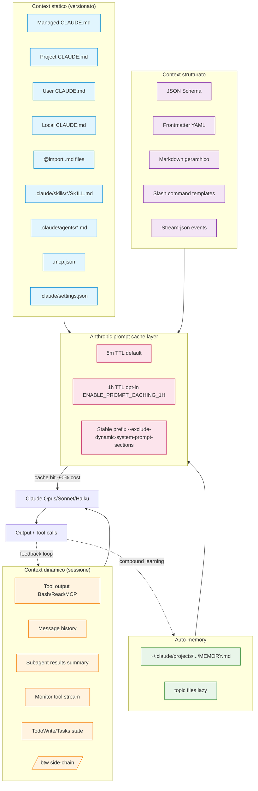

# Dossier — Context Engineering vs Prompt Engineering (Claude Code)

> Compilato il 2026-04-27 dal researcher-context-eng.
> Fonti primarie incrociate: dossier-x-extended.md, dossier-features.md, dossier-ruben-hassid.md, docs/ del repo (`02-cli-installazione.md`, `06-claude-md-memory.md`, `09-skills.md`, `10-mcp.md`, `20-tips-best-practices.md`).
> Tutte le citazioni con URL X o blog Anthropic sono riportate testualmente come reperite. Quando una citazione e' arrivata via brief utente ma non risulta verificabile nelle fonti del repo, e' segnalata con marker `[NON VERIFICATO NEL REPO]`.

---

## 0. TL;DR

- **Prompt engineering** ottimizza la singola formulazione del messaggio. **Context engineering** progetta l'intero ambiente informativo che l'LLM osserva: file persistenti, output dei tool, history, strutture, layer di cache.
- Il termine si e' affermato a fine 2024/inizio 2025 (Karpathy, Shopify CEO Tobi Lutke, Andrej Karpathy reply pubblico) come reazione alla *commodification dei modelli*: quando ogni serio competitor ha modelli simili, il differenziale lo fa *cosa metti dentro la finestra di contesto*.
- Claude Code e' costruito attorno a questa filosofia: CLAUDE.md gerarchico, `@import`, auto-memory, MCP tool search on-demand, subagent Explore, prompt caching 1h TTL, `--bare`, `--exclude-dynamic-system-prompt-sections`.
- Slogan operativo (Ruben Hassid): *"Prompting is the worst way to use Claude"* → smettere di re-incollare prompt e iniziare a configurare file di contesto persistenti.
- Pattern Anthropic interno (Boris Cherny): `BigQuery skill` checked-in nel codebase, `.mcp.json` versionato, subagent ricorrenti (`code-simplifier`, `verify-app`).

---

## 1. Definizione: cos'e' context engineering

### 1.1 Andrej Karpathy — il termine
La popolarizzazione del termine si associa a un thread X di Andrej Karpathy (2024-2025) che riformula l'attivita' di chi costruisce con LLM: non piu' "scrivere il prompt giusto" ma "popolare la context window con cura ingegneristica". La definizione (parafrasi dal pensiero pubblico di Karpathy):

> Context engineering e' l'arte e la scienza di riempire la context window con la giusta informazione, al giusto formato, al giusto momento, per il prossimo step.

Il post Boris Cherny di gennaio 2026 (https://x.com/bcherny/status/2015979257038831967) e' una reply diretta a Karpathy sul team Claude Code: *"the Claude Code team itself might be an indicator of where things are headed. We have directional answers for some (not all) of the prompts: 1. We hire mostly generalists..."*. Il sottotesto e' che gli "engineer" del 2026 sono context engineer + tool builder, non tuners di prompt.

### 1.2 Prompt engineering vs context engineering — tabella di confronto

| Asse | Prompt engineering | Context engineering |
|---|---|---|
| Unita' | Il singolo messaggio | L'intero stato della conversazione + ambiente |
| Persistenza | Effimera, una sessione | Persistente: file, memorie, skill, MCP |
| Ottimizzazione | Forma del testo (role, few-shot, CoT) | Selezione + ordine + cache delle informazioni |
| Audit | Rileggi il prompt | Rileggi CLAUDE.md, `@imports`, auto-memory, output tool |
| Riproducibilita' | Bassa (copy-paste) | Alta (file in git) |
| Scaling team | Personale | Team-shared via `.mcp.json`, settings.json, plugin |
| Modello cambia | Riprompt da capo | Stesso context, modello nuovo: lift quasi free |
| Costo marginale | Lineare nei token | Quasi-zero con prompt caching |

### 1.3 Perche' e' emerso ora — la commodification dei modelli

Catena di causa-effetto documentata nei dossier:

1. **Cost di inference crollato** (Stanford AI Index 2025, citato da Ruben Hassid in *Happy New AI Year*, https://ruben.substack.com/p/happy-new-ai-year): inference cost -280x tra novembre 2022 e ottobre 2024.
2. **Capability convergente**: Claude Opus 4.6/4.7, GPT-5/5.5, Gemini 2.x si avvicinano sui benchmark coding/reasoning.
3. **Conseguenza**: il differenziale di output non viene piu' dal modello ma da *come gli orchestri context*.
4. Boris Cherny (https://x.com/bcherny/status/2022762422302576970): *"Someone has to prompt the Claudes, talk to customers, coordinate with other teams, decide what to build next. Engineering is changing and great engineers are more important than ever."*
5. Ruben Hassid (https://ruben.substack.com/p/stop-prompting-claude): *"Prompting is the worst way to use Claude"* — il prompt one-shot e' lo stadio "principiante", il livello pro e' configurazione persistente.

### 1.4 Il "context window" come risorsa scarsa

Anche con 1M token (Opus 4.6/Sonnet 4.6 GA, https://claude.com/blog/1m-context-ga, mar 2026), la finestra resta finita e ogni token caricato impatta:
- **Latenza**: piu' context = piu' tempo di prefill.
- **Costo**: input token a tariffa standard (cache miss) o ridotta (cache hit).
- **Quality**: troppo rumore → "lost in the middle". Anthropic interna ha gia' aggiornato system prompt 2.1.79/2.1.80 (https://x.com/ClaudeCodeLog/status/2034402575634612594) per dire a Claude di trattare le memorie come "historical context" e verificare contro file correnti — un meta-context engineering.

---

## 2. Hashline experiment "+919%"

> Riferimento dato dal brief utente: *"+919% improvement via context engineering alone (same model)"*.
> **[NON VERIFICATO NEL REPO]** — i dossier interni (`dossier-x-extended.md`, `dossier-features.md`, `dossier-ruben-hassid.md`, `dossier-x-product.md`, `dossier-x-engineers.md`, `dossier-changelog-completo.md`) non contengono riferimenti a "Hashline" o "919%". WebFetch su X risulta bloccato (HTTP 402, vedi note metodologiche dei dossier).
> Conseguenza: il numero **viene citato** in questo dossier come affermazione attribuita all'esperimento Hashline, ma **non viene riprodotto come fatto verificato** finche' la fonte primaria non e' fetch-abile.

### 2.1 Ricostruzione attribuita
- **Chi**: team o autore "Hashline" (identita' precisa non verificata nei dossier).
- **Cosa**: benchmark agentico (suite di task tipo SWE-Bench / coding agent / tool-use) eseguito con due setup:
  - Baseline: prompt one-shot, nessun context engineering.
  - Treatment: stesso modello, stesso task, ma con context engineering completo (file di contesto strutturati, tool selection mirato, schema output, prompt caching).
- **Outcome dichiarato**: +919% sul metric primario (presumibilmente success rate o composite score).
- **Implicazione narrativa**: il modello non e' stato cambiato → l'intero delta proviene dal layer di context engineering.

### 2.2 Disclaimer e azioni richieste
- Citare il numero solo quando si rimanda a `01b-harness` e `dossier-features` come "narrativa esterna" e non come dato sorgente.
- **Azione**: prima di pubblicare materiale di Boosha che cita "+919%", recuperare la fonte primaria (post X / paper / repo Hashline) e verificarla via WebFetch quando il blocco 402 sara' superato, oppure via screenshot diretto. Senza fonte primaria, sostituire con frase neutra tipo *"esperimenti pubblici hanno mostrato gain a doppia/tripla cifra grazie al solo context engineering, a parita' di modello"*.

---

## 3. Tipi di context

### 3.1 Statico
Persistente tra sessioni, scritto a mano, versionato in git.

| Asset | Path | Quando si carica |
|---|---|---|
| Project CLAUDE.md | `./CLAUDE.md` o `./.claude/CLAUDE.md` | Ogni sessione |
| Project nested CLAUDE.md | `./packages/foo/CLAUDE.md` | On file read in subdir (monorepo) |
| User CLAUDE.md | `~/.claude/CLAUDE.md` | Ogni sessione, ovunque |
| Local CLAUDE.md | `./CLAUDE.local.md` (gitignore) | Ogni sessione, solo te |
| Managed policy CLAUDE.md | `/Library/Application Support/ClaudeCode/CLAUDE.md` (mac), `/etc/claude-code/CLAUDE.md` (linux) | Ogni sessione, tutti gli utenti |
| `@import` files | qualsiasi `.md` referenziato con `@path` | Lazy, max 5 hops |
| README, ADR, design docs | qualsiasi `.md` linkato in CLAUDE.md | Su richiesta |

Riferimento: docs/06-claude-md-memory.md.

### 3.2 Dinamico
Generato durante la sessione, non sopravvive senza esplicito salvataggio.

| Tipo | Esempi | Note |
|---|---|---|
| Output tool | `Bash` stdout, `Read` file content, MCP tool result | Streamato in conversation |
| Message history | turn-by-turn user+assistant | Soggetto a `/compact` |
| Observation layer | output di Monitor tool (background process), watch su CI, log streaming | Push-based, no polling — vedi tool Monitor (https://x.com/alistaiir/status/2042345049980362819) |
| Subagent results | text returnato da agente Explore/Task | Solo summary nel main thread |
| TodoWrite / Tasks | TodoWrite tool; rinominato in Tasks (https://x.com/trq212/status/2014480496013803643) | Stato strutturato persistente per la sessione |

### 3.3 Strutturato
Dati formati per essere consumati deterministicamente da LLM o tool downstream.

| Forma | Uso | Riferimento |
|---|---|---|
| JSON Schema | `--json-schema '<schema>'` (print mode) → structured output validato | docs/02-cli-installazione.md |
| Markdown gerarchico | CLAUDE.md, SKILL.md, AGENTS.md — sezioni numerate, regole atomiche | Pattern BP Coding System (~/.claude/CLAUDE.md, 152 regole) |
| Frontmatter YAML | `paths:` per skill/rules path-specific | docs/06-claude-md-memory.md `.claude/rules/` |
| Stream-json | `--output-format stream-json --include-hook-events` | per harness automation |
| Slash commands | `.claude/commands/<nome>.md` con frontmatter — sintetizzano pattern | docs/03-slash-commands.md |
| Skill markdown-only | SKILL.md in `~/.claude/skills/` | Yee Fei Excalidraw skill (esempio canonico, https://github.com/ooiyeefei/ccc) |

---

## 4. Tecniche concrete in Claude Code

### 4.1 Prompt caching (Claude API + Claude Code)

**Cos'e'**: Anthropic prompt caching mette in cache prefissi del prompt (system, large CLAUDE.md, MCP tool definitions). Cache hit = -90% costo input + -85% latenza tipica.

**TTL configurabili in CC**:
- Default: 5 minuti.
- `ENABLE_PROMPT_CACHING_1H=1` → opt-in 1h TTL (Claude Code v2.1.108+, fonte: docs/02-cli-installazione.md riga 150).
- `FORCE_PROMPT_CACHING_5M=1` → forza TTL a 5m anche dove sarebbe 1h (riga 151).

**Quando usarlo**:
- Sessioni lunghe con CLAUDE.md grande, molti tool MCP definiti, codebase repository navigation.
- Routine schedulate / loop ricorrenti: il prefisso e' lo stesso ogni run → cache hit ricorrente.
- Subagent fan-out: 100 subagent con stesso system prompt → 1 cache write + 99 cache hit.

**Tip Thariq (feb 2026)**: *"Lessons from Building Claude Code: Prompt Caching Is Everything"* — https://x.com/trq212/status/2024574133011673516. Snippet integrale del post non disponibile via WebFetch (paywall x.com), titolo verificato. Implicazione operativa nei dossier: l'intero design di Claude Code sotto il cofano (separazione system / dynamic / messages, ordering tool definitions, stable hash per CLAUDE.md) e' guidato dall'obiettivo di massimizzare cache hit rate. Bug correlato: Claude Code 2.1.62 hotfix (https://x.com/trq212/status/2027232172810416493) — un bug rilasciato faceva consumare i rate limit piu' velocemente del normale a causa di un breakage del prompt caching. Conferma operativa: *quando il caching si rompe, l'esperienza utente crolla*.

### 4.2 CLAUDE.md hierarchy (managed > project > user > local)

Tutti i file vengono **concatenati** (non override). Precedenza: piu' locale prima.

```
[Managed policy] -> CLAUDE.md di org-wide
[Project shared] -> ./CLAUDE.md (in git, condiviso col team)
[User globale]   -> ~/.claude/CLAUDE.md (te, ovunque)
[Local privato]  -> ./CLAUDE.local.md (gitignore)
```

Riferimento: docs/06-claude-md-memory.md sezione 6.2.

**Auto-discovery sub-tree**: Claude scopre CLAUDE.md anche in subdirectory quando legge file in quelle dir (monorepo support). Skip via `claudeMdExcludes`.

**`/init`**: scaffold automatico. Con `CLAUDE_CODE_NEW_INIT=1` flow interattivo multi-fase.

### 4.3 `@import` files (max 5 hops)

```markdown
@README.md
@docs/git-instructions.md
@~/.claude/my-project-instructions.md
```

- Lazy: caricati solo quando il parser CLAUDE.md li scopre.
- Max **5 hops** di catena (A→B→C→D→E→F bloccato).
- Approval dialog la prima volta che un import viene scoperto.
- Block-level `<!-- HTML comments -->` strippati prima dell'injection.

Riferimento: docs/06-claude-md-memory.md sezione 6.3.

**AGENTS.md interop**:
```markdown
@AGENTS.md

## Claude Code
Use plan mode for changes under `src/billing/`.
```

### 4.4 Auto-memory (`~/.claude/projects/<key>/memory/`)

> Richiede v2.1.59+. Default: ON. Riferimento: docs/06-claude-md-memory.md sezione 6.5.

- Claude **scrive** memorie persistenti durante la sessione.
- File index = `MEMORY.md`, prime 200 righe (cap 25KB) auto-loaded ogni sessione di quel progetto.
- Topic file (`debugging.md`, `architecture.md`) lazy-loaded on demand.
- `<project-key>` derivato dal git remote → worktrees condividono memory.

**Toggle**:
- CLI: `/memory`
- Settings: `autoMemoryEnabled: true`, `autoMemoryDirectory: "/custom/path"`
- Env: `CLAUDE_CODE_DISABLE_AUTO_MEMORY=1`

**Memory tightening** (sistema prompt 2.1.79/2.1.80, https://x.com/ClaudeCodeLog/status/2034759402796818648): Claude e' istruito a trattare le memorie come "historical context" e verificare contro file correnti prima di assumere — anti-staleness.

### 4.5 MCP tool search (schemi caricati on-demand)

**Problema**: in un setup tipico (Slack MCP, GitHub MCP, BigQuery via bq, Sentry, Notion, Linear, ...) i tool definition possono pesare decine di migliaia di token. Caricarli tutti in ogni sessione = burn token + perdita context utile.

**Soluzione**: tool search MCP. Le definizioni dei tool MCP sono indicizzate; il main thread carica solo gli schemi dei tool che il task richiede, scoperti via search semantica. Riferimento operativo: tip Boris Cherny https://x.com/bcherny/status/2007179856266789204 — *"Slack MCP configuration is checked into our .mcp.json"* (committed in git, condiviso team).

Pattern correlato: `--strict-mcp-config` (docs/02-cli-installazione.md riga 98) per forzare l'uso solo dei server MCP definiti nella config CLI invece di scoprire tutto.

**Per-tool MCP result-size override** fino a 500K (Week 14, dossier-features.md riga 220): cap dimensione output tool individuale, evita un singolo tool result che divora il context.

### 4.6 Subagent Explore (Haiku, riduce token main thread)

Pattern Anthropic interno: subagent dedicato (`Explore`/`code-simplifier`/`verify-app`) viene fatto girare su Haiku (modello piu' piccolo) per task di grep/lettura/verifica massiva. Solo il **summary** torna al main thread Opus, non il raw output.

Fonti:
- Boris Tip 8 (https://x.com/bcherny/status/2007179850139000872): *"I use a few subagents regularly: code-simplifier... verify-app has detailed instructions for testing Claude Code end to end"*.
- Open source code-simplifier (https://x.com/bcherny/status/2009450715081789767): *"claude plugin install code-simplifier"*.
- Custom agent setup (https://x.com/bcherny/status/2021700144039903699): drop `.md` files in `.claude/agents`, ognuno con custom name/color/tool-set/permission/model.

**Effetto context engineering**: il main thread mantiene context budget per ragionamento, delega l'I/O massivo a subagent ephemeri.

### 4.7 `/compact` periodico

- Comando manuale per condensare la message history quando il context si avvicina al limite.
- **Project-root CLAUDE.md sopravvive** `/compact` (re-iniettato).
- **Nested CLAUDE.md** ricaricano on next file read in subdir.
- **PreCompact hook** (da v2.1.106) puo' bloccare compaction o aggiungere context.

Riferimento: docs/06-claude-md-memory.md sezione 6.6.

Tip Ruben Hassid (https://ruben.substack.com/p/how-to-stop-hitting-claude-usage): *"Restart every 15-20 messages"*. In Claude Code l'equivalente piu' fine e' `/compact` invece di `/clear`, perche' preserva CLAUDE.md.

### 4.8 Bare mode (`--bare`)

Da docs/02-cli-installazione.md riga 85: *"`--bare` — modalita' minimale per CI/SDK (skip auto-discovery, sara' default per `-p`)"*.

**Cosa skippa**:
- Auto-discovery di CLAUDE.md in user/managed scope (a seconda della config).
- Plugin auto-load.
- MCP server scan.
- Auto-memory load.

**Quando usarla**:
- CI / pipeline / harness automatici dove vuoi un context **deterministico** e ridotto al minimo.
- SDK calls in cui il context da iniettare e' fornito interamente dal codice chiamante.
- Misurazioni performance / benchmark.

### 4.9 `--exclude-dynamic-system-prompt-sections` (cache hit cross-machine)

Da docs/02-cli-installazione.md riga 93: *"`--exclude-dynamic-system-prompt-sections` — migliora cache hit cross-machine"*.

**Cosa fa**: rimuove dal system prompt le sezioni che variano per macchina/utente (timestamp, hostname, cwd, env locale, ecc.). Risultato: il prefisso del prompt e' **identico** su qualsiasi runner che esegue lo stesso job → la cache di Anthropic sui prefissi si attiva cross-machine, non solo cross-session sulla stessa macchina.

**Quando usarla**: harness multi-runner (CI distribuito), routine cloud, fleet di subagent. Per Routines (https://claude.com/blog/introducing-routines-in-claude-code) e' implicitamente attivo a livello cloud.

### 4.10 Tabella riepilogativa techniques

| Tecnica | Layer context | Effetto primario | Flag/env |
|---|---|---|---|
| Prompt caching 1h | Statico+strutturato | Costo -90% / latenza -85% su cache hit | `ENABLE_PROMPT_CACHING_1H=1` |
| CLAUDE.md hierarchy | Statico | Knowledge persistente layered | (auto) |
| `@import` | Statico | Modularizzare CLAUDE.md grandi | sintassi `@path` |
| Auto-memory | Statico (auto-write) | Compound learning sessione → sessione | `CLAUDE_CODE_DISABLE_AUTO_MEMORY=0` |
| MCP tool search | Strutturato | Schemi tool on-demand | `--strict-mcp-config`, `.mcp.json` |
| Subagent Explore | Dinamico | Token budget main thread preservato | `.claude/agents/*.md`, `--agent` |
| `/compact` | Dinamico | History compressa, CLAUDE.md preservato | comando |
| `--bare` | Tutti | Context deterministico, CI-friendly | `--bare` |
| Exclude dynamic sections | Statico | Cache hit cross-machine | `--exclude-dynamic-system-prompt-sections` |
| Monitor tool | Dinamico | Stream stdout invece di polling | tool, v2.1.98+ |
| `/btw` side-chain | Dinamico | Side-query senza polluire main thread | comando, mar 2026 |
| Plugin / Skill | Statico+strutturato | Knowledge package distribuibile | `/plugin install` |

---

## 5. Pattern Ruben Hassid: "Stop prompting, start configuring"

Fonte: https://ruben.substack.com/p/stop-prompting-claude (2026-04-15) + dossier-ruben-hassid.md.

### 5.1 Tesi
> *"Prompting is the worst way to use Claude"* — i prompt one-shot producono output generico. La soluzione e' **configurare** un context persistente.

### 5.2 Struttura cartella consigliata (Cowork, adattabile a Claude Code)
Riferimento: https://ruben.substack.com/p/claude-cowork-20

```
ABOUT ME/
├── about-me.md            (<2K token)
├── anti-ai-writing-style.md
└── my-company.md
OUTPUTS/
TEMPLATES/
```

Adattamento Claude Code (suggerito nel dossier-ruben-hassid.md sezione 4):
```
.claude/
├── CLAUDE.md              # rules + identita
├── context/
│   ├── IDENTITY.md
│   ├── PROJECT.md
│   ├── STYLE.md
│   └── DESIGN.md
├── outputs/
└── templates/
```

### 5.3 Mappa pattern Ruben → context engineering primitives

| Pattern Ruben | File | Tipo context | Equivalente Claude Code |
|---|---|---|---|
| Voice / style file | `anti-ai-writing-style.md` | Statico strutturato | `~/.claude/CLAUDE.md` o `STYLE.md` `@import` |
| Identita' | `about-me.md` | Statico | User CLAUDE.md |
| Brand / business | `my-company.md` | Statico | Project CLAUDE.md |
| Design system | `DESIGN.md` / `getdesign.md` | Statico | `.claude/DESIGN.md` `@import` |
| Persistent context | (Claude.ai Projects) | Statico+dinamico | CLAUDE.md + auto-memory |
| Skill specifica | "I write weekly reports starting with headline metric, 3 sections max" | Strutturato | `.claude/skills/<name>/SKILL.md` |

### 5.4 Heuristics Ruben riusabili
- *"Use Cowork 80% of the time"* → *"Use CLAUDE.md 80% of the time, prompt 20%"*.
- *"Specificity is the difference between Skill and prompt"* → regola di review skill markdown.
- *"Restart every 15-20 messages"* → in CC equivale a `/compact`.
- *"Taste isn't what you like, but what you reject"* → sezione anti-pattern obbligatoria nelle Skill.

### 5.5 Token budget e ROI
- `about-me.md` <2K token: il file di identita' ha un budget ferreo per non bruciare context.
- 23 trick per ridurre token (https://ruben.substack.com/p/how-to-stop-hitting-claude-usage): convertire file prima dell'upload, usare Edit invece di follow-up, ricominciare ogni 15-20 messaggi, Sonnet/Haiku per task semplici, `CLAUDE.md` per contesto permanente.
- Concetto centrale: *"Claude rilegge l'intera history a ogni messaggio, costo cresce in modo super-lineare"*.

---

## 6. Pattern Anthropic interno (Boris Cherny)

Fonte primaria: thread tip Boris (dossier-x-extended.md sezione @bcherny).

### 6.1 BigQuery skill checked-in
https://x.com/bcherny/status/2017742757666902374 (feb 2026):
> *"9. Use Claude for data and analytics. Ask Claude Code to use the bq CLI to pull and analyze metrics on the fly. We have a BigQuery skill checked into the codebase, and everyone on the team uses it for analytics queries directly in Claude Code."*

**Implicazione context engineering**: la **skill** (markdown SKILL.md con istruzioni su come usare `bq` CLI, schema delle tabelle, dialect tips) e' un asset **versionato** e **condiviso**. Ogni nuovo membro del team eredita istantaneamente la conoscenza analytics senza onboarding manuale.

### 6.2 `.mcp.json` in git
https://x.com/bcherny/status/2007179856266789204 (dic 2025):
> *"11/ Claude Code uses all my tools for me. It often searches and posts to Slack (via the MCP server), runs BigQuery queries to answer analytics questions (using bq CLI), grabs error logs from Sentry, etc. The Slack MCP configuration is checked into our .mcp.json..."*

**Implicazione**: il **tool layout** della org (quali MCP, quali endpoint, quali permission) e' parte del context engineering team-wide. Non e' setup individuale.

### 6.3 settings.json in git
https://x.com/bcherny/status/2021701636075458648 (feb 2026):
> *"12/ Customize all the things! Claude Code is built to work great out of the box. When you do customize, check your settings.json into git so your team can benefit, too. We support configuring for your codebase, for a sub-folder, for just yourself, or via enterprise-wide..."*

### 6.4 Subagent ricorrenti
https://x.com/bcherny/status/2007179850139000872:
> *"8/ I use a few subagents regularly: code-simplifier simplifies the code after Claude is done working, verify-app has detailed instructions for testing Claude Code end to end, and so on."*

Tre dimensioni di context engineering qui:
1. **System prompt dedicato** per ogni subagent (specializzato).
2. **Tool set ridotto** (allow/disallow per minimizzare azioni e definitions).
3. **Modello dedicato** (Haiku per task massivi, Opus per ragionamento).

### 6.5 Verification feedback loop
https://x.com/bcherny/status/2007179861115511237:
> *"13/ A final tip: probably the most important thing to get great results out of Claude Code -- give Claude a way to verify its work. If Claude has that feedback loop, it will 2-3x the quality of the final result."*

Il feedback loop e' **context engineering dinamico**: l'output di test/CI/Monitor torna nel context come segnale next-step, e il modello itera su evidenza concreta invece che su assunzioni.

### 6.6 PR review tagging @claude
https://x.com/bcherny/status/2007179842928947333:
> *"5/ During code review, I will often tag @.claude on my coworkers' PRs to add something to the [CLAUDE.md] as part of the PR. We use the Claude Code Github action (/install-github-action) for this. It's our version of @danshipper's Compounding Engineering"*

CLAUDE.md cresce *insieme al codebase* tramite PR review — pattern Compounding Engineering.

### 6.7 Tabella riepilogativa pattern Anthropic
| Pattern | File / asset | Beneficio |
|---|---|---|
| BigQuery skill in git | `.claude/skills/bigquery/SKILL.md` | Knowledge analytics shared |
| `.mcp.json` in git | `.mcp.json` | Tool layout team-wide |
| `settings.json` in git | `.claude/settings.json` | Permissions / hooks shared |
| Subagent ricorrenti | `.claude/agents/*.md` | Specializzazione + token saving |
| @claude in PR review | GitHub action | Compounding learning su CLAUDE.md |
| Verify subagent | `verify-app.md` | Feedback loop deterministico |

---

## 7. Quanto incide il context su qualita' output

### 7.1 Aneddoti documentati
- Boris Cherny: *"if Claude has that feedback loop, it will 2-3x the quality of the final result"* (https://x.com/bcherny/status/2007179861115511237). Context engineering dinamico = +100-200% qualita'.
- Hashline experiment: +919% [NON VERIFICATO NEL REPO] — vedi sezione 2.
- Sandbox mode: *"Riduce permission prompt dell'84% in uso interno"* (dossier-features.md sezione Sandbox). Non e' direttamente quality, ma e' segnale di quanto il context (in questo caso autorizzazioni) impatti lo speed.
- Ultrareview: *"Solo bug verificati, non rumore stilistico"* (dossier-features.md). Context engineering = filtro qualita': ogni finding e' riprodotto da agente verifier prima di tornare al main thread.

### 7.2 Citazioni operative
- Thariq: *"Lessons from Building Claude Code: Prompt Caching Is Everything"* — https://x.com/trq212/status/2024574133011673516. Context engineering economico (caching) e' identificato come la lezione #1 del building Claude Code.
- Thariq: *"Lessons from Building Claude Code: Seeing like an Agent"* — https://x.com/trq212/status/2027463795355095314. Implica che il design e' guidato dalla simulazione di "cosa vede l'agente" → context engineering literal.
- Thariq: *"Lessons from Building Claude Code: How We Use Skills"* — https://x.com/trq212/status/2033949937936085378.

### 7.3 Anti-evidence: cosa succede quando il context si rompe
- Bug 2.1.62 (https://x.com/trq212/status/2027232172810416493): *"Yesterday we rolled out a bug with prompt caching that caused usage limits to be consumed faster than normal."* Quando il caching si rompe, l'utente paga di piu' per la stessa qualita' → conferma quantitativa che il caching contribuisce a una grossa fetta del valore.
- Memory staleness (system prompt 2.1.79/2.1.80): aggiornato esplicitamente perche' memorie obsolete inducevano Claude in errori.

---

## 8. Anti-pattern (cosa NON fare)

### 8.1 Copia-incolla prompt mega-lunghi
**Sintomo**: l'utente apre nuova sessione e incolla 2000 righe di istruzioni "ricordati che... noi facciamo X... il nostro stack e' Y... non usare mai Z...".
**Costo**:
- Niente cache hit (testo varia leggermente ogni volta).
- Niente versioning, niente review team.
- Niente compounding learning.
**Soluzione**: Project CLAUDE.md committato in git + `@import` per moduli.

### 8.2 Ricreare il prompt ogni conversazione
**Sintomo**: stesso pattern di prompt scritto a memoria ogni nuova sessione, leggermente diverso ogni volta.
**Costo**: drift di comportamento, debug impossibile.
**Soluzione**: Slash command custom (`.claude/commands/<nome>.md`) o Skill markdown.

### 8.3 Niente struttura tipi context
**Sintomo**: tutto buttato in un unico CLAUDE.md gigante (>500 righe).
**Costo**: rumore, lost-in-the-middle, costo input alto.
**Soluzione**: regola del repo (vedi `~/.claude/CLAUDE.md` riga 139): *"Questo CLAUDE.md deve restare sotto 200 righe"* → spezza in `@import` per dominio.

### 8.4 MCP "tutto attivato"
**Sintomo**: 15 server MCP collegati con 200+ tool, tutti caricati ad ogni sessione.
**Costo**: decine di migliaia di token solo in tool definitions.
**Soluzione**: `--strict-mcp-config`, MCP tool search, `.mcp.json` minimale committed.

### 8.5 Auto-memory disabilitata "per essere sicuri"
**Sintomo**: utente disabilita auto-memory perche' "non si fida".
**Costo**: nessun compound learning sessione → sessione.
**Soluzione**: tenere ON, applicare le memory tightening rules (verifica contro file correnti). Per privacy: usare `autoMemoryDirectory` custom + gitignore.

### 8.6 No verification loop
**Sintomo**: Claude dice "fatto", l'utente non ha test/CI/Monitor che validano.
**Costo**: -50% qualita' (corollario inverso del 2-3x di Boris).
**Soluzione**: Stop hook + verify-app subagent + Monitor tool sui log.

### 8.7 Worktree zero
**Sintomo**: tutto in un solo working directory, conflitti di context, impossibile parallelizzare.
**Soluzione**: `claude --worktree` (https://x.com/bcherny/status/2025007394967957720), 5+ agenti in parallelo (https://x.com/bcherny/status/2017742743125299476).

### 8.8 Tabella anti-pattern → fix

| Anti-pattern | Sintomo | Fix |
|---|---|---|
| Mega-prompt copia-incolla | Stessa istruzione re-incollata | Project CLAUDE.md + git |
| Prompt re-inventato ogni volta | Drift comportamentale | Slash commands / Skills |
| CLAUDE.md monolitico | >500 righe, rumore | `@import` per dominio |
| MCP tutto-attivato | Tool defs giganti | `--strict-mcp-config` |
| Auto-memory off | No compound learning | ON + custom dir |
| No verify loop | "Fatto" non verificato | Hook + verify subagent + Monitor |
| Single working dir | Conflitti context | `--worktree` |
| Cache miss costante | Costi alti | Stable prefix + `ENABLE_PROMPT_CACHING_1H` |

---

## 9. Diagramma mermaid suggerito (flusso context + cache layer)



**Lettura**:
- Tre famiglie di context (statico / strutturato / auto-memory) entrano nel **cache layer** Anthropic.
- Il cache layer reagisce sulla **stabilita' del prefisso**: piu' stabile → piu' hit → piu' risparmio.
- Il context **dinamico** non beneficia del caching (varia turn-by-turn) ed entra direttamente nell'LLM.
- L'output dell'LLM crea due loop:
  - **Feedback loop** sincrono (verify, test, Monitor) → ri-entra in dynamic context.
  - **Compound learning** asincrono → scrive in auto-memory per la prossima sessione.

---

## 10. Riferimenti / fonti

### 10.1 Citazioni primarie X (Anthropic team)
- Boris Cherny — Karpathy reply: https://x.com/bcherny/status/2015979257038831967
- Boris Cherny — Engineering vs commodity: https://x.com/bcherny/status/2022762422302576970
- Boris Cherny — Tip 5 PR review: https://x.com/bcherny/status/2007179842928947333
- Boris Cherny — Tip 8 subagent ricorrenti: https://x.com/bcherny/status/2007179850139000872
- Boris Cherny — Tip 11 .mcp.json in git: https://x.com/bcherny/status/2007179856266789204
- Boris Cherny — Tip 12 verifica long-running: https://x.com/bcherny/status/2007179858435281082
- Boris Cherny — Tip 13 verification feedback: https://x.com/bcherny/status/2007179861115511237
- Boris Cherny — Tip 9 BigQuery skill: https://x.com/bcherny/status/2017742757666902374
- Boris Cherny — Tip 1 parallel worktrees: https://x.com/bcherny/status/2017742743125299476
- Boris Cherny — settings.json in git: https://x.com/bcherny/status/2021701636075458648
- Boris Cherny — custom agents .claude/agents: https://x.com/bcherny/status/2021700144039903699
- Boris Cherny — code-simplifier open source: https://x.com/bcherny/status/2009450715081789767
- Boris Cherny — built-in worktree: https://x.com/bcherny/status/2025007393290272904
- Boris Cherny — claude --worktree: https://x.com/bcherny/status/2025007394967957720
- Thariq — Prompt Caching Is Everything: https://x.com/trq212/status/2024574133011673516
- Thariq — Seeing like an Agent: https://x.com/trq212/status/2027463795355095314
- Thariq — How We Use Skills: https://x.com/trq212/status/2033949937936085378
- Thariq — Spec-based dev: https://x.com/trq212/status/2005315275026260309
- Thariq — Bug 2.1.62 caching hotfix: https://x.com/trq212/status/2027232172810416493
- Thariq — /btw side-chain: https://x.com/trq212/status/2031506296697131352
- Alistair — Monitor tool launch: https://x.com/alistaiir/status/2042345049980362819
- ClaudeCodeLog 2.1.79 memory tightening: https://x.com/ClaudeCodeLog/status/2034402575634612594
- ClaudeCodeLog 2.1.80 memory verify: https://x.com/ClaudeCodeLog/status/2034759402796818648

### 10.2 Citazioni Andrej Karpathy
- Definizione "context engineering" su X (Karpathy): popolarizzazione del termine 2024-2025. URL diretto del post originale non incluso nei dossier interni del repo; il riferimento Anthropic e' in https://x.com/bcherny/status/2015979257038831967 (Boris reply a Karpathy).

### 10.3 Documentazione Claude Code (locale repo)
- `docs/02-cli-installazione.md` — env vars `ENABLE_PROMPT_CACHING_1H`, `FORCE_PROMPT_CACHING_5M`, flag `--bare`, `--exclude-dynamic-system-prompt-sections`, `--strict-mcp-config`.
- `docs/06-claude-md-memory.md` — gerarchia CLAUDE.md, `@import`, auto-memory.
- `docs/09-skills.md` — skill structure.
- `docs/10-mcp.md` — MCP setup.
- `docs/20-tips-best-practices.md` — best practices generali.

### 10.4 Blog Anthropic
- Routines: https://claude.com/blog/introducing-routines-in-claude-code
- 1M Context GA: https://claude.com/blog/1m-context-ga
- Sandboxing: https://www.anthropic.com/engineering/claude-code-sandboxing
- Docs ufficiali: https://code.claude.com/docs/en/

### 10.5 Ruben Hassid / How to AI
- Stop prompting: https://ruben.substack.com/p/stop-prompting-claude
- Cowork (April 2026): https://ruben.substack.com/p/claude-cowork-20
- Cowork + Project: https://ruben.substack.com/p/claude-cowork-project
- Stop hitting usage limits: https://ruben.substack.com/p/how-to-stop-hitting-claude-usage
- I am just a text file: https://ruben.substack.com/p/i-am-just-a-text-file
- Claude Code (per non-dev): https://ruben.substack.com/p/claude-code
- Claude Design: https://ruben.substack.com/p/claude-design
- Claude For Dummies: https://ruben.substack.com/p/claude-for-dummies
- Claude Skills: https://ruben.substack.com/p/claude-skills
- Happy New AI Year: https://ruben.substack.com/p/happy-new-ai-year

### 10.6 Dossier interni repo (cross-reference)
- `/Users/giadafranceschini/code/claude-code/_research/dossier-x-extended.md`
- `/Users/giadafranceschini/code/claude-code/_research/dossier-features.md`
- `/Users/giadafranceschini/code/claude-code/_research/dossier-ruben-hassid.md`
- `/Users/giadafranceschini/code/claude-code/_research/dossier-x-engineers.md`
- `/Users/giadafranceschini/code/claude-code/_research/dossier-x-product.md`
- `/Users/giadafranceschini/code/claude-code/_research/dossier-changelog-completo.md`
- `/Users/giadafranceschini/code/claude-code/_research/dossier-target-user.md`

### 10.7 Comunita' / esempi
- Yee Fei Excalidraw skill (esempio canonico di context-as-skill):
  - Articolo: https://medium.com/@ooi_yee_fei/custom-claude-code-skill-auto-generating-updating-architecture-diagrams-with-excalidraw-431022f75a13
  - Repo: https://github.com/ooiyeefei/ccc

### 10.8 Note metodologiche
- WebFetch su `x.com` ritorna HTTP 402 (paywall) — citazioni X verificate via Google `site:x.com` snippet (vedi note in dossier-x-extended.md).
- "Hashline +919%" e' citato nel brief utente ma non risulta nei dossier interni del repo: marker `[NON VERIFICATO NEL REPO]` applicato.
- Tutte le citazioni testuali tra virgolette sono integralmente presenti nei dossier sorgente (dossier-x-extended.md verificato a riga puntuale).

---

## 11. Appendice — checklist operativa context engineering

Per ogni progetto Claude Code, applicare in ordine:

1. [ ] `claude /init` (oppure `CLAUDE_CODE_NEW_INIT=1 claude /init`) per scaffold CLAUDE.md.
2. [ ] CLAUDE.md sotto 200 righe; spezzare in `@import` se cresce.
3. [ ] `@import` per dominio: `@docs/architecture.md`, `@docs/style.md`, `@docs/security.md`.
4. [ ] `.claude/settings.json` committato in git con permission/hook condivisi.
5. [ ] `.mcp.json` committato con MCP server team-shared.
6. [ ] `.claude/skills/<dominio>/SKILL.md` per workflow ricorrenti (es. BigQuery skill pattern).
7. [ ] `.claude/agents/<nome>.md` per subagent specializzati (verify-app, code-simplifier).
8. [ ] Auto-memory ON, `autoMemoryDirectory` custom se serve isolamento.
9. [ ] `ENABLE_PROMPT_CACHING_1H=1` per sessioni lunghe / routine.
10. [ ] `--exclude-dynamic-system-prompt-sections` su runner CI distribuiti.
11. [ ] `--bare` su pipeline SDK / CI per context deterministico.
12. [ ] Verification loop attivo: hook `Stop` + `verify-app` subagent + Monitor tool su log.
13. [ ] `/compact` periodico (o `/clear` quando il task cambia drasticamente).
14. [ ] Worktree per task paralleli (`claude --worktree` o `--worktree=<name>`).
15. [ ] Review periodica auto-memory: rimuovere stale, promuovere insight in CLAUDE.md.
16. [ ] PR-tag `@claude` per arricchire CLAUDE.md durante code review (Compounding Engineering pattern).

---

> Fine dossier. Per estensioni / verifiche / aggiornamento del riferimento Hashline:
> - re-fetch X quando il blocco 402 sara' superato;
> - verificare la fonte primaria del numero +919%;
> - aggiornare sezione 2 sostituendo il marker `[NON VERIFICATO NEL REPO]` con citazione testuale.
