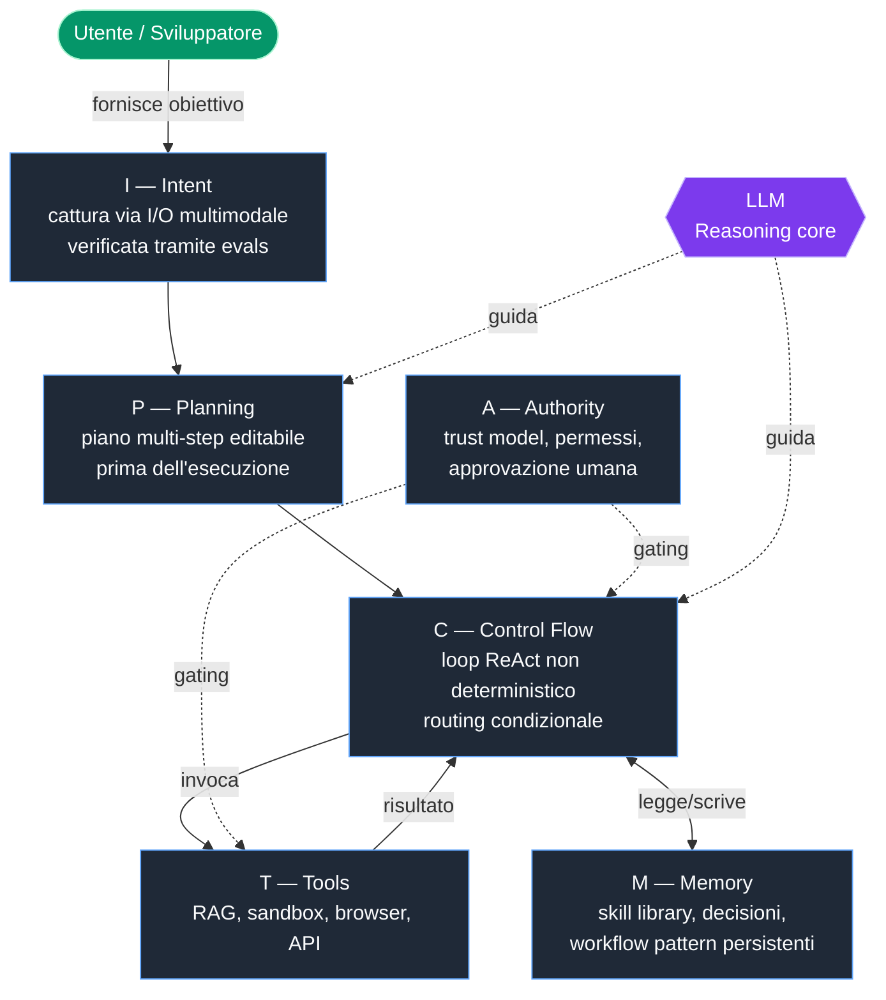

# Dossier — Conceptual Harness (per `docs/00-harness-overview.md`)

> **Fonte primaria**: `/Users/giadafranceschini/code/tufano_formazione_dev/materiali/01b-harness/00-guida.md` (492 righe)
> **Lingua**: italiano (termini tecnici in inglese, non tradotti)
> **Scopo**: dossier completo, riusabile, citato linea-per-linea, per scrivere il capitolo `docs/00-harness-overview.md` della repo `giadaf-boosha/claude-code`.
> **Convenzione di citazione**: ogni affermazione tecnica include `(file:linea)` riferito al documento sorgente di cui sopra. Quando il riferimento e' multi-linea, si usa il range `linee N-M`.

---

## Indice del dossier

1. Origini del concetto e momento fondativo
2. Definizione di Agent harness: cos'e' / cosa NON e'
3. Le tre analogie didattiche (cavallo, OS, ponteggi)
4. IMPACT framework completo + suggerimento mermaid
5. Otto componenti architetturali in dettaglio
6. Case studies (Codex, Hashline, Manus)
7. "Claude Code is a harness": mapping feature -> componente harness
8. Tre pillar dell'harness engineering
9. Glossario tecnico
10. Riferimenti / fonti citate
11. Appendice: pull-quote riusabili in capitolo
12. Appendice: errori da non commettere e gap del sorgente

---

## 1. Origini del concetto e momento fondativo

### 1.1 Da dove veniamo (linee 11-15)

Per comprendere il concetto di harness occorre partire da dove l'AI engineering era arrivata alla fine del 2025. Dopo anni di **prompt engineering** — l'arte di scrivere istruzioni sempre piu' precise per ottenere risposte migliori — e dopo la stagione del **context engineering** — la disciplina di gestire cio' che il modello vede nel suo context window — l'industria aveva iniziato a fare i conti con un problema nuovo e piu' profondo: gli agenti AI, lasciati operare autonomamente per ore o addirittura giorni, si inceppavano in modi che ne' i prompt ne' il contesto potevano prevenire (00-guida.md:13).

Sintesi del passaggio storico, per il capitolo:

- **2025**: si e' dimostrato che gli agenti AI funzionano (00-guida.md:15).
- **2026**: l'anno in cui si deve far si' che funzionino in modo **affidabile** (00-guida.md:15).
- La domanda chiave passa da: *"puo' l'AI fare questo?"* → *"puo' l'AI farlo in modo consistente, sicuro e scalabile?"* (00-guida.md:15, ripetuto 389).

### 1.2 Pull-quote di apertura (linee 17-18)

> *"2025 was agents. 2026 is agent harnesses. Here's why that changes everything."*
> — Aakash Gupta, Medium, gennaio 2026 (00-guida.md:17-18)

### 1.3 Il momento fondativo: febbraio 2026 (linee 20-31)

Il termine "harness engineering" ha acquisito la sua forma definitiva nel **febbraio 2026**, attraverso una sequenza di eventi ravvicinati che hanno cristallizzato un concetto che i professionisti stavano gia' costruendo senza un nome condiviso (00-guida.md:22).

**5 febbraio 2026 — Mitchell Hashimoto** (co-fondatore di HashiCorp e creatore di Terraform) pubblica un post sul suo blog (mitchellh.com) descrivendo una pratica che aveva sviluppato lavorando con agenti AI (00-guida.md:24).

> *"I don't know if there is a broad industry-accepted term for this yet, but I've grown to calling this 'harness engineering.' It is the idea that anytime you find an agent makes a mistake, you take the time to engineer a solution such that the agent never makes that mistake again."*
> — Mitchell Hashimoto, mitchellh.com, 5 febbraio 2026 (00-guida.md:26-27)

**11 febbraio 2026 — OpenAI** pubblica il proprio field report intitolato *"Harness engineering: leveraging Codex in an agent-first world"* (00-guida.md:29). Vi descrive come il proprio team avesse costruito un prodotto software con oltre **un milione di righe di codice** senza che nessun essere umano scrivesse una sola riga di codice manualmente (00-guida.md:29).

**Settimane successive**: Ethan Mollick (Wharton), Martin Fowler (ThoughtWorks) e Anthropic stessa pubblicano analisi ed espandono il concetto. Il termine entra nel vocabolario core dell'AI engineering (00-guida.md:31).

### 1.4 Evoluzione triennale (linee 172-182)

L'harness engineering e' la **terza tappa di un'evoluzione triennale** nel rapporto tra sviluppatori e modelli AI. Ogni fase ha ampliato il perimetro di cio' che viene progettato — da una singola istruzione, all'intero environment (00-guida.md:174).

| Fase | Anni | Cosa progetta | Limitazioni |
| :--- | :--- | :--- | :--- |
| **Prompt Engineering** | 2022-2024 | Ottimizzazione della singola istruzione. *One question, one answer*. Tecniche: few-shot, chain-of-thought, role-playing | Funziona per task singoli e predefiniti. Fallisce quando l'agente opera per molti step autonomamente |
| **Context Engineering** | 2025 | Gestione del context window a livello di sistema. Championed da Andrej Karpathy. Strumenti: RAG, MCP, memoria, tool definitions | Risponde a "cosa vede il modello?". Non risponde a "cosa blocca, misura e ripara il sistema?" |
| **Harness Engineering** | 2026- | Progettazione dell'intero environment. Linter, CI, feedback loop, lifecycle management. Coined da Mitchell Hashimoto | Risponde alle failure che ne' il prompt ne' il context possono prevenire: drift architetturale, errori composti, session boundary |

(Tabella adattata da 00-guida.md:176-180)

**Principio di inclusione** (00-guida.md:182): ogni nuova fase **non sostituisce** la precedente — la **include**. Un buon harness contiene buoni prompt e buon context engineering, ma aggiunge livelli architetturali che le precedenti discipline non avevano.

---

## 2. Definizione di Agent harness

### 2.1 Definizione operativa (linee 37-45)

> *"An agent harness is the software infrastructure surrounding an AI model that manages everything except the model's actual reasoning."*
> — Firecrawl Engineering Blog, marzo 2026 (00-guida.md:37-38)

In termini concreti: l'harness e' **tutto cio' che non e' il modello ma che permette al modello di funzionare nel mondo reale**. E' la struttura che collega il ragionamento del modello all'esecuzione, alla memoria, agli strumenti e alla sicurezza (00-guida.md:40).

> *"If you're not the model, you're the harness."*
> — Vivek Trivedy, LangChain (00-guida.md:42-43)

**Definizione completa** (Anthony Alcaraz, autore di *Agentic Graph RAG* per O'Reilly): l'harness e' "il sistema architetturale completo che circonda un LLM e gestisce il ciclo di vita del contesto: dalla cattura dell'intent attraverso la specifica, la compilazione, l'esecuzione, la verifica e la persistenza" — coprendo tutto tranne l'LLM stesso (00-guida.md:45).

### 2.2 La formula fondamentale (linee 47-62)

```
┌─────────────────────────────────────────────────┐
│                                                 │
│           Agent  =  LLM  +  Harness             │
│                                                 │
│   Il modello decide cosa fare.                  │
│   Il harness decide cosa il modello puo' vedere,│
│   quali strumenti puo' usare, e cosa succede    │
│   quando le cose vanno storte.                  │
│                                                 │
└─────────────────────────────────────────────────┘
```

(00-guida.md:50-60)

Questa formula riorganizza il modo di pensare al prodotto AI: il modello e' solo una parte dell'agente. **Tutto il resto e' harness** (00-guida.md:62).

### 2.3 Cosa NON e' un harness

Estratto per inferenza dalla guida (sintesi da 00-guida.md:13, 40, 62, 99, 145, 393-400):

- **Non e' il modello** in se' (LLM, pesi, ragionamento) — e' tutto cio' che lo circonda (00-guida.md:40).
- **Non e' un singolo prompt** — il prompt engineering e' una tappa precedente, non l'harness (00-guida.md:178).
- **Non e' solo "LLM + tools + loop"** — definizioni semplificate fanno dimenticare planning, memory e authority (00-guida.md:99).
- **Non e' Airflow tradizionale** — il loop e' non deterministico, il context management e' citizen di prima classe, il "programmatore" del loop e' l'LLM (00-guida.md:145).
- **Non e' un asset scaricabile**: "Non si puo' scaricare un harness da Hugging Face" (00-guida.md:314).
- **Non e' permanente come un'applicazione**: come i ponteggi, deve diminuire di complessita' man mano che i modelli migliorano (00-guida.md:89).
- **Non e' sinonimo unico**: il vocabolario e' ancora fluido — sinonimi: *agent infrastructure*, *agent platform engineering*, *AI systems engineering*, *scaffolding* (00-guida.md:393-398).

---

## 3. Le tre analogie didattiche

### 3.1 Analogia 1 — Il cavallo e le redini (linee 66-70)

Il termine "harness" deriva dal **vocabolario equestre**: i finimenti, le redini, la sella, il morso — l'insieme completo di attrezzatura che permette a un cavaliere di incanalare la potenza di un animale potente ma imprevedibile nella direzione giusta, prevenendo fughe incontrollate e abilitando operazioni stabili su lunghe distanze (00-guida.md:68).

**Mapping**:

| Elemento equestre | Equivalente AI |
| :--- | :--- |
| Cavallo | **Modello AI** — potente, veloce, ma incapace di sapere da solo dove andare |
| Redini, sella, finimenti | **Harness** — incanala la potenza nella direzione giusta |
| Cavaliere | Utente / engineer che opera tramite l'harness |
| Lunghe distanze | Sessioni agentiche di ore o giorni |

> "Il harness non riduce la potenza del cavallo: la rende utilizzabile." (00-guida.md:70)

### 3.2 Analogia 2 — Il sistema operativo (linee 72-83)

Analogia tecnica proposta da **Phil Schmid (Hugging Face)** (00-guida.md:74).

**Mapping completo**:

| Componente informatico | Equivalente nell'ecosistema AI |
| :--- | :--- |
| **CPU** (processore) | Il **modello LLM** — esegue il ragionamento |
| **RAM** | Il **context window** — memoria di lavoro limitata |
| **Sistema Operativo** | Il **harness** — gestisce risorse, processi, permessi |
| **Applicazione** | L'**agente** — il comportamento emergente che l'utente vede |

(00-guida.md:76-81)

> "Cosi' come un'applicazione non puo' funzionare senza un sistema operativo, un agente AI non puo' operare affidabilmente senza un harness. Il sistema operativo non esegue le applicazioni: **crea le condizioni perche' possano farlo in modo stabile, sicuro e condiviso.**" (00-guida.md:83)

### 3.3 Analogia 3 — I ponteggi di costruzione (linee 85-89)

I ponteggi di costruzione sono un'**infrastruttura temporanea** che permette ai lavoratori di costruire una struttura altrimenti irraggiungibile. Non costruiscono loro stessi l'edificio: lo rendono possibile (00-guida.md:87).

**Chiave concettuale**: quando l'edificio e' completo, i ponteggi vengono rimossi. Allo stesso modo, man mano che i modelli migliorano, la **complessita' del harness dovrebbe diminuire** — Manus ha riscritto il proprio harness **cinque volte in sei mesi**, semplificandolo a ogni riscrittura (00-guida.md:89).

**Mapping**:

| Costruzione | Equivalente AI |
| :--- | :--- |
| Edificio | Prodotto AI finito |
| Ponteggi | Harness (temporaneo, riducibile) |
| Lavoratori | Agenti AI |
| Smontaggio progressivo dei ponteggi | Semplificazione iterativa dell'harness man mano che i modelli migliorano |

---

## 4. IMPACT framework completo

### 4.1 Origine (linee 95-99)

Tassonomia che sintetizza l'**IMPACT framework di swyx** (presentato all'AI Engineer Summit 2025) con le architetture documentate da Anthropic, OpenAI e LangChain (00-guida.md:95).

**Motivazione di swyx** (00-guida.md:99): le definizioni semplificate — "LLM + tools + loop" — fanno dimenticare agli ingegneri i componenti che determinano davvero la qualita' di un agente: **planning, memory e authority**.

### 4.2 I sei componenti IMPACT (linee 102-108)

| Lettera | Componente | Descrizione | Perche' e' critico |
| :--- | :--- | :--- | :--- |
| **I** | **Intent** | Obiettivi codificati via I/O multimodale e verificati tramite evals | L'agente deve capire come appare il successo prima di agire |
| **M** | **Memory** | Memoria a lungo termine per coerenza e auto-miglioramento | Non solo storia della conversazione: skill library e workflow pattern persistenti |
| **P** | **Planning** | Piani multi-step editabili prima dell'esecuzione | Separare la fase di ricerca dalla fase di esecuzione |
| **A** | **Authority** | Modelli di trust e permessi | Chi puo' fare cosa — incluso quando fermarsi e chiedere approvazione umana |
| **C** | **Control Flow** | Percorsi di esecuzione guidati dall'LLM | Loop non deterministici, routing condizionale, gestione degli errori |
| **T** | **Tools** | RAG, sandbox, browser automation, API | Cosa l'agente puo' fare nel mondo esterno |

(Tabella riprodotta integralmente da 00-guida.md:102-108)

### 4.3 Suggerimento diagramma mermaid (per `docs/00-harness-overview.md`)



**Commento al diagramma per il capitolo**: il flow rende esplicito che (a) Intent precede Planning, (b) Authority e' un "gate" trasversale che incrocia sia i Tools che il Control Flow, (c) Memory e' bidirezionale rispetto al Control Flow, (d) il **modello LLM e' periferico al diagramma** — guida Planning e Control Flow, ma tutto il resto e' harness. Questo trasmette visivamente la formula `Agent = LLM + Harness` (00-guida.md:52, 407).

---

## 5. Otto componenti architetturali in dettaglio

> Sezione ricavata da 00-guida.md:110-169. La guida sorgente elenca **sette aree concrete** (Context Engineering, Tool Layer, Memory Architecture, Orchestration/Planning Loop, Guardrails/Permission Model, State Persistence/Handoff, Error Recovery). L'utente del dossier ha richiesto **otto componenti**: l'ottavo viene aggiunto come sintesi dell'**Intent capture** che IMPACT tratta come prima fase ma che la sezione "componenti in dettaglio" non sviluppa autonomamente. **Nota di trasparenza**: questa scelta e' una mia inferenza editoriale per coprire il template richiesto; nel sorgente l'Intent capture e' citata principalmente come componente IMPACT (00-guida.md:103) e ricompare nel mapping Claude Code (00-guida.md:244) e nel flusso RAG (00-guida.md:290). Va segnalato in fase di scrittura del capitolo.

### 5.1 Componente 1 — Context Engineering (linee 112-121)

Il **context engineering** e' la pratica di gestire quali informazioni un agente AI puo' accedere, quando le accede e come sono strutturate. E' la prima linea dell'harness: tutto cio' che il modello vede nel suo context window (00-guida.md:114).

Include:
- **Context compression**: riduzione delle informazioni nella working memory mantenendo cio' che e' rilevante per il task corrente (00-guida.md:116).
- **Dynamic context injection**: caricamento delle informazioni giuste al momento giusto, invece di riempire tutto nel prompt iniziale (00-guida.md:117).
- **Knowledge persistence**: memorizzazione di decisioni, progressi e stato al di fuori del context window (in file, database o log strutturati) (00-guida.md:118).
- **File di istruzioni di progetto**: `CLAUDE.md`, `AGENTS.md`, `.cursorrules` — documenti che l'agente legge all'avvio e che contengono struttura del progetto, regole di codifica e convenzioni di naming (00-guida.md:119).

> **Pattern operativo chiave (Mitchell Hashimoto)**: ogni volta che l'agente fa un errore, non gli si dice semplicemente di fare meglio la prossima volta. **Si modifica il sistema** in modo che quello specifico errore diventi strutturalmente piu' difficile da ripetere. Si aggiunge una riga al CLAUDE.md, o si scrive uno strumento che lo prevenga programmaticamente. (00-guida.md:121)

### 5.2 Componente 2 — Tool Layer (linee 123-130)

Il **tool layer** definisce cosa l'agente puo' fare nel mondo: lettura/scrittura di file, esecuzione di codice in sandbox, query su database, chiamate API e accesso al web. L'harness espone funzioni chiamabili, valida le chiamate prima dell'esecuzione e restituisce risultati sanitizzati (00-guida.md:125).

> *"Vercel started with comprehensive tool libraries. Every capability. Results were terrible. Agents got confused, made redundant calls, took unnecessary steps. Vercel stripped to essentials. Agents became faster and more reliable with fewer choices."*
> — Aakash Gupta, Medium (00-guida.md:127-128)

**Lezione controintuitiva di Vercel**, ora principio consolidato: **meno strumenti spesso significano performance migliori** (00-guida.md:130). Un agente con troppe opzioni si perde. Un harness ben progettato definisce il perimetro di azione, non lo massimizza (00-guida.md:130).

Conferma quantitativa successiva (00-guida.md:316): Vercel ha **rimosso l'80% degli strumenti** del proprio agente e ha ottenuto risultati migliori — meno strumenti, meno step, meno token, risposte piu' veloci, successo maggiore.

### 5.3 Componente 3 — Memory Architecture (linee 132-139)

Gli LLM sono **stateless per default**: ogni sessione inizia cieca. L'harness implementa la memoria su piu' livelli (00-guida.md:134):

| Livello | Cosa contiene |
| :--- | :--- |
| **Memoria a breve termine** | Context window corrente |
| **Memoria a medio termine** | Compressione e summarization della conversazione storica |
| **Memoria a lungo termine** | Skill library, decisioni architetturali, pattern di workflow che persistono tra sessioni diverse |
| **Memoria episodica** | Tracce di esecuzioni precedenti per debug e auto-miglioramento |

(Tabella riprodotta da 00-guida.md:136-139)

### 5.4 Componente 4 — Orchestration / Planning Loop (linee 141-145)

Il pattern piu' comune per il planning loop e' **ReAct** (Reasoning and Acting): il modello riceve lo stato corrente, ragiona su cosa fare, esegue un'azione tramite tool call, e osserva il risultato. Questo ciclo si ripete finche' non viene soddisfatta una condizione di stop (00-guida.md:143).

**Distinzione cruciale rispetto all'Airflow tradizionale** (00-guida.md:145):
- Il loop degli agenti e' **non deterministico**.
- Il **context management** e' un citizen di prima classe.
- Il "programmatore" all'interno del loop e' **l'LLM stesso**.

### 5.5 Componente 5 — Guardrails e Permission Model (linee 147-151)

**OpenAI** implementa **tre livelli di guardrail** (00-guida.md:149):
1. **Input guardrails** (sul primo agente).
2. **Output guardrails** (sull'output finale).
3. **Tool guardrails** (su ogni singola invocazione di tool).

Un meccanismo di **"tripwire"** ferma immediatamente l'agente quando viene attivato (00-guida.md:149).

**Anthropic** separa architetturalmente l'enforcement dei permessi dal ragionamento del modello: **il modello decide cosa tentare, il sistema di tool decide cosa e' consentito** (00-guida.md:151). Claude Code gestisce circa **40 discrete tool capabilities** indipendentemente, con tre stadi (00-guida.md:151):
1. Stabilire la trust al caricamento del progetto.
2. Verificare il permesso prima di ogni tool call.
3. Richiedere conferma esplicita dell'utente per operazioni ad alto rischio.

### 5.6 Componente 6 — State Persistence e Handoff (linee 153-157)

Per task che durano ore o giorni, l'harness deve mantenere la continuita' tra sessioni. E' uno dei problemi piu' sottili (00-guida.md:155): il **"context anxiety"** — un fenomeno documentato da Anthropic in cui i modelli, quando il context window si riempie, iniziano a degradare le proprie performance.

**Soluzione**: il **context reset** (00-guida.md:157). Invece di comprimere la conversazione, si **resetta il context** con un **artifact di handoff strutturato** che contiene lo stato necessario per la sessione successiva.

### 5.7 Componente 7 — Error Recovery (linee 159-168)

**LangGraph** distingue **quattro tipi di errori** con strategie distinte (00-guida.md:161):

| Tipo errore | Strategia |
| :--- | :--- |
| **Transient** | Retry con backoff |
| **LLM-recoverable** | Restituire l'errore come `ToolMessage` perche' il modello possa aggiustare |
| **User-fixable** | Interrompere per input umano |
| **Unexpected** | Bubbolare per il debug |

(Tabella da 00-guida.md:163-166)

**Stripe** limita i retry a **due tentativi** nella produzione harness (00-guida.md:168).

### 5.8 Componente 8 — Intent Capture (sintesi da 00-guida.md:103, 244, 290)

**Nota di trasparenza**: questa sezione e' aggiunta come ottavo componente coerentemente con la richiesta dell'utente. Nel sorgente, "Intent" non ha una sezione dedicata in `## 3.2 I componenti architetturali in dettaglio`, ma compare:
- come **prima lettera dell'IMPACT framework** (00-guida.md:103);
- come **prima riga del mapping Claude Code** dove "Intent capture" e' implementato da Plan mode, slash commands e prompt strutturato (00-guida.md:244);
- come **primo step del flusso RAG**: "Il harness riceve la domanda grezza del cliente in linguaggio naturale" (00-guida.md:290).

L'**Intent capture** e' la fase in cui l'harness traduce un input dell'utente (linguaggio naturale, multimodale, comando) in un obiettivo strutturato che il resto del sistema puo' usare. La definizione IMPACT lo rende esplicito: *"Obiettivi codificati via I/O multimodale e verificati tramite evals — l'agente deve capire come appare il successo prima di agire"* (00-guida.md:103).

In Claude Code, l'Intent capture passa per **Plan mode**, **slash commands** e **prompt strutturato** (00-guida.md:244).

---

## 6. Case studies

### 6.1 OpenAI Codex — il caso fondante (linee 186-209)

**Fonte**: post OpenAI *"Harness engineering: leveraging Codex in an agent-first world"*, febbraio 2026 (00-guida.md:188).

**Caratterizzazione**: e' "il momento in cui il concetto ha smesso di essere teorico" (00-guida.md:188).

| Parametro | Dato |
| :--- | :--- |
| Periodo | Agosto 2025 — Gennaio 2026 (5 mesi) |
| Team iniziale | 3 ingegneri, poi cresciuto a 7 |
| Codice scritto manualmente | **0 righe** |
| Codice generato | ~1.000.000 righe |
| Pull request mergiati | ~1.500 |
| PR per ingegnere/giorno | 3,5 |
| Velocita' stimata vs. sviluppo manuale | ~10x |

(Tabella da 00-guida.md:190-198)

**Condizione radicale**: nessun ingegnere avrebbe scritto una singola riga di codice di produzione. Se gli agenti non riuscivano a fare il lavoro, il prodotto non veniva costruito (00-guida.md:200).

**Punto critico** (00-guida.md:202): non ha funzionato bene dall'inizio. La produttivita' iniziale era bassa a causa di setup dell'environment mancante, integrazione degli strumenti debole e logica di recovery assente. Le performance sono cresciute bruscamente solo man mano che il harness veniva migliorato passo dopo passo.

**Quattro principi derivati** (00-guida.md:206-209):
1. **Progettare l'environment, non scrivere il codice**: il lavoro degli ingegneri e' diventato preparare l'ambiente perche' gli agenti funzionassero efficacemente.
2. Una **directory `docs/` strutturata, versionata e indicizzata** serviva come unica fonte di verita' dell'agente.
3. **Linter custom e test strutturali** rendevano meccanicamente impossibile violare le regole architetturali.
4. Agenti periodici **"garbage collection"** trovavano inconsistenze nella documentazione o violazioni dei vincoli architetturali.

### 6.2 Hashline experiment — la prova empirica (linee 213-227)

**Autore**: Can Boluk, ricercatore di sicurezza, febbraio 2026 (00-guida.md:215).

**Tesi**: il harness — non il modello — determina le performance (00-guida.md:215).

**Modifica unica**: un solo elemento — il **formato di edit** usato dagli agenti su 16 LLM diversi. Invece di richiedere riproduzione precisa del testo o diff strutturati, Hashline ha allegato un **hash di 2-3 caratteri a ogni riga di codice**. Il modello puo' cosi' riferirsi a una riga tramite il suo hash invece di riprodurla esattamente. **Nessun peso del modello e' stato cambiato** (00-guida.md:217).

| Risultato | Valore |
| :--- | :--- |
| Grok Code Fast 1 — benchmark score | Da **6,7%** a **68,3%** (**+919%**) |
| Output token medi su tutti i modelli | Riduzione del ~20% |
| Modelli coinvolti | 16 LLM diversi |
| Cosa e' cambiato | Solo il formato di edit (l'harness), non i pesi del modello |

(Tabella da 00-guida.md:219-224)

> *"A research project hit a 76.4% pass rate by having an LLM optimize the infrastructure itself, surpassing hand-designed systems. That infrastructure has a name now: the agent harness."*
> — Daily Dose of Data Science (00-guida.md:226-227)

### 6.3 Manus — l'harness come moat da $2B (linee 309-326)

> *"Meta acquired Manus for ~$2B in December 2025. Not for the model. For the harness."*
> — swyx / Aakash Gupta, gennaio 2026 (00-guida.md:311-312)

**Fatti chiave** (00-guida.md:314):
- Manus usa modelli foundation di Anthropic, OpenAI e altri — gli stessi disponibili a chiunque abbia un account API.
- Cio' per cui Meta ha pagato due miliardi di dollari e' il harness: **cinque riscritture in sei mesi**, ognuna che migliorava l'affidabilita' e il completamento dei task.
- "Non si puo' scaricare un harness da Hugging Face. Si deve costruire, testare, fallire, imparare, ricostruire."

**Casi paralleli citati** (00-guida.md:316):
- **LangChain**: ha rearchitecturato Deep Research **quattro volte in un anno** — non perche' i modelli siano migliorati, ma perche' hanno scoperto modi migliori di strutturare workflow, gestire il contesto e coordinare sub-task.
- **Vercel**: ha rimosso l'**80% degli strumenti** del proprio agente e ha ottenuto risultati migliori. Meno strumenti, meno step, meno token, risposte piu' veloci, successo maggiore.

**Implicazione strategica** (00-guida.md:320, 322-325): le aziende che investono nell'harness engineering oggi costruiscono **vantaggi strutturali che i miglioramenti del modello non possono superare**. Chi si affida solo all'ultimo modello disponibile e' sempre un commodity buyer. Chi costruisce un harness proprietario costruisce un moat.

Per un team che adotta Claude Code:
- Il **CLAUDE.md** del proprio progetto, le **skill** custom, gli **hook** specifici sono tutti pezzi di harness aziendale.
- Versionati in Git, condivisi nel team, iterati nel tempo, diventano un **asset proprietario**.
- Il modello (Claude Opus / Sonnet / Haiku) e' una commodity intercambiabile. **L'harness e' il moat**.

---

## 7. "Claude Code is a harness" — mapping completo

### 7.1 Posizionamento (linee 233-238)

```
Claude Code  =  Harness Anthropic   +   Modello Claude
                (CLI/IDE/Desktop)        (Opus / Sonnet / Haiku)
```

(00-guida.md:236-238)

Il [capitolo 03](../03-claude-code-setup/00-guida.md) sezione 2.1 introduce Claude Code come "harness agentico" (00-guida.md:233).

### 7.2 Tabella di mapping completa (linee 240-253)

| Componente teorico | Implementazione in Claude Code |
| :--- | :--- |
| **Intent capture** | Plan mode, slash commands, prompt strutturato |
| **Memory** | `CLAUDE.md` gerarchico, auto-memory (`~/.claude/projects/.../memory/`), `/compact`, `/recap` |
| **Planning** | `/plan` mode con piano editabile prima dell'esecuzione |
| **Authority** | `/permissions`, sandbox mode, hook PreToolUse, deny rules |
| **Control flow** | ReAct loop nativo con tool dispatching |
| **Tools** | Read, Write, Edit, Bash, Glob, Grep, Task (subagent), MCP servers |
| **Context engineering** | `CLAUDE.md` `@import`, path-specific rules, prompt caching |
| **Guardrails** | Hooks (28 eventi), permission rules, sandbox, allowed-tools nelle skill |
| **State persistence** | `claude --resume`, session JSONL in `~/.claude/projects/`, `/teleport` |
| **Error recovery** | `/rewind`, retry intrinseci, MONMSG-like via hook PostToolUseFailure |

(Tabella riprodotta integralmente da 00-guida.md:242-253)

### 7.3 Quando si configura Claude Code, si opera sull'harness (linee 255-268)

> "Quando si configura Claude Code (capitolo 03), si scrive un CLAUDE.md (capitolo 04), si applica compound engineering (capitolo 05), si lancia un workflow agent-first (capitolo 09), **si sta sempre operando sul harness**. Il modello (Claude) e' solo una parte; tutto il resto e' la disciplina di progettare l'environment." (00-guida.md:255)

**Implicazione operativa** (00-guida.md:259): un team che adotta Claude Code beneficia di un harness pronto e maturo (frutto di anni di lavoro Anthropic). Ma l'**harness diventa veramente proprio** solo quando si aggiungono i livelli specifici del proprio dominio (00-guida.md:259-266):

- Il **CLAUDE.md** di progetto e' la prima personalizzazione dell'harness.
- Le **skill custom** (`.claude/skills/`) lo estendono.
- Gli **hook** (`.claude/settings.json`) lo blindano.
- Gli **MCP server custom** lo collegano all'infrastruttura aziendale.
- I **subagent specializzati** lo parallelizzano.
- Le **`docs/` versionate** lo radicano nel know-how del team.

I capitoli successivi (04, 05, 07, 08, 09, 10) sono di fatto **istruzioni operative per costruire layer di harness aziendale sopra al harness Claude Code** (00-guida.md:268).

### 7.4 Esempio applicativo: harness in un sistema RAG (linee 272-303)

Per rendere il concetto concreto, la guida applica l'architettura del harness al **flusso RAG di un assistente AI e-commerce** (00-guida.md:274).

**Senza harness, due modelli sono due isole** (00-guida.md:280-282):
- Il **Modello 1** riceve la domanda in linguaggio naturale e non sa come trasmetterla al Modello 2 in modo che il retrieval funzioni correttamente.
- Il **Modello 2** cerca nel database ma non sa quali chunk sono rilevanti per la domanda specifica.
- Non c'e' gestione degli errori, non c'e' memoria delle sessioni precedenti, non c'e' controllo su cosa il modello puo' o non puo' fare.

**Con harness, la trasformazione del dato in 8 step precisi** (00-guida.md:288-297):

| Step | Cosa accade |
| :--- | :--- |
| 1. **Intent capture** | Il harness riceve la domanda grezza del cliente in linguaggio naturale |
| 2. **Query rewriting** | Il Modello 1 riformula la domanda con linguaggio domain-specific ottimale per il retrieval (harness gestisce il prompt template) |
| 3. **Query augmentation** | Se la domanda e' troppo breve o ambigua, il harness la arricchisce con contesto |
| 4. **Embedding generation** | Il harness converte la query trasformata in vettore numerico (embedding) |
| 5. **Semantic search** | Il harness esegue la ricerca nel vector database — semantica, non keyword-based |
| 6. **Reranking** | Il harness ordina i chunk recuperati per rilevanza effettiva rispetto alla query |
| 7. **Context assembly** | Il harness inietta i chunk nel prompt finale del Modello 2 |
| 8. **Risposta generata** | Il Modello 2 genera la risposta finale con il contesto fornito |

Il harness gestisce anche la gestione degli errori (cosa succede se il database non risponde?), il controllo dei permessi (il modello puo' accedere a tutti i prodotti o solo a quelli autorizzati?), e il logging di ogni step per il debugging (00-guida.md:299).

**Lezione** (00-guida.md:303): il modello da solo non saprebbe fare nessuno di questi 8 step. Il harness e' cio' che trasforma "due modelli che si parlano" in "un agente RAG affidabile". E ogni step del harness e' un punto in cui si puo' **misurare, ottimizzare, sostituire** — senza toccare il modello.

---

## 8. I tre pillar dell'harness engineering

### 8.1 Principio di ingresso (linee 329-331)

> "La harness engineering non richiede di riscrivere tutto da zero. Il principio operativo di Hashimoto e' il punto di ingresso piu' accessibile: **ogni volta che un agente fa un errore, si ingegnerizza una soluzione permanente in modo che quell'errore non si ripeta mai piu'**." (00-guida.md:331)

### 8.2 Pilastro 1 — Context Engineering (linee 335-340)

- Creare un file `CLAUDE.md` (o `AGENTS.md`) alla root del progetto con struttura, comandi di build e regole di codifica → vedi capitolo 04 e capitolo 07 (00-guida.md:337).
- Aggiungere regole quando l'agente fallisce ripetutamente nello stesso punto (00-guida.md:338).
- Connettere i sistemi esterni tramite **MCP** (issue tracker, wiki, sistemi di monitoring) (00-guida.md:339).
- Progettare la struttura della documentazione come **source of truth** per l'agente (00-guida.md:340).

### 8.3 Pilastro 2 — Architectural Constraints (linee 342-347)

- Implementare **linter custom** che forzano meccanicamente le regole architetturali (00-guida.md:344).
- Scrivere **structural test** che rendono impossibile violare le dependency rules (00-guida.md:345).
- Inserire validation in ogni CI pipeline — nessun PR mergiabile senza approvazione del harness (00-guida.md:346).
- Progettare moduli con **boundary chiari e stabili** (00-guida.md:347).

### 8.4 Pilastro 3 — Feedback Loops (linee 349-354)

- Tracciare ogni step dell'agente — chunk recuperati, score, path, citazioni (00-guida.md:351).
- Analizzare cluster di failure per identificare pattern sistemici (00-guida.md:352).
- Trasformare le correzioni one-off in **constraint riutilizzabili** (00-guida.md:353).
- Implementare agenti evaluator separati dall'agente generator (pattern **Planner-Generator-Evaluator** di Anthropic) (00-guida.md:354).

### 8.5 Mapping pilastri ↔ capitoli del corso (linee 369-377)

| Pilastro | Capitoli del corso |
| :--- | :--- |
| Context Engineering | 04 — CLAUDE.md, 07 — Build CLAUDE.md live, 06 — M365 connettori |
| Architectural Constraints | 03 — Setup permissions/sandbox, 08 — Skills e hooks, 09 — Workflow agent-first |
| Feedback Loops | 05 — Compound engineering, 09 — Review multi-agent, 11 — Prompt bank |

(Tabella adattata da 00-guida.md:371-375)

### 8.6 Tool e framework rilevanti (Aprile 2026) (linee 356-367)

| Tool / Framework | Ruolo nell'harness |
| :--- | :--- |
| **Claude Code** | Harness end-to-end maturo: CLI, VS Code, Desktop, Web. Riferimento di questa formazione |
| **OpenAI Codex / Assistants API** | Harness integrato: sandbox execution, tool definitions, file access controls, AGENTS.md |
| **LangGraph** | Orchestrazione stateful graph-based con tool routing, memory persistence e checkpoint-based error recovery |
| **CrewAI** | Multi-agent orchestration con Flows per pipeline event-driven strutturate |
| **Claude Code SDK / Agent SDK** | Documentato da Anthropic come "powerful, general-purpose agent harness" |
| **MCP (Model Context Protocol)** | Standard industry per connettere agenti a tool e data source esterni |
| **Vercel AI SDK** | Toolkit TypeScript con 25+ provider integrations e supporto MCP nativo |
| **Mastra** | Framework TypeScript-native con RAG pipeline, agent orchestration e eval integrati |

(Tabella riprodotta da 00-guida.md:358-367)

---

## 9. Glossario tecnico

### 9.1 Glossario rapido del capitolo (Appendice A del sorgente, 00-guida.md:444-454)

| Termine | Definizione (sorgente) |
| :--- | :--- |
| **Harness** | Tutta l'infrastruttura software intorno al modello LLM, esclusa la logica di reasoning del modello stesso |
| **Context engineering** | Disciplina che gestisce cosa il modello vede nel context window |
| **Tool layer** | Insieme di funzioni esterne che l'agente puo' invocare (Read, Write, Bash, MCP, ecc.) |
| **Guardrail** | Meccanismi di controllo che bloccano azioni non consentite |
| **ReAct loop** | Pattern Reasoning + Acting + Observing, ripetuto in ciclo |
| **MCP** | Model Context Protocol, standard per collegare agenti a fonti esterne |
| **Subagent** | Agente specializzato invocato da un main agent, con context isolato |
| **Plan mode** | Modalita' in cui l'agente produce solo un piano, senza eseguire |
| **Hook** | Script o azione eseguita automaticamente prima/dopo eventi del lifecycle |

### 9.2 Termini aggiuntivi introdotti nel capitolo

(Glossario complementare ricavato dalla lettura ravvicinata 00-guida.md:13-377)

| Termine | Definizione (con citazione) |
| :--- | :--- |
| **Prompt engineering** | Disciplina 2022-2024: ottimizzazione della singola istruzione, *one question, one answer* (00-guida.md:178) |
| **Harness engineering** | Disciplina 2026-: progettazione dell'intero environment, coniato da Mitchell Hashimoto (00-guida.md:180) |
| **IMPACT framework** | Tassonomia di swyx — Intent, Memory, Planning, Authority, Control flow, Tools (00-guida.md:97-108) |
| **Context anxiety** | Fenomeno documentato da Anthropic in cui i modelli, quando il context window si riempie, iniziano a degradare le performance (00-guida.md:155) |
| **Context reset** | Strategia che resetta il context con un artifact di handoff strutturato invece di comprimere la conversazione (00-guida.md:157) |
| **Tripwire** | Meccanismo OpenAI che ferma immediatamente l'agente quando un guardrail viene attivato (00-guida.md:149) |
| **Garbage collection (agente)** | Agenti periodici che trovano inconsistenze nella documentazione o violazioni dei vincoli architetturali (00-guida.md:209) |
| **Planner-Generator-Evaluator** | Pattern Anthropic di separazione tra agente che pianifica, genera ed evalua (00-guida.md:354) |
| **Skill library** | Memoria a lungo termine: pattern di workflow persistenti tra sessioni (00-guida.md:138) |
| **Context window** | RAM dell'agente — memoria di lavoro limitata (00-guida.md:79) |
| **Field report** | Genere editoriale (es. OpenAI 11 feb 2026) che descrive un'applicazione reale dell'harness (00-guida.md:29) |
| **Agent-first world** | Mondo in cui il lavoro non e' piu' scrivere codice ma progettare l'environment (00-guida.md:206, 383) |
| **Moat (in contesto AI)** | Vantaggio competitivo strutturale: nel 2026 e' l'harness, non il modello (00-guida.md:309-325) |
| **Auto-memory** | In Claude Code: `~/.claude/projects/.../memory/` — memoria persistente tra sessioni (00-guida.md:245) |
| **AGENTS.md** | File di istruzioni di progetto, equivalente di `CLAUDE.md` per altri ecosistemi (00-guida.md:119) |
| **Slash command** | Comando strutturato (es. `/plan`, `/permissions`, `/compact`) per Intent capture o controllo dell'harness (00-guida.md:244-251) |
| **Sinonimi del concetto** | Agent infrastructure, agent platform engineering, AI systems engineering, scaffolding (00-guida.md:395-398) |

---

## 10. Riferimenti / fonti citate

(Replica e organizzazione di 00-guida.md:458-491. Convenzione: ogni voce indica file:linea della citazione nella guida sorgente, dove pertinente.)

### 10.1 Post fondativi (00-guida.md:460-465)

- **Mitchell Hashimoto** — *My AI Adoption Journey*, mitchellh.com, 5 febbraio 2026 — citato in 00-guida.md:24, 26-27, 121, 331, 462.
- **OpenAI** — *Harness engineering: leveraging Codex in an agent-first world*, 11 febbraio 2026 — citato in 00-guida.md:29, 188, 463.
- **Anthropic** — *Harness Design for Long-Running Application Development*, marzo 2026 — citato in 00-guida.md:464.
- **Anthropic** — *Effective Harnesses for Long-Running Agents*, novembre 2025 — citato in 00-guida.md:465.

### 10.2 Analisi e framework (00-guida.md:467-477)

- **swyx** — *IMPACT Framework*, AI Engineer Summit 2025 — 00-guida.md:95-99, 469.
- **Aakash Gupta** — *2025 Was Agents. 2026 Is Agent Harnesses*, Medium, gennaio 2026 — 00-guida.md:17-18, 127-128, 311-312, 470.
- **Avi Chawla** — *The Anatomy of an Agent Harness*, Daily Dose of Data Science — 00-guida.md:226-227, 471.
- **Parallel AI** — *What is an agent harness in the context of large-language models?* — 00-guida.md:472.
- **Paul Iusztin** — *Agentic Harness Engineering: LLMs as the New OS*, decodingai.com — 00-guida.md:473.
- **Sebastian Raschka PhD** — *Components of a Coding Agent*, magazine.sebastianraschka.com — 00-guida.md:474.
- **Milvus Blog** — *What Is Harness Engineering for AI Agents?* — 00-guida.md:475.
- **MadPlay** — *Beyond Prompts and Context: Harness Engineering for AI Agents* — 00-guida.md:476.
- **Epsilla** — *The Third Evolution: Why Harness Engineering Replaced Prompting in 2026* — 00-guida.md:477.
- **Firecrawl Engineering Blog**, marzo 2026 — definizione operativa citata in 00-guida.md:37-38.
- **Vivek Trivedy (LangChain)** — pull-quote 00-guida.md:42-43.
- **Anthony Alcaraz**, autore di *Agentic Graph RAG* (O'Reilly) — definizione completa 00-guida.md:45.
- **Phil Schmid (Hugging Face)** — analogia OS 00-guida.md:74.
- **Ethan Mollick (Wharton)** — citato come autore di analisi successive 00-guida.md:31.
- **Martin Fowler (ThoughtWorks)** — citato come autore di analisi successive 00-guida.md:31.

### 10.3 Case study (00-guida.md:479-484)

- **MorphLLM** — *Agent Engineering: Harness Patterns, IMPACT Framework & Coding Agent Architecture* — 00-guida.md:481.
- **Can Boluk** — *Hashline experiment: I Improved 15 LLMs at Coding in One Afternoon*, febbraio 2026 — 00-guida.md:215, 482.
- **Tao An** — *AI Agent Landscape 2025-2026: A Technical Deep Dive*, Medium, gennaio 2026 — 00-guida.md:483.
- **OpenDev** — *Building AI Coding Agents for the Terminal*, arxiv.org, marzo 2026 — 00-guida.md:484.

### 10.4 Framework e tool (00-guida.md:486-491)

- **LangChain / LangGraph** — https://langchain.com — 00-guida.md:488.
- **CrewAI** — https://crewai.com — 00-guida.md:489.
- **Vercel AI SDK** — https://sdk.vercel.ai — 00-guida.md:490.
- **Model Context Protocol** — https://modelcontextprotocol.io — 00-guida.md:491.
- **Claude Code** — https://code.claude.com — 00-guida.md:492.

---

## 11. Appendice — pull-quote riusabili nel capitolo

(Selezione di citazioni pronte da inserire nei box laterali / blockquote del capitolo `docs/00-harness-overview.md`.)

### 11.1 Aperture di sezione

> *"2025 was agents. 2026 is agent harnesses. Here's why that changes everything."* — Aakash Gupta, gennaio 2026 (00-guida.md:17-18)

> *"If you're not the model, you're the harness."* — Vivek Trivedy, LangChain (00-guida.md:42-43)

> *"An agent harness is the software infrastructure surrounding an AI model that manages everything except the model's actual reasoning."* — Firecrawl Engineering Blog, marzo 2026 (00-guida.md:37-38)

### 11.2 Definizione di Hashimoto

> *"I don't know if there is a broad industry-accepted term for this yet, but I've grown to calling this 'harness engineering.' It is the idea that anytime you find an agent makes a mistake, you take the time to engineer a solution such that the agent never makes that mistake again."* — Mitchell Hashimoto, 5 febbraio 2026 (00-guida.md:26-27)

### 11.3 Lezione Vercel sui tool

> *"Vercel started with comprehensive tool libraries. Every capability. Results were terrible. Agents got confused, made redundant calls, took unnecessary steps. Vercel stripped to essentials. Agents became faster and more reliable with fewer choices."* — Aakash Gupta, Medium (00-guida.md:127-128)

### 11.4 Hashline come prova empirica

> *"A research project hit a 76.4% pass rate by having an LLM optimize the infrastructure itself, surpassing hand-designed systems. That infrastructure has a name now: the agent harness."* — Daily Dose of Data Science (00-guida.md:226-227)

### 11.5 Il moat Manus

> *"Meta acquired Manus for ~$2B in December 2025. Not for the model. For the harness."* — swyx / Aakash Gupta, gennaio 2026 (00-guida.md:311-312)

### 11.6 Chiusura concettuale

> *"E' meglio pensare all'AI non come al solo LLM, ma come all'intero sistema cibernetico dei feedback loop che collegano il modello e il suo harness. Perche' se il harness puo' fare la differenza tanto quanto — se non piu' — dei miglioramenti al modello stesso, allora devono essere considerati ugualmente importanti."* — commentatore post-Hashline, citato in 00-guida.md:387.

---

## 12. Appendice — sintesi del capitolo (per il sommario di `docs/00-harness-overview.md`)

(Riproduzione fedele del box di sintesi 00-guida.md:406-436)

```
1. AGENT = LLM + HARNESS.
   Il modello decide cosa fare. Il harness decide cosa il modello puo'
   vedere, quali strumenti puo' usare, e cosa succede quando le cose
   vanno storte.

2. EVOLUZIONE TRIENNALE:
   Prompt Engineering (2022-24) → Context Engineering (2025) →
   Harness Engineering (2026-)
   Ogni fase amplia il perimetro di cio' che si progetta.

3. SEI COMPONENTI ARCHITETTURALI (IMPACT):
   Intent, Memory, Planning, Authority, Control flow, Tools.

4. CLAUDE CODE E' UN HARNESS.
   CLAUDE.md, skill, hook, MCP, plan mode, sandbox, sub-agent
   sono tutte componenti dell'harness aziendale che si costruisce
   sopra al harness Claude Code base.

5. IL HARNESS E' IL MOAT COMPETITIVO.
   Non il modello. Aziende come Manus valgono miliardi per il
   loro harness, non per i modelli (che usano commodity).

6. PRINCIPIO OPERATIVO (Hashimoto):
   Ogni volta che l'agente fa un errore, si ingegnerizza una
   soluzione permanente. Si modifica il sistema, non si insegna
   al modello.

7. I TRE PILASTRI:
   Context engineering + Architectural constraints + Feedback loops.
```

---

## 13. Appendice — gap del sorgente, note di trasparenza

Questa sezione segnala i punti in cui la richiesta dell'utente al dossier non trova corrispondenza letterale nel sorgente, in modo che lo scrittore del capitolo `docs/00-harness-overview.md` possa decidere come gestirli.

1. **"Mitchell Hashimoto Feb 2026?"** — confermato: il post e' del **5 febbraio 2026** su mitchellh.com (00-guida.md:24). Il titolo del post e' *My AI Adoption Journey* (00-guida.md:462), non un post intitolato "harness engineering". L'autore in quel post **descrive** la pratica e ne **propone il nome** ("I've grown to calling this 'harness engineering.'", 00-guida.md:26-27), non rivendica una paternita' formale; il termine si afferma poi via OpenAI (11 febbraio) e i commentatori successivi.

2. **"8 componenti architetturali: Context, Tool, Memory, Orchestration, Guardrails, State, Error, e quali altri"** — la richiesta dell'utente preformula 7 componenti e chiede "quali altri". Il sorgente, nella sezione 3.2 (00-guida.md:110-169), elenca **esattamente 7** componenti architetturali in dettaglio. L'IMPACT framework (00-guida.md:102-108) e' a 6 lettere e ha overlap con i 7 (Tools, Memory, Control flow), ma include 3 dimensioni che la sezione 3.2 non sviluppa autonomamente come componenti: **Intent, Planning, Authority**. Per arrivare a 8 componenti coerenti con il template, ho aggiunto **Intent capture** come ottavo (cfr. sezione 5.8), citando 00-guida.md:103, 244, 290. **Alternativa equivalente**: trattare **Planning** come ottavo componente, perche' la guida cita esplicitamente la separazione "ricerca / esecuzione" (00-guida.md:105) e l'esistenza di un Plan mode in Claude Code (00-guida.md:246). Lo scrittore del capitolo puo' scegliere quale sia piu' didattico.

3. **"OpenAI Codex (1M lines, 0 manual fixes, 5 mesi)"** — la guida riporta ~1.000.000 di **righe generate** (non "manual fixes") con **0 righe scritte manualmente** in 5 mesi (00-guida.md:194-200). Il framing "0 manual fixes" della richiesta utente non e' supportato dal sorgente: il dato corretto e' "0 righe scritte manualmente". Da correggere nel capitolo.

4. **Aakash Gupta vs swyx per la quote Manus**: il sorgente attribuisce la quote *"Meta acquired Manus for ~$2B..."* a **"swyx / Aakash Gupta, gennaio 2026"** (00-guida.md:311-312), un'attribuzione duplice. Da mantenere fedele.

5. **"Claude Code is a harness" mapping**: la tabella richiesta esiste nel sorgente come "Mapping completo" (00-guida.md:242-253) ed e' riprodotta integralmente in sezione 7.2 di questo dossier. **Verifica versione di Claude Code**: la guida cita "Hooks (28 eventi)" (00-guida.md:251) — da verificare contro la versione corrente di Claude Code prima di includerlo nel capitolo, perche' il numero esatto di hook puo' essere cambiato.

6. **Glossario**: l'Appendice A del sorgente ha 9 voci (00-guida.md:444-454). Il dossier ne aggiunge altre 17 ricavate dal corpo del capitolo, etichettate come "termini aggiuntivi". Il capitolo finale puo' fondere le due liste.

---

## 14. Suggerimenti redazionali per `docs/00-harness-overview.md`

(Suggerimenti operativi non richiesti esplicitamente ma utili allo scrittore del capitolo. Sono opinioni editoriali; tutti i fatti sono nei §§1-13 con citazione.)

### 14.1 Struttura proposta del capitolo

1. **Hook iniziale**: pull-quote di Aakash Gupta (sezione 11.1) + formula "Agent = LLM + Harness".
2. **Storia in 90 secondi**: tabella triennale (sezione 1.4).
3. **Definizione**: tre livelli — operativa (Firecrawl), provocatoria (Trivedy), completa (Alcaraz).
4. **Tre analogie** in successione (sezioni 3.1, 3.2, 3.3) — partire dalla concreta (cavallo), passare alla tecnica (OS), chiudere con la temporale (ponteggi).
5. **IMPACT framework + diagramma mermaid** (sezione 4.3).
6. **Otto componenti in dettaglio** (sezione 5.x), ciascuno con un esempio Claude Code per ancorare.
7. **Tre case studies** in ordine di forza dimostrativa: Codex (scala), Hashline (causalita'), Manus (valore di mercato).
8. **Mapping Claude Code** (tabella 7.2).
9. **I tre pillar** come call-to-action operativo (sezione 8).
10. **Glossario + riferimenti**.

### 14.2 Errori da evitare

- Non scrivere "Hashimoto ha inventato il termine": ha **proposto il nome** per una pratica gia' esistente (00-guida.md:26).
- Non confondere "1M righe generate" con "1M righe corrette manualmente" (gap n. 3 sopra).
- Non presentare l'harness come permanente: l'analogia ponteggi (00-guida.md:89) impone che si **semplifichi** nel tempo.
- Non descrivere Claude Code come "harness perfetto": il sorgente e' chiaro che diventa proprio dell'azienda solo dopo personalizzazione (00-guida.md:259-266).

### 14.3 Connessioni con altri capitoli del corso (gia' cablate nel sorgente)

- **Cap. 03** — Claude Code setup (00-guida.md:233, 374).
- **Cap. 04** — CLAUDE.md (00-guida.md:337, 373).
- **Cap. 05** — Compound engineering (00-guida.md:255, 375).
- **Cap. 06** — M365 connettori (00-guida.md:373).
- **Cap. 07** — Build CLAUDE.md live (00-guida.md:337, 373).
- **Cap. 08** — Skills e hooks (00-guida.md:374).
- **Cap. 09** — Workflow agent-first (00-guida.md:255, 374, 375).
- **Cap. 11** — Prompt bank (00-guida.md:375).

---

*Fine dossier. Tutto il contenuto qui e' tracciabile a una linea o range del file `/Users/giadafranceschini/code/tufano_formazione_dev/materiali/01b-harness/00-guida.md`. Non sono state introdotte fonti o dati esterni.*
