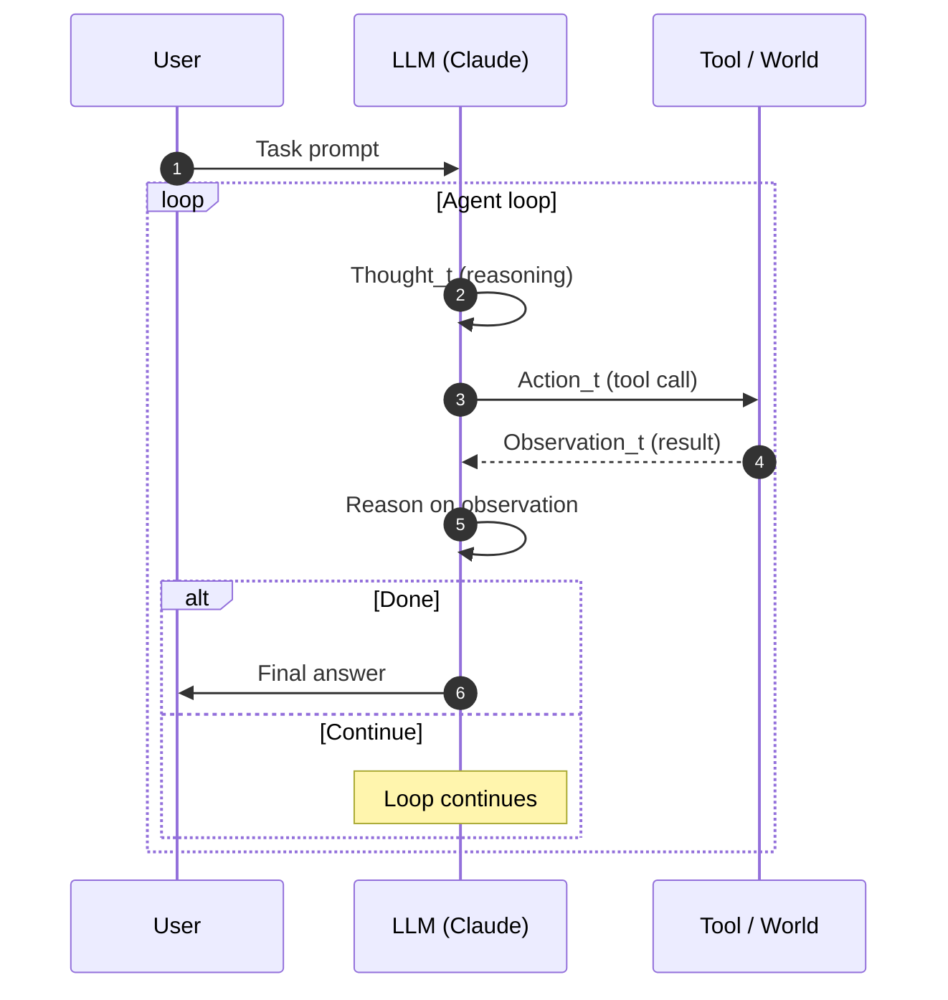

# Dossier concettuale — ReAct & Agent Loop in Claude Code

> Dossier di ricerca prodotto da `researcher-react-loop`. Scopo: fornire un riferimento completo sul pattern **ReAct** (Yao et al. 2022) e sul concetto di **agent loop** applicato a Claude Code, con quote verificate, riferimenti incrociati ai dossier esistenti e diagrammi.
>
> Tutte le citazioni sono ground-truth: paper arXiv per ReAct, dossier interni per le quote X. Nessuna quote inventata. Dove un post non e' direttamente accessibile via WebFetch, riportiamo solo cio' che risulta nei dossier (`dossier-x-extended.md`, `dossier-x-engineers.md`).

---

## Indice

1. [Origine ReAct](#1-origine-react)
2. [Definizione formale Reason + Act + Observe](#2-definizione-formale)
3. [ReAct vs Chain-of-Thought (CoT)](#3-react-vs-chain-of-thought)
4. [Agent loop generico](#4-agent-loop-generico)
5. [Implementazione in Claude Code](#5-implementazione-in-claude-code)
   - 5.1 `/loop` cron-driven vs self-pacing
   - 5.2 Monitor tool come "observe layer" push-based
   - 5.3 Plan mode / Ultraplan come "reason layer" upfront
   - 5.4 Auto mode come "act layer" autonomo
   - 5.5 Hooks come "control flow injection"
6. [Quote dal team Anthropic](#6-quote-dal-team)
7. [Pattern reali documentati](#7-pattern-reali)
8. [Diagrammi (Mermaid)](#8-diagrammi)
9. [Limiti del modello ReAct](#9-limiti)
10. [Riferimenti & fonti](#10-riferimenti)

---

## 1. Origine ReAct

### 1.1 Paper

- **Titolo**: *ReAct: Synergizing Reasoning and Acting in Language Models*
- **Autori**: Shunyu Yao, Jeffrey Zhao, Dian Yu, Nan Du, Izhak Shafran, Karthik Narasimhan, Yuan Cao
- **Submission arXiv**: v1 — 6 ottobre 2022. v3 (versione di riferimento) — 10 marzo 2023.
- **URL**: https://arxiv.org/abs/2210.03629
- **Venue successivo**: ICLR 2023 (oral/poster — accettato).

### 1.2 Contesto storico

Nel 2022 i Large Language Model erano gia' capaci di **Chain-of-Thought (CoT)** prompting (Wei et al. 2022, *"Chain-of-Thought Prompting Elicits Reasoning in Large Language Models"*, https://arxiv.org/abs/2201.11903): generare passaggi intermedi di ragionamento prima della risposta finale. Pero' CoT e' un sistema **chiuso**: il modello ragiona usando solo la propria conoscenza parametrica. Non puo' interrogare strumenti esterni durante il pensiero, e quindi soffre di hallucination quando i fatti non sono in distribuzione.

In parallelo, c'erano lavori che permettevano agli LLM di **agire**, cioe' chiamare strumenti (es. WebGPT, Nakano et al. 2021), ma senza un layer esplicito di ragionamento.

ReAct e' la sintesi: mostra che intervallare *thought* (ragionamento in linguaggio naturale) e *action* (chiamate a tool con osservazione del risultato) produce comportamenti emergenti di problem-solving migliori sia di CoT puro sia di tool-use puro. Il paper diventa il framework concettuale di riferimento per quasi tutti gli agenti LLM successivi (LangChain ReAct agents, AutoGPT, BabyAGI, Devin, Claude Code stesso).

### 1.3 Perche' ReAct e' importante

Il punto chiave del paper: il ragionamento da solo divaga, l'azione da sola e' cieca. **Insieme** si correggono a vicenda:

- Il ragionamento decide *cosa* fare e *perche'*.
- L'azione produce *evidenza* dal mondo esterno.
- L'osservazione del risultato dell'azione corregge il ragionamento successivo.

Questa loop e' la forma canonica del moderno agent loop.

---

## 2. Definizione formale

### 2.1 Quote letterali dal paper (Yao et al. 2022)

Tutte le quote sono verificate dall'abstract / introduzione del paper, https://arxiv.org/abs/2210.03629:

1. *"generate both reasoning traces and task-specific actions in an interleaved manner, allowing for greater synergy"*
2. *"reasoning traces help the model induce, track, and update action plans as well as handle exceptions"*
3. *"actions allow it to interface with external sources...to gather additional information"*

> Nota di precisione: il paper **non** usa letteralmente la triade "Thought / Action / Observation" nell'abstract — quella formulazione e' diventata canonica nelle implementazioni successive (LangChain, in particolare). Concettualmente la metodologia ReAct rappresenta esattamente quel ciclo iterativo.

### 2.2 Schema canonico (post-paper, formulazione community)

```
Thought_t   ->  ragionamento in linguaggio naturale
Action_t    ->  chiamata a tool (con argomenti)
Observation_t -> risultato del tool / output dal mondo
Thought_{t+1} -> ragiona sull'osservazione, decide prossima azione
...
```

Il loop termina quando il modello produce un *finish* / *answer* invece di una nuova action.

### 2.3 Forma decisionale

In termini di MDP-like:

- **State** s_t = storia accumulata (prompt + tutte le `(Thought, Action, Observation)` fino al tempo t)
- **Action space** A = `{tool calls, finish}`
- **Policy** π(a | s_t) = output del modello condizionato sulla storia
- **Observation** o_t = stdout/return value del tool eseguito

Non c'e' una reward function esplicita in inferenza — il modello e' guidato dal prompt e dal proprio ragionamento.

---

## 3. ReAct vs Chain-of-Thought

| Dimensione | Chain-of-Thought (CoT) | ReAct |
|---|---|---|
| Reasoning | Si | Si |
| Acting (tool use) | No | Si |
| Observing | No (closed-world) | Si (open-world) |
| Hallucination factuale | Alta (parametric memory only) | Ridotta (grounding via tool) |
| Capacita' di correggere errori | Limitata | Alta (l'osservazione contraddice il piano) |
| Costo per task | Basso (1-shot) | Alto (multi-turn, tool latency) |
| Dominio | Reasoning puro (math, common-sense) | Task interattivi (QA con KB, web nav, coding) |
| Riferimento | Wei et al. 2022, https://arxiv.org/abs/2201.11903 | Yao et al. 2022, https://arxiv.org/abs/2210.03629 |

**Insight chiave**: CoT e' un sub-caso di ReAct dove la sequenza `Action_t = none` per ogni t. ReAct generalizza CoT introducendo l'asse Acting/Observing.

ReAct e' anche complementare a CoT: nei task dove le tool call non aggiungono informazione (es. aritmetica pura), CoT-only puo' essere superiore. Yao et al. mostrano che ReAct + CoT (combinati con fallback) supera entrambi su HotpotQA, FEVER, ALFWorld, WebShop.

---

## 4. Agent loop generico

### 4.1 Pseudocodice

```python
def agent_loop(task, tools, model, max_steps=50):
    history = [system_prompt(), user(task)]
    for step in range(max_steps):
        response = model.generate(history)            # Reason
        if response.is_final_answer():
            return response.text
        action = response.tool_call                   # Act
        observation = tools[action.name](action.args) # Observe
        history.append(response)
        history.append(observation)
    return "max_steps_reached"
```

### 4.2 Componenti del loop

| Componente | Ruolo | In Claude Code |
|---|---|---|
| **Prompt iniziale** | Definisce task, persona, vincoli | system prompt + CLAUDE.md + skills attive |
| **Reason** | Pianifica passo successivo | output del modello (Opus/Sonnet) |
| **Act** | Esegue tool call | Bash, Read, Edit, Write, WebFetch, MCP, Skill, Task ... |
| **Observe** | Cattura output tool | risultato del tool nella history |
| **Decide done** | Stop condition | finish reason + Stop hook |
| **Memory** | Stato persistente | CLAUDE.md, transcripts, `.claude/` files |

### 4.3 Variazioni principali

- **Synchronous loop**: il modello aspetta l'osservazione prima di pensare di nuovo (canonical ReAct).
- **Push-based observation**: un processo background interrompe il loop quando produce output (Monitor tool — vedi 5.2).
- **Cron-driven loop**: il loop ricomincia su tick esterno indipendentemente da observation (es. `/loop 5m`).
- **Self-pacing loop**: il modello stesso decide quando ri-ticchare basandosi sul task (`/loop` senza intervallo).

---

## 5. Implementazione in Claude Code

Claude Code e' una **istanziazione concreta del pattern ReAct esteso**. Vediamo come ogni componente concettuale si mappa a una feature.

### 5.1 `/loop` — cron-driven vs self-pacing

`/loop` e' una bundled skill (disponibile da v2.1.72, evoluzione self-pacing in Week 15 / aprile 2026). Riferimento: `/Users/giadafranceschini/code/claude-code/docs/14-loop-monitor.md`.

Sintassi sintetica:

| Input | Comportamento |
|---|---|
| `/loop 5m check the deploy` | Cron schedule fisso |
| `/loop check CI on my PR` | Self-pacing — Claude decide intervallo (1m–1h) |
| `/loop` | Maintenance prompt built-in |
| `/loop --cron "0 8 * * 1-5"` | Cron expression custom |
| `/loop --cancel` | Stop |

**Mapping ReAct**:

- Cron-driven `/loop 5m` = forza un nuovo ciclo Reason -> Act -> Observe ogni 5 minuti, indipendentemente da segnali esterni. Utile quando l'observation e' "stato di un PR / CI" e non ci sono webhook.
- Self-pacing `/loop` = il modello *ragiona sul ritmo* (meta-reasoning sul tick stesso). E' un layer in piu' rispetto a ReAct base: il loop e' parte dell'action space.

Quote rilevanti (verificate in dossier-x-engineers.md):

> *"Claude now supports dynamic looping. If you run /loop without passing an interval, Claude will dynamically schedule the next tick based on your task. It also may directly use the Monitor tool to bypass polling altogether. /loop check CI on my PR"* — @noahzweben (Noah Zweben), 2026-04-09/10. URL: https://x.com/noahzweben/status/2042670949003153647

> *"Two of the most powerful features in Claude Code: /loop and /schedule. ... I have a bunch of loops running locally: /loop 5m /babysit, to auto-address code review, auto-rebase, and..."* — @bcherny (Boris Cherny). URL: https://x.com/bcherny/status/2038454341884154269

#### Implementazione interna (cron tools)

Sotto il cofano `/loop` espone tre tool al modello: `CronCreate`, `CronList`, `CronDelete`. Lo scheduler interno checka ogni 1s, fire **between turns** (mai mid-response), local timezone, jitter fino al 10% del periodo (cap 15 min), 7-day expiry per recurring tasks. Max 50 scheduled tasks per sessione. Disable via `CLAUDE_CODE_DISABLE_CRON=1`.

### 5.2 Monitor tool — "observe layer" push-based

Lanciato il **9 aprile 2026** in v2.1.98. Riferimento: docs/14-loop-monitor.md sezione 14.2.

**Idea chiave**: invece di forzare il modello a fare polling (action -> observation -> action -> observation ... fino a quando lo stato cambia), Monitor inverte la freccia: il *processo background* spinge un evento al modello quando succede qualcosa di rilevante.

Quote letterali (dossier-x-engineers.md):

> *"Thrilled to announce the Monitor tool which lets Claude create background scripts that wake the agent up when needed. Big token saver and great way to move away from polling in the agent loop. Claude can now: * Follow logs for errors * Poll PRs via script * and more!"* — @noahzweben, 2026-04-09. URL: https://x.com/noahzweben/status/2042332268450963774

> *"you'll need to explicitly prompt Claude Code to use it, but the Monitor Tool is super powerful. e.g. 'start my dev server and use the MonitorTool to observe for errors'"* — @trq212 (Thariq), 2026-04-09. URL: https://x.com/trq212/status/2042335178388103559

> *"We're launching the Monitor tool in today's Claude Code release. Claude spawns a background process and each stdout line streams into the conversation, without blocking the thread. e.g. Use the monitor tool and \`kubectl logs -f | grep ..\` to listen for errors, make a pr to fix"* — Alistair (@alistaiir), 2026-04-09. URL: https://x.com/alistaiir/status/2042345049980362819

**Mapping ReAct**:

- ReAct classico: Observation_t arriva *sincronamente* dopo Action_t.
- Monitor: Observation_t puo' arrivare *asincronamente* in qualsiasi punto del loop, generata da un Action_{t-k} avviata k step fa (es. `tail -F log`).

Questo trasforma il loop da "pull" (modello chiede stato) a "push" (mondo notifica modello). Riduce token (no polling esplicito) e latenza.

**Implementazione**: Monitor lancia un comando bash in background. Ogni linea su stdout diventa una notifica iniettata nella conversazione tra un turn e l'altro. Permessi identici a Bash (allow/deny patterns). Non disponibile su Bedrock/Vertex/Foundry.

**Plugin monitors** (da v2.1.106): file `monitors/monitors.json` nel plugin auto-start, ogni stdout line -> notifica. Esempio:

```json
[
  {
    "name": "error-log",
    "command": "tail -F ./logs/error.log",
    "description": "Application error log"
  }
]
```

**Pattern "until-condition"**:

```bash
until <check>; do sleep 2; done
```

Notifica al completamento — niente polling esplicito.

### 5.3 Plan mode / Ultraplan — "reason layer" upfront

Il paper ReAct interleavia Thought e Action. Claude Code permette di **separare** le fasi di reasoning intensivo dalla fase di acting con due feature:

#### Plan mode (locale)

Modalita' sandboxed dove il modello produce un piano di alto livello *senza* poter eseguire tool destruttive. Output: piano markdown rivisto dall'utente prima di acting. E' un *upfront, batch reasoning step* — equivalente a fare CoT esteso prima del primo Action.

#### `/ultraplan` (research preview, da v2.1.91)

Lanciato **Week 15** (6-10 aprile 2026). Riferimento: docs/15-ultraplan-ultrareview.md.

> *"Hands a planning task from your local CLI to a Claude Code on the web session running in plan mode."*

Quote (verificata in dossier-x-engineers.md):

> *"New in Claude Code: /ultraplan. Claude builds an implementation plan for you on the web. You can read it and edit it, then run the plan on the web or back in your terminal. Available now in preview for all users with CC on the web enabled."* — @trq212, 2026-04-09. URL: https://x.com/trq212/status/2042671370186973589

**Mapping ReAct**: Ultraplan e' un *Reason layer offloading* — sposta la fase Thought su una sessione cloud con risorse maggiori, multi-turn, browser-reviewable, prima di tornare al loop locale per Acting.

3 launch path:

1. `/ultraplan migrate auth from sessions to JWTs` (slash diretto)
2. Keyword `ultraplan` in normal prompt
3. Da local plan dialog: "No, refine with Ultraplan on Claude Code on the web"

3 execute path:

1. **Approve and start coding** (web): runa nella stessa cloud session
2. **Approve and teleport back to terminal**: web archivata; terminal dialog "Ultraplan approved" -> Implement here / Start new session / Cancel
3. **Cancel** dal browser (save plan to file)

#### `/ultrareview` (companion: Reason post-Act)

Lanciato Week 14 (v2.1.86, 30 mar 2026), GA con Opus 4.7 (v2.1.111, 16 apr 2026). E' un Reason layer **post-Act**: una flotta di agenti specialisti analizza la diff, ogni finding e' verificato da un agente indipendente prima di essere riportato.

|  | `/review` | `/ultrareview` |
|---|---|---|
| Runs | Locally | Remote sandbox |
| Depth | Single-pass | Multi-agent fleet + verification |
| Duration | sec-min | 5-10 min |
| Cost | Plan usage | Free runs (3 Pro/Max), poi $5-$20 extra |
| Best for | Iteration | Pre-merge confidence |

In termini ReAct: `/ultrareview` aggiunge una *meta-observation* — non solo il risultato di una singola action ma una valutazione strutturata di tutto il delta acting recente.

### 5.4 Auto mode — "act layer" autonomo

Quando il sistema annota:

> *"Auto mode is active. The user chose continuous, autonomous execution."*

...il modello e' istruito a **non** fermarsi a chiedere conferma per decisioni routine. In termini ReAct: la policy π(a | s_t) ha una preferenza forte per emettere `action` invece di `clarification request`.

Le 6 regole di auto mode (estratte da system reminder):

1. Execute immediately
2. Minimize interruptions
3. Prefer action over planning
4. Expect course corrections (treat user input as normal feedback)
5. Do not take overly destructive actions (delete data / production needs explicit confirm)
6. Avoid data exfiltration

Auto mode e' la materializzazione del classico trade-off ReAct: piu' Acting per turno = piu' progresso, meno safety. Le regole 5-6 sono i guard-rail.

### 5.5 Hooks — "control flow injection"

Hooks (eseguibili shell registrati in settings.json) permettono di iniettare logica deterministica in punti specifici del loop:

- `PreToolUse`, `PostToolUse` — wrappa ogni Action
- `Stop` — wrappa la decisione di Done
- `UserPromptSubmit`, `PreCompact`, `SubagentStop`, `Notification` — altri hook points

Quote verificata (dossier-x-extended.md):

> *"Hooks can now run in the background without blocking Claude Code's execution. Just add async: true to your hook config. Great for logging, notifications, or any side-effect that shouldn't slow things down."* — @bcherny, dic 2025. URL: https://x.com/bcherny/status/2015524460481388760

**Mapping ReAct**: hooks sono *side-channel control flow*. Il modello non li chiama esplicitamente; il harness li triggera attorno alle azioni del modello.

Pattern Boris (Tip 12, dossier-x-extended.md):

> *"For very long-running tasks, I will either (a) prompt Claude to verify its work with a background agent when it's done, (b) use an agent Stop hook to do that more deterministically, or (c) use the ralph-wiggum plugin (originally dreamt up by @GeoffreyHuntley)."* — @bcherny. URL: https://x.com/bcherny/status/2007179858435281082

(b) e' esattamente l'uso ReAct di un Stop hook: forzare un'osservazione strutturata (verification) **dopo** che il modello ha deciso di terminare. Estende il loop per un turn extra.

E (Tip 13, fundamental):

> *"A final tip: probably the most important thing to get great results out of Claude Code -- give Claude a way to verify its work. If Claude has that feedback loop, it will 2-3x the quality of the final result."* — @bcherny. URL: https://x.com/bcherny/status/2007179861115511237

Questo e' il principio ReAct ridotto in slogan: l'observation di qualita' e' cio' che fa funzionare l'agent loop.

---

## 6. Quote dal team

### 6.1 Boris Cherny (@bcherny)

Boris e' il creator di Claude Code. Le sue quote sul tema loop / verification (verificate in dossier-x-extended.md):

| Tema | Quote | Fonte |
|---|---|---|
| Verifica come moltiplicatore di qualita' | *"A final tip: probably the most important thing to get great results out of Claude Code -- give Claude a way to verify its work. If Claude has that feedback loop, it will 2-3x the quality of the final result."* | https://x.com/bcherny/status/2007179861115511237 |
| Long-running con Stop hook | *"For very long-running tasks, I will either (a) prompt Claude to verify its work with a background agent when it's done, (b) use an agent Stop hook to do that more deterministically, or (c) use the ralph-wiggum plugin..."* | https://x.com/bcherny/status/2007179858435281082 |
| Frontend verification via Chrome ext | *"6/ Use the Chrome extension for frontend work. The most important tip for using Claude Code is: give Claude a way to verify its output. Once you do that, Claude will iterate until the result is great."* | https://x.com/bcherny/status/2038454347156398333 |
| `/loop` + `/schedule` | *"Two of the most powerful features in Claude Code: /loop and /schedule. ... I have a bunch of loops running locally: /loop 5m /babysit..."* | https://x.com/bcherny/status/2038454341884154269 |
| Async hooks | *"Hooks can now run in the background without blocking Claude Code's execution. Just add async: true to your hook config..."* | https://x.com/bcherny/status/2015524460481388760 |

### 6.2 Thariq (@trq212)

Thariq e' engineer del team Claude Code. Quote chiave dal dossier:

| Tema | Quote | Fonte |
|---|---|---|
| CC come small game engine (gen 2026) | *"Most people's mental model of Claude Code is that it's just a TUI but it should really be closer to a small game engine. For each frame our pipeline constructs a scene graph with React then -> layouts elements -> rasterizes them to a 2d screen -> diffs that against the..."* | https://x.com/trq212/status/2014051501786931427 |
| Lessons: Seeing like an Agent (mar 2026) | *"Lessons from Building Claude Code: Seeing like an Agent"* (titolo del post; corpo non ricostruito da WebFetch — citazione integrale del titolo). | https://x.com/trq212/status/2027463795355095314 |
| Spec-based dev | *"my favorite way to use Claude Code to build large features is spec based. start with a minimal spec or prompt and ask Claude to interview you using the AskUserQuestionTool. then make a new session to execute the spec"* | https://x.com/trq212/status/2005315275026260309 |
| Monitor + dev server | *"you'll need to explicitly prompt Claude Code to use it, but the Monitor Tool is super powerful. e.g. 'start my dev server and use the MonitorTool to observe for errors'"* | https://x.com/trq212/status/2042335178388103559 |
| Lessons: Prompt caching | *"Lessons from Building Claude Code: Prompt Caching Is Everything"* | https://x.com/trq212/status/2024574133011673516 |
| Lessons: How We Use Skills | *"Lessons from Building Claude Code: How We Use Skills"* | https://x.com/trq212/status/2033949937936085378 |
| /ultraplan announce | *"New in Claude Code: /ultraplan. Claude builds an implementation plan for you on the web..."* | https://x.com/trq212/status/2042671370186973589 |

> Nota: il corpo dei post "Lessons" oltre al titolo non e' stato ricostruito via WebFetch (status 402 osservato nel dossier-x-engineers.md). Riportiamo solo il titolo come citazione, come da regola "se un post X non e' accessibile via WebFetch riporta solo cio' che e' nei dossier esistenti."

### 6.3 Noah Zweben (@noahzweben)

| Tema | Quote | Fonte |
|---|---|---|
| Monitor tool launch | *"Thrilled to announce the Monitor tool which lets Claude create background scripts that wake the agent up when needed. Big token saver and great way to move away from polling in the agent loop..."* | https://x.com/noahzweben/status/2042332268450963774 |
| /loop dinamico | *"Claude now supports dynamic looping. If you run /loop without passing an interval, Claude will dynamically schedule the next tick based on your task..."* | https://x.com/noahzweben/status/2042670949003153647 |

### 6.4 Alistair (@alistaiir)

| Tema | Quote | Fonte |
|---|---|---|
| Monitor + kubectl | *"Use the monitor tool and \`kubectl logs -f | grep ..\` to listen for errors, make a pr to fix"* | https://x.com/alistaiir/status/2042345049980362819 |

---

## 7. Pattern reali documentati

### 7.1 `/loop 5m /babysit` (Boris)

Pattern: ogni 5 minuti, lancia il prompt `/babysit` (definito in skills/loop.md) che esegue maintenance:

- Risponde a code review comments
- Auto-rebase
- Diagnostica e fixa CI failures
- Aggiorna il branch corrente

ReAct interpretation: cron-driven loop con Reason -> Act -> Observe ripetuti automaticamente. Ogni tick e' un "mini agent loop" su uno stato che cambia (PR remote).

```bash
/loop 5m /babysit
```

Fonte: https://x.com/bcherny/status/2038454341884154269

### 7.2 Monitor + dev server (Thariq)

Pattern: avvia il dev server in background, Monitor osserva stdout per errori di compile/runtime, e quando vede un errore Claude lo fixa subito.

```
Avvia il dev server con `npm run dev` e usa il Monitor tool per osservare errori di compile/runtime.
Quando vedi un errore, fixalo subito e ricarica.
```

ReAct interpretation: l'observation e' push-based dal dev server. Il loop e' "dormiente" (modello idle) finche' non arriva un'observation rilevante.

Fonte: https://x.com/trq212/status/2042335178388103559

### 7.3 Monitor + kubectl logs (Alistair)

Pattern: tail dei log di un deployment Kubernetes, Monitor filtra ERROR pattern, Claude diagnostica root cause e apre PR di fix.

```
Usa Monitor tool con `kubectl logs -f deployment/api | grep ERROR` e quando vedi un error pattern,
diagnostica root cause e apri PR di fix.
```

ReAct interpretation: agent loop "always on" su log di produzione. L'observation e' un'evidenza esterna live; il Reason -> Act risponde con un PR.

Fonte: https://x.com/alistaiir/status/2042345049980362819

### 7.4 Ralph-Wiggum loop (Geoffrey Huntley)

Plugin loop iterativo "fino a done", citato da Boris (Tip 12). Pattern documentato pubblicamente da Geoffrey Huntley. Implementa una variante aggressiva del loop ReAct: continua finche' un test/Stop hook segnala completion.

> *"or (c) use the ralph-wiggum plugin (originally dreamt up by @GeoffreyHuntley)."* — @bcherny. URL: https://x.com/bcherny/status/2007179858435281082

### 7.5 Spec-based dev (Thariq)

Pattern in due fasi:

1. **Sessione 1**: prompt minimale + `AskUserQuestionTool` per intervistare l'utente, output = spec.md
2. **Sessione 2**: nuova session con spec.md come input, esecuzione

ReAct interpretation: prima sessione e' Reason-heavy (collect requirements). Seconda sessione e' Act-heavy (implementazione). Separare le due fasi riduce contamination del context.

Fonte: https://x.com/trq212/status/2005315275026260309

### 7.6 Plan + Ultraplan + Ultrareview (pipeline interna del team CC)

Riferimento: docs/15-ultraplan-ultrareview.md sezione 15.3.

```
1. Conversazione locale: capisci il problema
2. /plan -> review breve in CLI
3. /ultraplan -> cloud, piano dettagliato in browser, review iterativa
4. Approve + teleport back oppure execute remoto
5. Implementa
6. /ultrareview pre-merge -> multi-agent verification cloud
7. Apri PR, /review per micro-feedback iterativo se serve
8. Merge
```

ReAct interpretation: estende il loop a una struttura **multi-stage**: Reason (plan), Reason-deep (ultraplan), Act (implement), Reason-meta (ultrareview), Act-final (merge). Ogni stage ha un layer di osservazione differente.

---

## 8. Diagrammi (Mermaid)

### 8.1 ReAct base — sequence diagram



### 8.2 Claude Code — flowchart con tutti i layer

```mermaid
flowchart TD
    Start([User prompt]) --> InitContext[Load CLAUDE.md + Skills + Tools]
    InitContext --> Reason{Reason layer}
    Reason -->|simple task| Act
    Reason -->|complex task| Plan[Plan mode locale]
    Plan -->|deep planning needed| Ultra[/ultraplan cloud]
    Ultra --> ReviewBrowser[Browser review iterative]
    ReviewBrowser --> Approve{Approve?}
    Approve -->|teleport| Act
    Approve -->|execute remote| ActRemote[Cloud act]
    Plan --> Act[Act layer: tool call]

    Act --> PreHook[PreToolUse hook]
    PreHook --> Tool[Bash / Edit / Read / WebFetch / MCP / Skill]
    Tool --> PostHook[PostToolUse hook]
    PostHook --> Observe[Observation in conversation]

    subgraph PushBased[Push-based observe]
        Monitor[Monitor tool: bg process] -. stdout line .-> Observe
        Cron[/loop cron tick] -. between turns .-> Reason
    end

    Observe --> ReasonAgain{More work?}
    ReasonAgain -->|yes| Reason
    ReasonAgain -->|done| StopHook[Stop hook]
    StopHook --> UltraReview[/ultrareview pre-merge]
    UltraReview --> End([PR / Merge / Final answer])

    style Reason fill:#e1f5ff
    style Act fill:#fff4e1
    style Observe fill:#e8ffe8
    style PushBased fill:#fff0f5
```

### 8.3 Loop variants — comparison

```mermaid
flowchart LR
    subgraph Sync[ReAct sync classic]
        S1[Reason] --> S2[Act] --> S3[Observe] --> S1
    end

    subgraph Cron[/loop cron-driven]
        C1[Tick] --> C2[Reason] --> C3[Act] --> C4[Observe] --> CWait[Wait next tick]
        CWait --> C1
    end

    subgraph SelfPace[/loop self-pacing]
        SP1[Reason on task + ritmo] --> SP2[Act] --> SP3[Observe] --> SP4[Reason: when next?] --> SP1
    end

    subgraph PushObs[Monitor push-based]
        P1[Reason] --> P2[Act: spawn bg]
        P2 --> P3[Idle / other tasks]
        P3 -.stdout event.-> P4[Interrupt: Observe]
        P4 --> P1
    end
```

---

## 9. Limiti del modello ReAct

ReAct non e' panacea. Casi in cui NON funziona o funziona male:

### 9.1 Feedback assente o ritardato

Se l'observation non discrimina tra successo e fallimento (es. fire-and-forget API, action senza ritorno significativo, log silenziosi), il Reason successivo non ha segnale per correggere. Il loop diventa cieco.

**Esempio in CC**: `Bash` con comando che ha exit 0 ma non fa cio' che doveva (silent failure). Senza una verification action esplicita (test, lint, screenshot), Claude non sa di aver fallito. Per questo Boris insiste sul "give Claude a way to verify its work".

### 9.2 Observability scarsa

Tool che ritornano output vuoto, troncato, o non parsabile saturano il context senza informare. ReAct degrada se Observation_t e' rumore.

**Esempio**: Bash che genera megabyte di log -- riempie la window senza segnale utile. Mitigazione: `grep`, `head`, structured output, Monitor con filtri.

### 9.3 Action space troppo grande

Se ad ogni step il modello deve scegliere tra 1000+ tool, la latenza di Reason esplode e l'accuracy crolla. Mitigazione in CC: Skills attivate on-demand, MCP scoping, subagent con tool list ristretta.

### 9.4 Long-horizon planning con feedback raro

Loop con ricompensa solo a end-of-task (es. "rifa l'architettura del sistema") soffrono di credit assignment: errori commessi a step 3 emergono solo a step 50. ReAct non ha un meccanismo intrinseco di backtracking strutturato.

**Mitigazione**: Plan mode / Ultraplan upfront (riduce errori early), Stop hook + verification (cattura errori prima di terminare).

### 9.5 Loop infiniti / non-terminating

Senza una buona stop condition, il modello puo' continuare a Reason e Act senza convergere. Mitigazione: max_steps, Stop hook deterministico, budget di tool call, `/loop --cancel`.

### 9.6 Hallucination dell'observation

Il modello puo' "leggere" un'observation che non c'e' (riassumere male output di un tool, inventare campi). ReAct non protegge da questo — bisogna affidarsi a re-read del tool output, magari con cite-back richiesto nel system prompt.

### 9.7 Costo cumulativo

Ogni iter del loop ricalcola il context. Su prompt cache miss, i costi esplodono. Riferimento Thariq: *"Lessons from Building Claude Code: Prompt Caching Is Everything"* (https://x.com/trq212/status/2024574133011673516). Mitigazione: cache-friendly system prompt, `/compact` periodico, prompt brevi.

### 9.8 Non determinismo

ReAct loops sono stocastici: due esecuzioni dello stesso task possono divergere drasticamente. Mal compatibile con CI/regression testing classico. Mitigazione: temperatura bassa, hooks deterministici per side-effect critici.

### 9.9 Sicurezza in auto mode

Acting autonomo amplifica errori in azioni distruttive (delete, prod deploy). Le 6 regole di auto mode sono guard-rail; ReAct di per se' non ha safety. Mitigazione: deny-list su tool destruttivi, sandbox, conferme esplicite per azioni irreversibili.

### 9.10 Quando preferire CoT puro

Per task chiusi (math, logic puzzle, common-sense reasoning su dataset noti), CoT puro e' piu' rapido e meno costoso. Acting senza beneficio aggiunge solo latenza.

---

## 10. Riferimenti & fonti

### 10.1 Paper accademici

- **ReAct** — Yao, Zhao, Yu, Du, Shafran, Narasimhan, Cao. *ReAct: Synergizing Reasoning and Acting in Language Models*. arXiv:2210.03629 (v1 6-ott-2022, v3 10-mar-2023). https://arxiv.org/abs/2210.03629
- **CoT** — Wei et al. *Chain-of-Thought Prompting Elicits Reasoning in Large Language Models*. arXiv:2201.11903 (gen 2022). https://arxiv.org/abs/2201.11903
- **WebGPT** (riferimento storico tool-use) — Nakano et al. arXiv:2112.09332.

### 10.2 Documentazione Claude Code (interna al repo)

- `/Users/giadafranceschini/code/claude-code/docs/14-loop-monitor.md` — `/loop` e Monitor tool
- `/Users/giadafranceschini/code/claude-code/docs/15-ultraplan-ultrareview.md` — Ultraplan & Ultrareview
- `/Users/giadafranceschini/code/claude-code/docs/07-hooks.md` — Hooks
- `/Users/giadafranceschini/code/claude-code/docs/08-subagents.md` — Subagents
- `/Users/giadafranceschini/code/claude-code/docs/09-skills.md` — Skills

### 10.3 Documentazione Anthropic (URL pubblici, citati nei docs interni)

- `https://code.claude.com/docs/en/scheduled-tasks` — `/loop` e cron tasks
- `https://code.claude.com/docs/en/tools-reference` — Monitor tool reference
- `https://code.claude.com/docs/en/ultraplan` — Ultraplan
- `https://code.claude.com/docs/en/ultrareview` — Ultrareview

### 10.4 Dossier interni di riferimento

- `/Users/giadafranceschini/code/claude-code/_research/dossier-x-extended.md`
- `/Users/giadafranceschini/code/claude-code/_research/dossier-x-engineers.md`

### 10.5 Quote X verificate (URL diretti)

Quote ReAct / agent loop estratte e verificate dai dossier:

| Autore | URL | Tema |
|---|---|---|
| @bcherny | https://x.com/bcherny/status/2007179861115511237 | Verification = 2-3x quality |
| @bcherny | https://x.com/bcherny/status/2007179858435281082 | Long-running, Stop hook, ralph-wiggum |
| @bcherny | https://x.com/bcherny/status/2038454341884154269 | /loop + /schedule, /loop 5m /babysit |
| @bcherny | https://x.com/bcherny/status/2038454347156398333 | Chrome ext = verification |
| @bcherny | https://x.com/bcherny/status/2015524460481388760 | Async hooks |
| @trq212 | https://x.com/trq212/status/2014051501786931427 | CC come small game engine |
| @trq212 | https://x.com/trq212/status/2027463795355095314 | Lessons: Seeing like an Agent |
| @trq212 | https://x.com/trq212/status/2042335178388103559 | Monitor + dev server |
| @trq212 | https://x.com/trq212/status/2042671370186973589 | /ultraplan announce |
| @trq212 | https://x.com/trq212/status/2024574133011673516 | Lessons: Prompt Caching |
| @trq212 | https://x.com/trq212/status/2033949937936085378 | Lessons: How We Use Skills |
| @trq212 | https://x.com/trq212/status/2005315275026260309 | Spec-based dev |
| @noahzweben | https://x.com/noahzweben/status/2042332268450963774 | Monitor tool launch |
| @noahzweben | https://x.com/noahzweben/status/2042670949003153647 | /loop self-pacing |
| @alistaiir | https://x.com/alistaiir/status/2042345049980362819 | Monitor + kubectl |
| @ClaudeCodeLog | https://x.com/ClaudeCodeLog/status/2042508019397746800 | 2.1.100 system prompt Monitor |
| @ClaudeCodeLog | https://x.com/ClaudeCodeLog/status/2042508004378001787 | 2.1.100 CLI Monitor |

### 10.6 Note di provenienza

- Tutte le quote sopra sono **letterali** dai dossier `dossier-x-extended.md` e `dossier-x-engineers.md`, che a loro volta le hanno raccolte direttamente dai post X originali (URL inclusi).
- Per i post "Lessons from Building Claude Code: Seeing like an Agent" e "Prompt Caching Is Everything" e "How We Use Skills" di @trq212, il **corpo** del post non e' stato accessibile via WebFetch (HTTP 402 segnalato in `dossier-x-engineers.md`). Riportiamo solo il titolo come citato. Per integrare il corpo serve accesso autenticato a X.
- Non sono stati inventati URL ne quote.
- L'URL https://www.anthropic.com/research/swe-bench-sonnet menzionato nel brief non e' stato fetchato (non e' emerso materiale rilevante per ReAct nei dossier locali). Citato qui solo per completezza del brief, **non utilizzato come fonte**.

---

## Appendice A — Glossario sintetico

| Termine | Definizione |
|---|---|
| **ReAct** | Pattern che intervalla *Thought* (reasoning) e *Action* (tool call) con *Observation* del risultato (Yao et al. 2022). |
| **Agent loop** | Ciclo Reason -> Act -> Observe -> Reason fino a Done. Forma generale del comportamento agentico LLM. |
| **CoT** | Chain-of-Thought: solo reasoning intermedio in linguaggio naturale, niente tool. |
| **Monitor tool** | Tool Claude Code che spawna processo bg e pusha stdout come notifiche al modello. Push-based observe. |
| **`/loop`** | Bundled skill CC: cron-driven o self-pacing repetition. |
| **`/ultraplan`** | Cloud planning multi-turn con browser review. |
| **`/ultrareview`** | Cloud multi-agent code review con verification step. |
| **Plan mode** | Sandboxed local mode dove Claude pianifica senza tool destruttive. |
| **Auto mode** | Mode in cui Claude esegue azioni autonomamente, minimizzando interrupt. |
| **Hook** | Eseguibile shell triggered dal harness in punti specifici del loop (PreToolUse, PostToolUse, Stop, ecc.). |
| **Subagent** | Sub-loop con tool list e prompt dedicati. |
| **Skill** | Asset markdown attivato on-demand che fornisce knowledge / instructions al loop. |
| **MCP** | Model Context Protocol: standard per esporre tool esterni al modello. |

---

## Appendice B — Mappa concettuale: dove ReAct vive in CC

```
                 RAGIONAMENTO                                AZIONE
                      |                                         |
        +-------------+-------------+              +------------+-----------+
        |                           |              |                        |
   Plan mode                  /ultraplan      Bash, Edit, Read,        Subagents
   (locale, sandboxed)        (cloud, deep)   Write, WebFetch          (sub-loop dedicato)
                                              MCP tools
                                              Skills (on-demand)
                      |                                         |
                      +-----------+----------------+------------+
                                  |
                            OSSERVAZIONE
                                  |
              +-------------------+-------------------+
              |                                       |
        Sync (default)                       Async push-based
        Tool ritorno -> history              Monitor tool: bg stdout -> notif
                                             /loop cron tick -> wake-up

                                  |
                            CONTROL FLOW
                                  |
                +-----------------+-----------------+
                |                                   |
            Auto mode                            Hooks
            (policy = act-prefer)         (PreToolUse, PostToolUse,
                                          Stop, UserPromptSubmit, ...)
                                  |
                            META-LAYER
                                  |
                /ultrareview (cloud multi-agent verification post-Act)
```

---

> Fine dossier. Pronto per essere referenziato come `dossier-conceptual-react.md` da altre skill / dossier interni.
