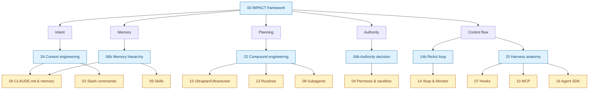
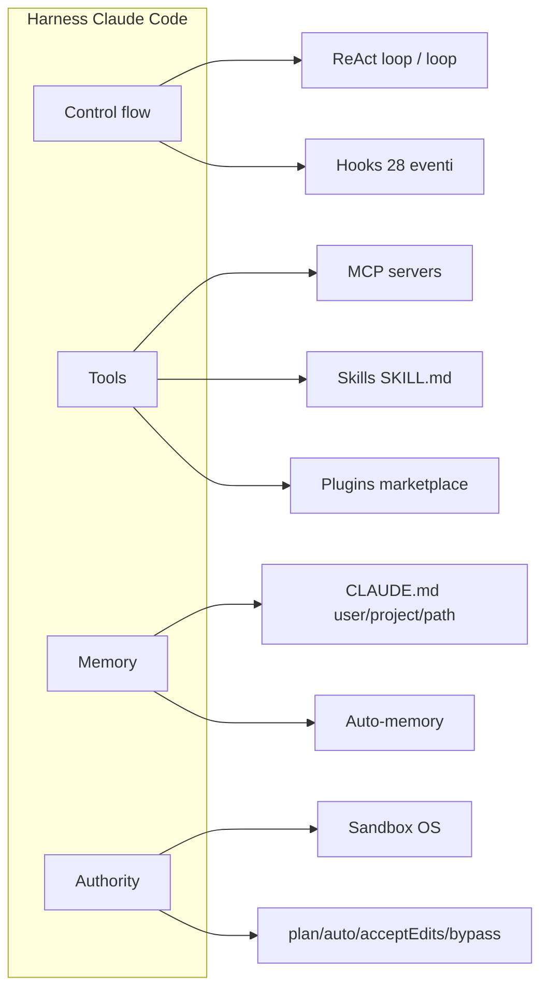
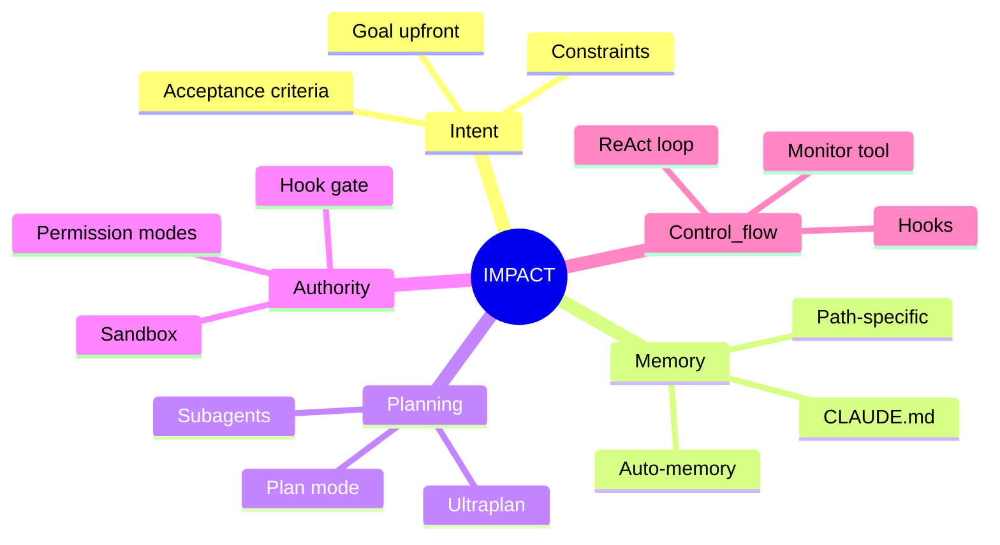
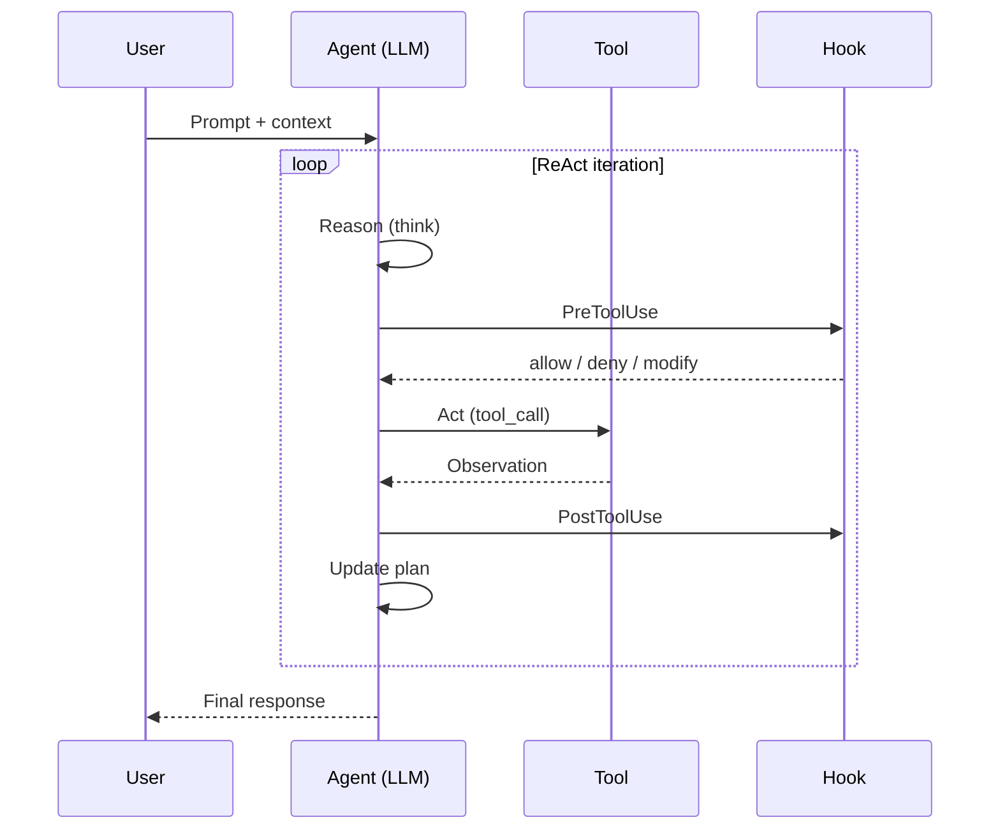
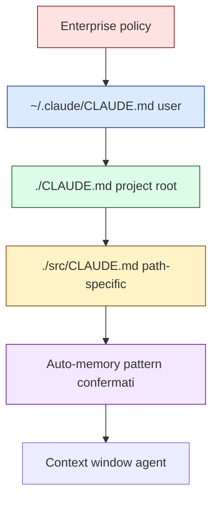
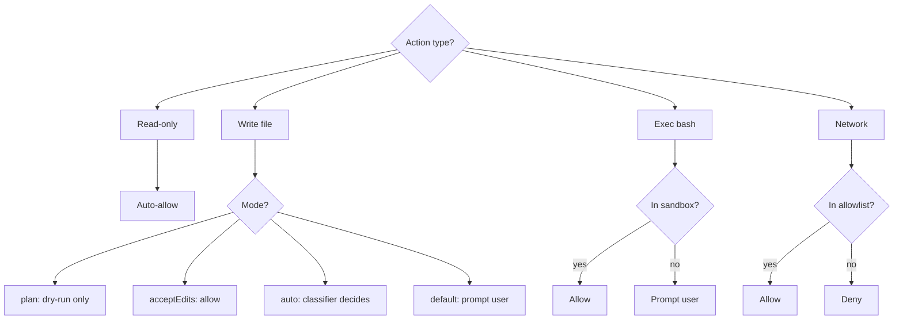
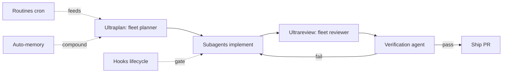

# Dossier — Sistema di navigazione completo per `giadaf-boosha/claude-code`

> Design system di navigazione progettato per la repo dopo l'aggiunta degli **8 nuovi capitoli concettuali** (00, 04b, 06b, 14b, 22, 23, 24, 25) che portano il totale a **29 documenti**.
> Obiettivi: (1) ridurre il "lost in docs" a piu' di 20 capitoli, (2) ancorare ogni doc operational al concetto teorico che lo fonda, (3) offrire 3 ingressi per persona diversa, (4) glossario unico come single-source-of-truth dei termini.
> Autore: subagent `designer-navigation` · Data: 27 aprile 2026.

---

## 0. Inventario doc target (29 capitoli)

Mappatura post-aggiunta degli 8 nuovi capitoli concettuali. Convenzione numerica: i nuovi capitoli "concettuali" usano suffisso `b` per stare adiacenti al cap. operational corrispondente (es. `04-modalita-permessi.md` → `04b-authority-decision.md`).

| # | Slug | Tipo | Difficulty | Macro-sezione |
|---|---|---|---|---|
| 00 | `00-impact-framework.md` | Concettuale | beginner | Concetti foundation |
| 01 | `01-snapshot.md` | Riferimento | beginner | Fondamenta |
| 02 | `02-cli-installazione.md` | Operational | beginner | Fondamenta |
| 03 | `03-slash-commands.md` | Operational | beginner | Fondamenta |
| 04 | `04-modalita-permessi.md` | Operational | intermediate | Workflow |
| 04b | `04b-authority-decision.md` | Concettuale | intermediate | Concetti foundation |
| 05 | `05-fast-mode-1m-context.md` | Operational | intermediate | Workflow |
| 06 | `06-claude-md-memory.md` | Operational | beginner | Workflow |
| 06b | `06b-memory-hierarchy.md` | Concettuale | intermediate | Concetti foundation |
| 07 | `07-hooks.md` | Operational | advanced | Estensibilita' |
| 08 | `08-subagents.md` | Operational | intermediate | Estensibilita' |
| 09 | `09-skills.md` | Operational | intermediate | Estensibilita' |
| 10 | `10-mcp.md` | Operational | advanced | Estensibilita' |
| 11 | `11-plugins-marketplace.md` | Operational | intermediate | Estensibilita' |
| 12 | `12-agent-teams.md` | Workflow | advanced | Estensibilita' |
| 13 | `13-routines-cloud.md` | Workflow | intermediate | Cloud |
| 14 | `14-loop-monitor.md` | Workflow | intermediate | Cloud |
| 14b | `14b-react-agent-loop.md` | Concettuale | intermediate | Concetti foundation |
| 15 | `15-ultraplan-ultrareview.md` | Workflow | advanced | Cloud |
| 16 | `16-headless-agent-sdk.md` | Operational | advanced | Integrazione |
| 17 | `17-ide-surface.md` | Riferimento | beginner | Integrazione |
| 18 | `18-settings-auth.md` | Riferimento | intermediate | Integrazione |
| 19 | `19-changelog.md` | Riferimento | beginner | Riferimenti |
| 20 | `20-tips-best-practices.md` | Riferimento | beginner | Riferimenti |
| 21 | `21-guide-target-user.md` | Riferimento | beginner | Riferimenti |
| 22 | `22-compound-engineering.md` | Concettuale | advanced | Concetti foundation |
| 23 | `23-glossario.md` | Riferimento | beginner | Riferimenti |
| 24 | `24-context-engineering.md` | Concettuale | intermediate | Concetti foundation |
| 25 | `25-harness-anatomy.md` | Concettuale | advanced | Concetti foundation |

Totale **29** doc. Sezioni master: **7** (Concetti foundation, Fondamenta, Workflow, Estensibilita', Cloud, Integrazione, Riferimenti).

---

## 1. Sistema breadcrumb header

### 1.1 Regola generale

Ogni doc inizia (riga 2 o 3, dopo il titolo H1) con un breadcrumb a **massimo 3 hop**:

```
> 📍 [README](../README.md) → [Sezione master](../README.md#anchor-sezione) → **Doc corrente**
```

### 1.2 Sezioni master del README e relativi anchor

Il `README.md` deve esporre 7 anchor stabili (slug minuscoli, kebab-case):

| Sezione master | Anchor README | Doc inclusi |
|---|---|---|
| Concetti foundation | `#concetti-foundation` | 00, 04b, 06b, 14b, 22, 24, 25 |
| Fondamenta | `#fondamenta` | 01, 02, 03 |
| Workflow e modalita' | `#workflow-e-modalita` | 04, 05, 06 |
| Estensibilita' | `#estensibilita` | 07, 08, 09, 10, 11, 12 |
| Cloud e automazione | `#cloud-e-automazione` | 13, 14, 15 |
| Integrazione e produzione | `#integrazione-e-produzione` | 16, 17, 18 |
| Riferimenti | `#riferimenti` | 19, 20, 21, 23 |

### 1.3 Esempi pronti per copy-paste

**Per `docs/00-impact-framework.md`** (concettuale, root del sistema):
```markdown
# 00 — IMPACT framework: i 5 concetti foundation di Claude Code

> 📍 [README](../README.md) → [Concetti foundation](../README.md#concetti-foundation) → **IMPACT framework**
> 📘 Concettuale · beginner · prerequisito di tutti i capitoli operational
```

**Per `docs/04-modalita-permessi.md`** (operational con concetto sorgente):
```markdown
# 04 — Modalita' permessi, Sandbox, Checkpoints

> 📍 [README](../README.md) → [Workflow](../README.md#workflow-e-modalita) → **Modalita' permessi**
> 🔧 Operational · intermediate · concetto sorgente: [04b — Authority decision](./04b-authority-decision.md)
```

**Per `docs/15-ultraplan-ultrareview.md`** (workflow):
```markdown
# 15 — Ultraplan & Ultrareview

> 📍 [README](../README.md) → [Cloud](../README.md#cloud-e-automazione) → **Ultraplan & Ultrareview**
> 🚀 Workflow · advanced · concetto sorgente: [22 — Compound engineering](./22-compound-engineering.md)
```

**Per `docs/23-glossario.md`** (riferimento):
```markdown
# 23 — Glossario

> 📍 [README](../README.md) → [Riferimenti](../README.md#riferimenti) → **Glossario**
> 📚 Riferimento · beginner · 30 termini chiave con link incrociati
```

### 1.4 Regole di stile breadcrumb

1. Usare `>` blockquote per separarlo visivamente dal corpo.
2. Emoji `📍` solo all'inizio del primo hop.
3. Bold (`**`) solo sull'ultimo hop (doc corrente, no link).
4. Mai piu' di 3 hop: se serve un livello in piu', e' segnale che il doc va spezzato.
5. Riga 2 (subito sotto H1). Riga 3: badge tipologia + difficulty + concetto sorgente (opzionale).

---

## 2. Format glossario `docs/23-glossario.md`

### 2.1 Template per termine (copy-paste pronto)

```markdown
### Agent

**Definizione**. Sistema software che combina LLM, tool e loop di esecuzione per portare a termine task in autonomia. In Claude Code l'agent e' l'istanza CLI che riceve un prompt e itera tool-call → osservazione → ragionamento.

**Sinonimi**: AI agent, autonomous agent, coding agent.

**Appare in**:
- [00 — IMPACT framework](./00-impact-framework.md#1-cose-un-agent)
- [14b — Agent loop ReAct](./14b-react-agent-loop.md#21-anatomia-del-loop)
- [25 — Harness anatomy](./25-harness-anatomy.md#3-componenti)

**Esempio uso**. "Avvio un agent in plan mode per refactorare il modulo auth: legge i file, propone un piano, attende conferma prima di scrivere."

**Termini correlati**: [Harness](#harness), [ReAct](#react), [Subagent](#subagent), [Agent Team](#agent-team).

---
```

### 2.2 Lista 30 termini chiave (alfabetica) con cross-link suggeriti

| Termine | Capitoli sorgente | Correlati |
|---|---|---|
| Agent | 00, 14b, 25 | Harness, ReAct, Subagent |
| Agent Team | 12, 22 | Subagent, Compound engineering |
| Authority | 00, 04, 04b | Sandbox, Plan mode, Auto mode |
| Auto mode | 04, 04b | Authority, Plan mode |
| Checkpoint | 04, 19 | Plan mode, Dry-run |
| Compound Engineering | 22 | Routines, Ultraplan, Ultrareview |
| Context Engineering | 06, 06b, 24 | Memory, CLAUDE.md, Auto-memory |
| Control flow | 00, 14b, 25 | ReAct, Hook, Loop |
| Cowork | 11, 22 | Plugin, Agent Team |
| Dry-run | 04, 04b | Plan mode, Checkpoint |
| Fast mode | 05, 19 | Opus, Sonnet |
| Harness | 00, 25 | Agent, Control flow |
| Hook | 07, 25 | Control flow, MCP |
| IMPACT | 00 | Intent, Memory, Planning, Authority, Control flow |
| Intent | 00, 24 | Context engineering, Memory |
| MCP | 10, 25 | Plugin, Hook, Skill |
| Memory | 00, 06, 06b | CLAUDE.md, Context engineering, Auto-memory |
| Monitor tool | 14, 14b | Loop, Routines |
| Output style | 03, 18 | Status line, Skill |
| Plan mode | 04, 04b | Authority, Auto mode, Dry-run |
| Planning | 00, 15, 22 | Ultraplan, Subagent |
| Plugin | 11, 25 | MCP, Skill, Hook |
| ReAct | 14b, 25 | Agent, Control flow, Loop |
| Routines | 13, 22 | Cloud, Compound engineering |
| Sandbox | 04, 04b, 25 | Authority, Permissions |
| Skill | 09, 25 | Plugin, MCP, Output style |
| Status line | 18 | Output style |
| Subagent | 08, 12, 22 | Agent, Agent Team, Compound engineering |
| Ultraplan | 15, 22 | Planning, Compound engineering |
| Ultrareview | 15, 22 | Compound engineering, Subagent |

### 2.3 Header glossario (copy-paste)

```markdown
# 23 — Glossario

> 📍 [README](../README.md) → [Riferimenti](../README.md#riferimenti) → **Glossario**
> 📚 30 termini chiave di Claude Code, ordinati alfabeticamente. Ogni voce: definizione 1-2 frasi, sinonimi, capitoli sorgente con link diretti, esempio d'uso, termini correlati.

**Indice rapido**: [A](#a) · [B](#b) · [C](#c) · [D](#d) · [F](#f) · [H](#h) · [I](#i) · [M](#m) · [O](#o) · [P](#p) · [R](#r) · [S](#s) · [U](#u)

---

## A
```

### 2.4 Regole di consistenza

1. **Definizione 1-2 frasi**: prima frase = "cos'e'" tecnicamente, seconda frase = come si manifesta in Claude Code.
2. **Sinonimi** in italiano e inglese, separati da virgola.
3. **Appare in** = link diretti con anchor specifici (`#sezione`), max 4 capitoli.
4. **Esempio uso** in italiano, una frase con virgolette, scenario realistico.
5. **Termini correlati**: max 4, ordine di rilevanza.
6. Separatore `---` tra termini.
7. Anchor di lettera maiuscola (`## A`) per indice rapido.

---

## 3. Struttura `README-NAVIGATION.md`

File nuovo, da creare in **root** della repo accanto a `README.md`. Funzione: layer di navigazione "esperienziale" (per persona, per percorso, per concetto), mentre `README.md` resta indice canonico.

### 3.1 Skeleton completo (copy-paste)

```markdown
# README-NAVIGATION — Trova la tua strada in claude-code

> Questa repo contiene 29 documenti. Tre modi per orientarti: per **percorso** (3 quick start), per **concetto** (mappa IMPACT), per **persona** (rinvio a 21).
> Per definizioni: [glossario](./docs/23-glossario.md). Per indice canonico: [README](./README.md).

---

## 1. Quick start path — scegli il tuo percorso

### 🟢 Beginner (mai usato Claude Code) — 90 minuti

Ordine consigliato:
1. [00 — IMPACT framework](./docs/00-impact-framework.md) (15 min) — i 5 concetti che reggono tutto
2. [01 — Snapshot prodotto](./docs/01-snapshot.md) (10 min) — cos'e', dove gira, quanto costa
3. [02 — Installazione CLI](./docs/02-cli-installazione.md) (15 min) — `npm i -g`, primo `claude`
4. [03 — Slash commands](./docs/03-slash-commands.md) (10 min) — i 10 comandi che userai ogni giorno
5. [06 — CLAUDE.md & memory](./docs/06-claude-md-memory.md) (15 min) — configura, non promptare
6. [04 — Permessi & sandbox](./docs/04-modalita-permessi.md) (15 min) — plan / auto / acceptEdits
7. [20 — Tips & best practices](./docs/20-tips-best-practices.md) (10 min) — pattern operativi

Output atteso: sai installare, configurare CLAUDE.md, lanciare un task in plan mode.

### 🟡 Dev intermedio (ha gia' usato CC, vuole padroneggiarlo) — 3 ore

Ordine consigliato:
1. [24 — Context engineering](./docs/24-context-engineering.md) — perche' funziona meglio del prompting
2. [06b — Memory hierarchy](./docs/06b-memory-hierarchy.md) — gerarchia user/project/path
3. [04b — Authority decision](./docs/04b-authority-decision.md) — quando concedere bypass
4. [09 — Skills](./docs/09-skills.md) + [07 — Hooks](./docs/07-hooks.md) — estensibilita' day-to-day
5. [08 — Subagents](./docs/08-subagents.md) — Explore, Plan, custom
6. [10 — MCP](./docs/10-mcp.md) + [11 — Plugins](./docs/11-plugins-marketplace.md)
7. [14 — /loop & Monitor](./docs/14-loop-monitor.md) + [14b — ReAct loop](./docs/14b-react-agent-loop.md)
8. [22 — Compound engineering](./docs/22-compound-engineering.md) — il salto di qualita'

Output atteso: skill custom, hook PreToolUse, MCP server connesso, /loop self-pacing.

### 🔴 Harness engineer (costruisce sopra Claude Code) — 6 ore

Ordine consigliato:
1. [25 — Harness anatomy](./docs/25-harness-anatomy.md) — control flow + tools + memory
2. [14b — ReAct agent loop](./docs/14b-react-agent-loop.md) — il loop di base
3. [16 — Headless & Agent SDK](./docs/16-headless-agent-sdk.md) — Python/TS SDK
4. [10 — MCP](./docs/10-mcp.md) — protocollo per tool esterni
5. [07 — Hooks](./docs/07-hooks.md) — 28 eventi del lifecycle
6. [12 — Agent Teams](./docs/12-agent-teams.md) — coordinamento multi-istanza
7. [13 — Routines](./docs/13-routines-cloud.md) + [15 — Ultraplan/Ultrareview](./docs/15-ultraplan-ultrareview.md)
8. [22 — Compound engineering](./docs/22-compound-engineering.md) — pattern di scaling
9. [18 — Settings & auth](./docs/18-settings-auth.md) — Teams/Enterprise

Output atteso: SDK in produzione, hook custom, routine in cloud, MCP server proprietario.

---

## 2. Mappa concetti foundation → capitoli operational



---

## 3. Indice per concetto IMPACT

| Lettera | Concetto | Doc concettuale | Doc operational |
|---|---|---|---|
| **I** | Intent | [24 — Context engineering](./docs/24-context-engineering.md) | [03](./docs/03-slash-commands.md), [06](./docs/06-claude-md-memory.md), [20](./docs/20-tips-best-practices.md) |
| **M** | Memory | [06b — Memory hierarchy](./docs/06b-memory-hierarchy.md) | [06](./docs/06-claude-md-memory.md), [09](./docs/09-skills.md) |
| **P** | Planning | [22 — Compound engineering](./docs/22-compound-engineering.md) | [08](./docs/08-subagents.md), [13](./docs/13-routines-cloud.md), [15](./docs/15-ultraplan-ultrareview.md) |
| **A** | Authority | [04b — Authority decision](./docs/04b-authority-decision.md) | [04](./docs/04-modalita-permessi.md), [18](./docs/18-settings-auth.md) |
| **C** | Control flow | [14b — ReAct loop](./docs/14b-react-agent-loop.md), [25 — Harness anatomy](./docs/25-harness-anatomy.md) | [07](./docs/07-hooks.md), [10](./docs/10-mcp.md), [14](./docs/14-loop-monitor.md), [16](./docs/16-headless-agent-sdk.md) |

---

## 4. Indice per persona

8 percorsi pre-confezionati per beginner / indie hacker / senior backend / frontend / DevOps / tech lead / AI-ML / legacy stack.

→ [21 — Guide per target user](./docs/21-guide-target-user.md)

---

## 5. Cerca per termine

30 termini chiave (Agent, Harness, IMPACT, ReAct, Compound engineering, Hook, Skill, MCP, Sandbox, Plan mode, ...) con definizione, esempio, capitoli sorgente.

→ [23 — Glossario](./docs/23-glossario.md)

---

## 6. Diagramma master harness → feature


```

### 3.2 Posizionamento del file

- Path: `/README-NAVIGATION.md` (root, accanto a `README.md`).
- Link in `README.md`, dopo la frase introduttiva: `> Cerchi un percorso guidato? Vedi [README-NAVIGATION](./README-NAVIGATION.md).`

---

## 4. Diagrammi mermaid raccomandati

Sei diagrammi, ognuno con tipo, sintassi pronta, destinazione.

### 4.1 Diagramma 1 — IMPACT framework

**Tipo**: `mindmap`
**Destinazione**: `docs/00-impact-framework.md` (sezione 1.2) + `README.md` (subito dopo "Cos'e' Claude Code").
**Sintassi**:



### 4.2 Diagramma 2 — Agent loop ReAct

**Tipo**: `sequenceDiagram`
**Destinazione**: `docs/14b-react-agent-loop.md` (sezione 2) + `README-NAVIGATION.md` (sezione opzionale).
**Sintassi**:



### 4.3 Diagramma 3 — Memory hierarchy

**Tipo**: `flowchart TD`
**Destinazione**: `docs/06b-memory-hierarchy.md` (sezione 1).
**Sintassi**:



### 4.4 Diagramma 4 — Authority decision tree

**Tipo**: `flowchart TD`
**Destinazione**: `docs/04b-authority-decision.md` (sezione 3).
**Sintassi**:



### 4.5 Diagramma 5 — Compound engineering patterns

**Tipo**: `graph LR`
**Destinazione**: `docs/22-compound-engineering.md` (sezione 2).
**Sintassi**:



### 4.6 Diagramma 6 — Harness components → CC features

**Tipo**: `flowchart LR`
**Destinazione**: `docs/25-harness-anatomy.md` (sezione 1) + `README-NAVIGATION.md` (sezione 6, gia' previsto).
**Sintassi**: vedi sezione 3.1 sopra (diagramma master harness).

---

## 5. Convenzioni typographic

### 5.1 Badge tipologia (riga 3 di ogni doc)

| Badge | Significato | Quando usarlo |
|---|---|---|
| 📘 Concettuale | Spiega un concetto teorico | 00, 04b, 06b, 14b, 22, 24, 25 |
| 🔧 Operational | How-to su una feature | 02, 04, 05, 06, 07, 09, 10, 11, 16, 18 |
| 🚀 Workflow | Processo end-to-end multi-feature | 12, 13, 14, 15 |
| 📚 Riferimento | Tabelle, snapshot, indici | 01, 03, 17, 19, 20, 21, 23 |
| 🛠️ Estensibilita' | Building block per estendere | 07, 08, 09, 10, 11 (alias di 🔧) |

Convenzione: **un solo badge primario** per doc. Tipologie secondarie come tag inline.

### 5.2 Difficulty tag (opzionale, accanto al badge)

| Tag | Quando |
|---|---|
| `beginner` | Nessun prerequisito oltre conoscere il terminale |
| `intermediate` | Richiede aver letto i 5 cap. beginner |
| `advanced` | Richiede comprensione del concetto sorgente |

### 5.3 Esempio riga 3 completa (copy-paste)

```markdown
> 📘 Concettuale · intermediate · prerequisito di [04 — Permessi](./04-modalita-permessi.md)
```

```markdown
> 🚀 Workflow · advanced · concetto sorgente: [22 — Compound engineering](./22-compound-engineering.md)
```

### 5.4 Convenzioni tipografiche generali

1. **H1** uguale al titolo del doc, prefissato dal numero (`# 04 — Modalita' permessi`).
2. **H2** numerati (`## 4.1 ...`) per stabilire ancore stabili.
3. **Tabelle** sempre con riga di intestazione bold via markdown standard (`| Col |`).
4. **Code fence** sempre con linguaggio (`bash`, `mermaid`, `json`, `typescript`).
5. **Link interni**: relativi (`./04-modalita-permessi.md#sezione`), mai assoluti.
6. **Emoji** solo nei badge/breadcrumb. Nel testo italiano accenti corretti (`perche'` con apostrofo, mai unicode `é`).
7. **Footer ogni doc**:

```markdown
---

> ⬅️ [Capitolo precedente](./03-slash-commands.md) · ➡️ [Capitolo successivo](./05-fast-mode-1m-context.md) · 🏠 [README](../README.md) · 📚 [Glossario](./23-glossario.md)
```

---

## 6. Modifiche al README.md (canonico)

### 6.1 Aggiunta sezione "Concetti foundation" in cima a "Indice della guida"

```markdown
## Indice della guida (completo)

### Concetti foundation 📘
0. [IMPACT framework](./docs/00-impact-framework.md) — Intent / Memory / Planning / Authority / Control flow
- [04b — Authority decision](./docs/04b-authority-decision.md) — quando bypass, quando plan
- [06b — Memory hierarchy](./docs/06b-memory-hierarchy.md) — user → project → path → auto
- [14b — ReAct agent loop](./docs/14b-react-agent-loop.md) — think → act → observe
- [22 — Compound engineering](./docs/22-compound-engineering.md) — pattern di scaling
- [24 — Context engineering](./docs/24-context-engineering.md) — configura, non promptare
- [25 — Harness anatomy](./docs/25-harness-anatomy.md) — componenti del sistema

### Fondamenta
1. [Snapshot prodotto](./docs/01-snapshot.md)
...
```

### 6.2 Aggiunta riga link a navigation in cima

Dopo la riga "Reference completa di Claude Code...":

```markdown
> 🧭 Cerchi un percorso guidato? **[README-NAVIGATION](./README-NAVIGATION.md)** — quick start per beginner / intermedi / harness engineer + mappa IMPACT + glossario 30 termini.
```

### 6.3 Aggiunta voce glossario in "Riferimenti"

```markdown
22. [Compound engineering](./docs/22-compound-engineering.md) — pattern di scaling multi-agent
23. [Glossario](./docs/23-glossario.md) — 30 termini chiave con cross-link
```

---

## 7. Checklist applicativa per ogni doc esistente

Quando si aggiorna un doc per applicare il sistema:

- [ ] Aggiunto breadcrumb riga 2 (max 3 hop).
- [ ] Aggiunto badge tipologia + difficulty riga 3.
- [ ] Linkato concetto sorgente (se operational) o capitoli operational (se concettuale).
- [ ] H2 numerati per anchor stabili.
- [ ] Footer con prev/next/README/glossario.
- [ ] Cross-link verso glossario per i termini del doc presenti nei 30.
- [ ] Diagramma mermaid se presente nelle raccomandazioni della sezione 4.
- [ ] No emoji unicode negli accenti italiani (`perche'` non `perché`).

---

## 8. Validazione e manutenzione

### 8.1 Script di check (proposta, non implementato in questo dossier)

Idea: script bash che verifichi:
1. Ogni doc ha breadcrumb riga 2 con `📍`.
2. Ogni doc ha badge riga 3 con uno dei 5 emoji ammessi.
3. Ogni link relativo punta a un file esistente.
4. Ogni termine glossario in `23-glossario.md` ha almeno 1 link "Appare in" valido.
5. Ogni anchor `#sezione` referenziato esiste come H2/H3 nel target.

### 8.2 Aggiornamento glossario quando si aggiunge un cap

Workflow consigliato quando si crea cap. nuovo:
1. Aggiungere il cap. al README in sezione master corretta.
2. Aggiungere breadcrumb + badge nel doc.
3. Per ogni termine del glossario menzionato nel doc, aggiornare "Appare in" del termine.
4. Se il doc introduce un termine **nuovo non presente nei 30**: valutare se entra nel glossario (criterio: usato in 2+ doc).

---

## 9. Trade-off e rischi

### 9.1 Rischi del sistema proposto

1. **Manutenzione del glossario**: 30 termini × 4 link medi = 120 link da mantenere. Mitigazione: script di check + revisione semestrale.
2. **Breadcrumb ridondante con titolo H1**: rischio di rumore visivo. Mitigazione: badge riga 3 compatto, prev/next solo in footer.
3. **Mermaid non renderizza su tutti i viewer**: GitHub si', VS Code preview si', cat no. Mitigazione: ogni diagramma ha caption testuale che lo riassume.
4. **Numerazione `04b` non standard**: alcuni utenti possono confondersi. Alternativa scartata: rinumerare tutto (rompe link esterni esistenti).

### 9.2 Alternative considerate e scartate

| Alternativa | Perche' scartata |
|---|---|
| File singolo `INDEX.md` invece di `README-NAVIGATION.md` | Conflitto con `README.md` come indice canonico |
| Rinumerazione totale (1-29 senza `b`) | Rompe link esterni e history git |
| Glossario inline in ogni doc | Duplicazione, drift inevitabile |
| Diagrammi ASCII invece di mermaid | Meno leggibili, no semantica per tooling |
| Breadcrumb con 4+ hop | Eccede regola "max 3 hop" del design system |

---

## 10. Riepilogo decisioni chiave

1. **7 sezioni master** nel README, con anchor stabili kebab-case.
2. **Breadcrumb max 3 hop** in riga 2 di ogni doc, formato `📍 README → Sezione → **Doc**`.
3. **5 badge** tipologia (📘 🔧 🚀 📚 🛠️) + 3 difficulty (beginner/intermediate/advanced).
4. **Glossario unico** `23-glossario.md` con 30 termini, template fisso a 5 campi (definizione, sinonimi, appare in, esempio, correlati).
5. **README-NAVIGATION.md** nuovo file root con 3 quick start path + mappa IMPACT + indici.
6. **6 diagrammi mermaid** distribuiti su 7 doc (alcuni replicati).
7. **Cap. concettuali** numerati con suffisso `b` per restare adiacenti al cap. operational.
8. **Footer prev/next** in ogni doc per lettura sequenziale.

Sistema progettato per scalare a 35-40 doc senza ristrutturazione, mantenendo la regola dei 3 hop e dei 7 master.

---

## Appendice A — Snippet pronti all'uso

### A.1 Header standard concettuale

```markdown
# 00 — IMPACT framework

> 📍 [README](../README.md) → [Concetti foundation](../README.md#concetti-foundation) → **IMPACT framework**
> 📘 Concettuale · beginner · prerequisito di tutti i capitoli operational

> TL;DR. IMPACT = Intent, Memory, Planning, Authority, Control flow. Cinque concetti che reggono ogni feature di Claude Code.
```

### A.2 Header standard operational

```markdown
# 04 — Modalita' permessi, Sandbox, Checkpoints

> 📍 [README](../README.md) → [Workflow](../README.md#workflow-e-modalita) → **Modalita' permessi**
> 🔧 Operational · intermediate · concetto sorgente: [04b — Authority decision](./04b-authority-decision.md)

> TL;DR. Sei modi di interagire (default / acceptEdits / plan / auto / sandbox / bypass) + sandbox OS + checkpoint rewind.
```

### A.3 Footer standard

```markdown
---

> ⬅️ [03 — Slash commands](./03-slash-commands.md) · ➡️ [04b — Authority decision](./04b-authority-decision.md) · 🏠 [README](../README.md) · 📚 [Glossario](./23-glossario.md#authority)
```

### A.4 Voce glossario completa (Harness)

```markdown
### Harness

**Definizione**. Sistema che orchestra LLM, tool, memoria, control flow e permessi per trasformare un modello in un agent operativo. In Claude Code l'harness e' la CLI/IDE/SDK che incapsula Sonnet o Opus dentro un loop ReAct con hook, MCP e sandbox.

**Sinonimi**: agent runtime, agent shell, agentic harness.

**Appare in**:
- [00 — IMPACT framework](./00-impact-framework.md#3-architettura)
- [25 — Harness anatomy](./25-harness-anatomy.md) (intero capitolo)
- [16 — Headless & Agent SDK](./16-headless-agent-sdk.md#1-cose-lsdk)

**Esempio uso**. "L'harness di Claude Code aggiunge a Sonnet 4.6 un loop ReAct, 28 hook, MCP transport e sandbox OS — il modello da solo non saprebbe scrivere file."

**Termini correlati**: [Agent](#agent), [Control flow](#control-flow), [ReAct](#react), [MCP](#mcp).

---
```

### A.5 Voce glossario completa (Compound Engineering)

```markdown
### Compound Engineering

**Definizione**. Pattern in cui il lavoro fatto da un agent o da un team di agent **compone valore** nel tempo: ogni run lascia tracce (memory, routines, skill, plan) che rendono il run successivo piu' veloce e affidabile. Concetto coniato dal team Every / Anthropic per descrivere multi-agent fleet review e routine cron.

**Sinonimi**: agent compounding, multi-agent compound work.

**Appare in**:
- [22 — Compound engineering](./22-compound-engineering.md) (intero capitolo)
- [15 — Ultraplan/Ultrareview](./15-ultraplan-ultrareview.md#3-pattern)
- [13 — Routines](./13-routines-cloud.md#2-pattern)
- [22 — Compound engineering](./22-compound-engineering.md#5-anti-pattern)

**Esempio uso**. "Setup compound engineering: una routine notturna lancia /ultrareview sul main branch, salva i finding in auto-memory, il giorno dopo Claude evita gli stessi bug."

**Termini correlati**: [Routines](#routines), [Ultraplan](#ultraplan), [Ultrareview](#ultrareview), [Subagent](#subagent).

---
```

### A.6 Tabella IMPACT in `README.md` (sezione "Cos'e' Claude Code")

```markdown
### IMPACT — i 5 concetti che reggono Claude Code

| Lettera | Concetto | In una frase | Approfondisci |
|---|---|---|---|
| **I** | Intent | Cosa vuoi ottenere — full context upfront, non a tappe | [24](./docs/24-context-engineering.md) |
| **M** | Memory | Cosa sa di te e del progetto — CLAUDE.md + auto-memory | [06b](./docs/06b-memory-hierarchy.md) |
| **P** | Planning | Come spezza il task — plan mode, subagent, ultraplan | [22](./docs/22-compound-engineering.md) |
| **A** | Authority | Cosa puo' fare — sandbox, permessi, hook gate | [04b](./docs/04b-authority-decision.md) |
| **C** | Control flow | Come itera — ReAct loop, hook, /loop, monitor | [14b](./docs/14b-react-agent-loop.md) |

→ Capitolo completo: [00 — IMPACT framework](./docs/00-impact-framework.md).
```

---

Fine dossier. Output atteso a valle: 8 nuovi capitoli concettuali scritti seguendo questi template, README aggiornato, README-NAVIGATION creato, glossario popolato, breadcrumb aggiunto ai 21 doc esistenti.
