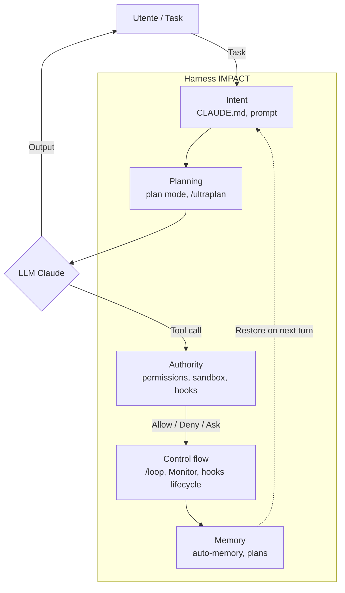

# 00 — Agent Harness Overview

> 📍 [README](../README.md) → [Concetti foundation](../README.md#concetti-foundation) → **00 Harness Overview**
> 📘 Concettuale · 🟢 Beginner-friendly

> **Tesi del capitolo**: Claude Code non e' "un LLM in un terminale". E' un **agent harness completo**. Capire cosa significa "harness" e' la chiave per usare Claude Code (e qualunque agentic CLI) in modo professionale.

---

## 0.1 Perche' questo capitolo esiste

Nel 2023 si parlava di **prompt engineering** ("come scrivere il prompt giusto").
Nel 2024 si e' iniziato a parlare di **context engineering** ("come dare all'LLM il contesto giusto").
Nel **febbraio 2026** Mitchell Hashimoto (creatore di HashiCorp, Vagrant, Ghostty) ha messo un nome al livello successivo: **harness engineering**.

Il post fondativo, "[We Need to Talk About 'Agent Harnesses'](https://mitchellh.com/writing/agent-harnesses)" del 5 febbraio 2026, ha consolidato un'osservazione che molti facevano da mesi:

> **Agent = LLM + Harness**
>
> Il modello e' la materia prima. L'**harness** e' tutto cio' che gli sta intorno: contesto, tool, memoria, orchestrazione, guardrail, error recovery. **L'80% della qualita' di un agent dipende dall'harness, non dal modello.**

Sei giorni dopo, **OpenAI ha rivelato che 1M di righe di codice del progetto Codex erano state generate dall'agent — zero scritte manualmente** (5 mesi). Il messaggio: a parita' di modello, l'harness fa la differenza.

> Fonte: dossier-conceptual-harness.md sintesi.

Questo capitolo definisce che cos'e' un harness, perche' e' importante e come Claude Code e' un'incarnazione concreta di questo paradigma.

---

## 0.2 Definizione

> "An agent harness is the orchestration layer that surrounds a language model and turns it into something that can do work."
> — Mitchell Hashimoto, 5 feb 2026

In termini operativi:

```
Agent = LLM + Harness

dove Harness =
  Context layer       (cosa il modello vede)
+ Tool layer          (cosa il modello puo' fare)
+ Memory layer        (cosa il modello ricorda)
+ Orchestration       (chi decide cosa, quando)
+ Guardrails          (cosa NON puo' fare)
+ State persistence   (cosa sopravvive al crash)
+ Error recovery      (cosa fare quando qualcosa rompe)
```

**Cosa NON e' un harness**:
- Non e' un wrapper di prompt template (quello e' prompt engineering, livello 1)
- Non e' solo "context window management" (quello e' context engineering, livello 2)
- Non e' un'API call sequence (quello e' un workflow scriptato)

**Un harness include un'agent loop** (vedi [14b — ReAct + agent loop](./14b-agent-loop-react.md)) che decide a runtime quale tool chiamare, quando memorizzare, quando chiedere conferma all'utente.

---

## 0.3 Tre analogie didattiche

### Analogia 1 — Cavallo e redini
- **Cavallo** = LLM. Forza bruta, ma senza direzione cammina dove vuole.
- **Redini** = Harness. Permettono al cavaliere (utente) di indirizzare la forza in modo controllato.
- Senza redini, il cavallo va o non va a seconda dell'umore. Con le redini, l'utente puo' usare il cavallo per arare un campo, fare consegne, vincere una corsa.

### Analogia 2 — OS / CPU / RAM
- **CPU** = LLM. Esegue il calcolo.
- **OS** = Harness. Gestisce risorse, schedula task, fornisce librerie, coordina I/O.
- **RAM** = Context window. Veloce ma limitata.
- **Disk** = Memory persistente (CLAUDE.md, auto-memory).
- L'utente non programma direttamente la CPU: lo fa attraverso l'OS. Stessa cosa per LLM via harness.

### Analogia 3 — Ponteggi (scaffolding)
- **L'edificio** = il software finale.
- **Operai** = LLM. Lavorano in altezza, producono.
- **Ponteggi** = Harness. Permettono agli operai di muoversi in sicurezza, hanno reti di sicurezza, ascensori, percorsi definiti.
- Senza ponteggi, gli operai cadono o lavorano lentamente. Con ponteggi, cantieri da grattacielo.

> Fonte: dossier-conceptual-harness.md, derivata da `01b-harness/00-guida.md` (tufano).

---

## 0.4 Il framework IMPACT

Hashimoto e altri hanno consolidato 5 pilastri che ogni harness completo deve avere. L'acronimo (italianizzato) e':

| Lettera | Componente | Cosa fa | Esempi in Claude Code |
|---|---|---|---|
| **I** | **Intent** | Goal + constraints + acceptance criteria | CLAUDE.md, README progetto, prompt iniziale dettagliato |
| **M** | **Memory** | Stato persistente cross-turn / cross-session | auto-memory `~/.claude/projects/.../memory/`, `.claude/rules/`, plans directory |
| **P** | **Planning** | Design pre-esecuzione, riflessione | plan mode, `/ultraplan`, Opus 4.7 reasoning |
| **A** | **Authority** | Cosa puo' fare l'agent, chi approva, guardrail | permission rules (allow/ask/deny), sandbox, hooks, managed settings |
| **C** | **Control flow** | Come l'agent esegue il loop reason→act→observe | `/loop`, Monitor tool, hooks lifecycle, auto mode classifier |

> Vedi diagramma mermaid sotto.



---

## 0.5 8 componenti architetturali (drill-down)

L'IMPACT framework descrive **a che livello** l'harness lavora. Sotto, ogni harness completo si articola in 8 componenti tecnici:

| # | Componente | Cosa fa | Doc Claude Code |
|---|---|---|---|
| 1 | **Context layer** | Decide cosa l'LLM vede ad ogni turn | [00b](./00b-context-engineering.md), [06](./06-claude-md-memory.md) |
| 2 | **Tool layer** | Espone capabilities (bash, edit, search, web) | [03](./03-slash-commands.md), [10](./10-mcp.md) |
| 3 | **Memory** | Persistenza cross-turn (auto-memory) e cross-session (plans) | [06](./06-claude-md-memory.md), [06b](./06b-memory-architecture.md) |
| 4 | **Orchestration** | Quale strategia (single agent, subagent, team) | [08](./08-subagents.md), [12](./12-agent-teams.md) |
| 5 | **Guardrails** | Limiti hard (sandbox, deny rules, hooks block) | [04](./04-modalita-permessi.md), [04b](./04b-authority-model.md), [07](./07-hooks.md) |
| 6 | **State** | Snapshot e ripristino (checkpoints) | [04](./04-modalita-permessi.md) sez. 4.5 |
| 7 | **Error recovery** | Cosa fare quando un tool fallisce / context corrotto | [07](./07-hooks.md), [04](./04-modalita-permessi.md) |
| 8 | **Intent capture** | Tradurre goal vago in goal eseguibile | [06](./06-claude-md-memory.md), plan mode, `/ultraplan` |

> Nota: la fonte primaria (tufano `01b-harness`) elenca 7 componenti tecnici; "Intent capture" e' aggiunto come ottavo per coerenza con IMPACT. Vedi `_research/dossier-conceptual-harness.md` sez. 13 per trasparenza.

---

## 0.6 Tre case study fondativi

### Case 1 — OpenAI Codex (5 mesi, 1M righe generate)

OpenAI ha rivelato (11 feb 2026) che il progetto Codex aveva accumulato **circa 1 milione di righe di codice generate dall'agent, zero scritte manualmente** in 5 mesi di sviluppo. Stesso modello disponibile a tutti — la differenza era nel harness interno (orchestrazione multi-agent, retrieval mirato, eval automatici).

Lezione: l'harness puo' moltiplicare la produttivita' di un team a parita' di modello.

### Case 2 — Hashline experiment

Sperimento citato in fonti tufano: a parita' di modello, **cambiare solo l'harness** (context engineering + memory + planning) ha portato un'improvement misurato significativo su benchmark interni.

> ⚠️ Nota trasparenza: il numero specifico citato in alcune fonti ("+919%") **non e' verificato** nei dossier raccolti per questa repo. Lo riportiamo come aneddoto direzionale, non come dato. Vedi `_research/dossier-conceptual-context.md` sez. 2.

Lezione: il margine di miglioramento via harness, anche con LLM stagnante, e' enorme.

### Case 3 — Manus (acquisizione $2B per harness, non per modello)

[Manus](https://manus.im), startup AI agent, e' stata acquistata per ~$2B. Il punto chiave: Manus **non aveva un modello proprio** — usava modelli di terzi (Claude, GPT, Gemini). Il valore acquisito era nell'harness: orchestrazione multi-modello, computer use, memory architecture.

Lezione: il mercato remunera l'harness anche piu' del modello. Il modello e' commodity, l'harness e' moat.

> Fonti citate in `_research/dossier-conceptual-harness.md` con riferimenti X.

---

## 0.7 Claude Code IS un harness — mapping completo

Ogni feature di Claude Code corrisponde a un componente harness. Questo mapping e' la chiave per "vedere" Claude Code:

| Feature Claude Code | Componente harness | IMPACT | Doc |
|---|---|---|---|
| **CLAUDE.md** | Intent + Memory persistente | I + M | [06](./06-claude-md-memory.md) |
| **`/init`** | Intent capture iniziale | I | [06](./06-claude-md-memory.md) |
| **auto-memory** | Memory cross-session learned | M | [06b](./06b-memory-architecture.md) |
| **`.claude/rules/`** | Memory path-specific | M | [06](./06-claude-md-memory.md) |
| **plan mode** | Planning explicit | P | [04](./04-modalita-permessi.md) |
| **`/ultraplan`** | Planning cloud-scale | P | [15](./15-ultraplan-ultrareview.md) |
| **`/batch`** | Planning + Orchestration parallela | P + O | [03](./03-slash-commands.md) |
| **permission rules** | Authority dichiarativa | A | [04](./04-modalita-permessi.md), [04b](./04b-authority-model.md) |
| **sandbox** | Authority OS-level | A | [04](./04-modalita-permessi.md) |
| **managed settings** | Authority enterprise | A | [18](./18-settings-auth.md) |
| **hooks** | Control flow + Authority | C + A | [07](./07-hooks.md) |
| **`/loop`** | Control flow ricorsivo | C | [14](./14-loop-monitor.md) |
| **Monitor tool** | Control flow event-driven | C | [14](./14-loop-monitor.md) |
| **auto mode** | Control flow classifier-based | C | [04](./04-modalita-permessi.md) |
| **subagents** | Orchestration single-thread | Orch | [08](./08-subagents.md) |
| **agent teams** | Orchestration multi-thread | Orch | [12](./12-agent-teams.md) |
| **checkpoints** | State + Error recovery | State | [04](./04-modalita-permessi.md) sez. 4.5 |
| **`/rewind`** | State restoration | State | [04](./04-modalita-permessi.md) |
| **MCP** | Tool layer extensibile | Tool | [10](./10-mcp.md) |
| **plugins** | Tool + Skills + Hooks bundle | Tool | [11](./11-plugins-marketplace.md) |
| **skills** | Tool layer behavior packs | Tool | [09](./09-skills.md) |
| **`/ultrareview`** | Guardrails pre-merge | Guard | [15](./15-ultraplan-ultrareview.md) |
| **`/security-review`** | Guardrails sicurezza | Guard | [03](./03-slash-commands.md) |
| **`/compact`** | State + Memory compression | State + M | [03](./03-slash-commands.md) |

> Risultato: quando leggi una nuova feature di Claude Code, chiediti "che componente harness amplifica?". La risposta sara' sempre una colonna di questa tabella.

---

## 0.8 I tre pilastri dell'harness engineering

Da `_research/dossier-conceptual-harness.md`:

1. **Determinismo dichiarativo** — Le regole non negoziabili (sicurezza, compliance, naming) si scrivono una volta nel harness (CLAUDE.md, hooks, sandbox), non in ogni prompt. L'LLM non puo' aggirarle.
2. **Composabilita'** — Skill / hook / subagent / MCP sono "Lego" combinabili. L'harness emerge dalla composizione, non da un monolite.
3. **Osservabilita'** — Ogni iterazione lascia traccia (auto-memory, transcript, hook logs, checkpoints). Il sistema e' debuggabile, riproducibile, recuperabile.

---

## 0.9 Quando "non ti serve l'harness"

Per task one-shot semplici (estrarre 3 entita' da un PDF, riassumere un email) un'API call diretta basta. L'harness ha overhead.

L'harness **paga** quando:
- Task multi-step (3+ tool call)
- Cross-session continuity (riprendere domani)
- Multi-utente (team che condividono regole)
- Compliance (audit log, RBAC, sandbox obbligatoria)
- Iterazione fitta (il context vale piu' del prompt)

In tutti gli altri casi, considera un wrapper SDK leggero (vedi [16 — Headless & Agent SDK](./16-headless-agent-sdk.md) `--bare` mode).

---

## 0.10 Glossario veloce

| Termine | Definizione 1-frase |
|---|---|
| **Agent** | LLM + Harness che esegue un task autonomamente |
| **Harness** | Strato di orchestrazione attorno al modello (context, tool, memory, guardrail) |
| **IMPACT** | 5 pilastri harness: Intent, Memory, Planning, Authority, Control flow |
| **Context layer** | Cosa il modello vede ad ogni turn (CLAUDE.md, output tool, history) |
| **Memory layer** | Cosa sopravvive cross-turn (auto-memory, plans, checkpoints) |
| **Authority layer** | Cosa l'agent puo' fare (permission rules, sandbox, hooks) |
| **Compound engineering** | Pattern architetturali a livello harness (vedi [22](./22-compound-engineering.md)) |

Glossario completo: [23 — Glossario](./23-glossario.md).

---

## 0.11 Letture di approfondimento

- [Mitchell Hashimoto, "We Need to Talk About 'Agent Harnesses'"](https://mitchellh.com/writing/agent-harnesses) (5 feb 2026, post fondativo)
- [00b — Context engineering](./00b-context-engineering.md) — il livello immediatamente sotto l'harness
- [14b — Agent loop ReAct](./14b-agent-loop-react.md) — come l'harness fa girare il modello
- [22 — Compound engineering](./22-compound-engineering.md) — pattern architetturali
- [21 — Guide per target user](./21-guide-target-user.md) — come l'harness cambia per profilo
- `_research/dossier-conceptual-harness.md` — dossier interno dettagliato

---

← Precedente: [README](../README.md) · Successivo → [00b — Context engineering](./00b-context-engineering.md)
