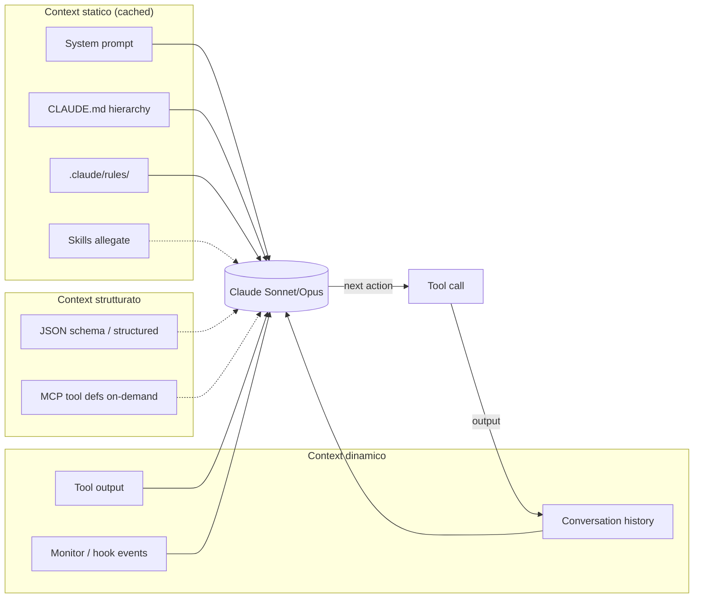

# 00b — Context engineering

> 📍 [README](../README.md) → [Concetti foundation](../README.md#concetti-foundation) → **00b Context engineering**
> 📘 Concettuale · 🟢 Beginner-friendly

> **Tesi del capitolo**: a parita' di modello, **il contesto vale piu' del prompt**. "Context engineering" e' la disciplina di scegliere cosa il modello vede, quando, e in che forma. E' l'80% del lavoro non-prompt che fa la differenza fra una sessione mediocre e una eccellente.

---

## 00b.1 Da prompt engineering a context engineering

L'evoluzione si puo' tracciare in 3 fasi:

| Fase | Anno | Idea centrale | Esempio |
|---|---|---|---|
| **Prompt engineering** | 2022-2023 | "Come scrivere il prompt giusto" | "Sei un esperto di Python con 20 anni..." |
| **Context engineering** | 2024-2025 | "Cosa il modello vede oltre al prompt" | RAG, system prompt strutturato, file allegati |
| **Harness engineering** | 2026+ | "Come orchestrare LLM + memoria + tool + guardrail" | Claude Code, agent SDK, IMPACT framework |

> "Context is the new prompt. The model is commodity, what differentiates is what you put in front of it."
> — sintesi parafrasata da varie fonti (Karpathy, Boris Cherny, Ruben Hassid)

---

## 00b.2 Cos'e' "context"

In termini operativi, il context e' **tutto cio' che entra nel modello** ad ogni turn, esclusi i pesi del modello stesso. Si compone di 3 strati:

### 00b.2.1 Context statico
Cose che cambiano raramente, caricate una volta e cached:
- **CLAUDE.md hierarchy** (managed > project > user > local)
- **`.claude/rules/`** (path-specific)
- **Skill markdown** (caricato on-demand)
- **System prompt** di Claude Code (vendor-managed)

### 00b.2.2 Context dinamico
Cose che cambiano ad ogni turn:
- **Output dei tool** (lettura file, bash output, search results)
- **Conversation history** (turni precedenti)
- **Observation layer** (Monitor tool, hook output)

### 00b.2.3 Context strutturato
Cose che il modello consuma in formato schemato:
- **JSON Schema** (`--json-schema` per structured outputs)
- **Markdown gerarchico** (sezioni, tabelle)
- **MCP tool definitions** (caricate on-demand via tool search)

---

## 00b.3 Tecniche concrete in Claude Code

Le 9 tecniche principali per fare context engineering in Claude Code:

### 1. Prompt caching 1h TTL
Sopra una certa soglia, il context viene cached da Anthropic per 1 ora. Riduce costi ~90% sui turn successivi.

```bash
ENABLE_PROMPT_CACHING_1H=1 claude
```

Vedi [Thariq @trq212, "Lessons: Prompt Caching Is Everything"](https://x.com/trq212/status/2024574133011673516) (feb 2026).

### 2. CLAUDE.md hierarchy
Discovery automatico, concatenazione, precedenza locale. Il modello vede tutto come unico system prompt cached.

```
~/.claude/CLAUDE.md         (utente, ovunque)
./CLAUDE.md                 (progetto, condiviso)
./.claude/CLAUDE.md         (alternativa)
./CLAUDE.local.md           (privato, gitignored)
```

Vedi [06 — CLAUDE.md & memory](./06-claude-md-memory.md).

### 3. `@import` files
Modulare il CLAUDE.md su file separati per dominio:
```markdown
@docs/api-rules.md
@docs/security.md
@~/.claude/team-conventions.md
```
Max 5 hop. Approval dialog la prima volta.

### 4. Auto-memory
`~/.claude/projects/<project>/memory/` con `MEMORY.md` index (cap 25KB caricato ogni sessione) + topic file (lazy). Claude scrive learnings dal codice; tu non programmi nulla.

Vedi [06b — Memory architecture](./06b-memory-architecture.md).

### 5. MCP tool search (on-demand)
Per server con molti tool, gli schemi vengono caricati **solo quando rilevanti** via il tool `ToolSearch`. Riduce token startup di server pesanti come `playwright`, `github`.

### 6. Subagent Explore (Haiku, cheap)
Delegare ricerca codebase a un subagent Haiku, che ritorna summary nel main thread (Sonnet/Opus). Il main thread non si "sporca" con grep output massicci.

```
subagent_type: "Explore"
prompt: "Trova tutti gli endpoint REST nel monorepo e ritorna lista file:linea"
```

### 7. `/compact`
Comprime la conversation in summary, mantenendo solo cio' che serve. Ideale ogni 30-50 turn.

### 8. `--bare` mode
Skippa auto-discovery (CLAUDE.md, MCP, plugin, skill). Ideale per CI dove vuoi context minimo riproducibile.

```bash
claude -p "..." --bare --max-budget-usd 2
```

### 9. `--exclude-dynamic-system-prompt-sections`
Esclude sezioni che cambiano per macchina (CWD, timezone) per migliorare cache hit cross-machine.

---

## 00b.4 Pattern di Ruben Hassid: "Stop prompting, start configuring"

Da [ruben.substack.com/p/stop-prompting-claude](https://ruben.substack.com/p/stop-prompting-claude) (15 apr 2026), riformulato per dev:

| Anti-pattern | Fix context engineering |
|---|---|
| Riscrivere il system prompt ad ogni nuova chat | CLAUDE.md project-shared |
| Copiare 50 righe di convenzioni in ogni prompt | `@import` modulari |
| Caricare l'intera repo come context | Subagent Explore + tool search |
| Ripetere "rispondi in italiano, sii conciso" | Output style + CLAUDE.md regola fissa |
| Spiegare lo stack ad ogni turno | `STYLE.md`, `IDENTITY.md`, `PROJECT.md` come asset versionati |

---

## 00b.5 Pattern Anthropic interno

Dai post X di Boris Cherny (vedi [posts/bcherny.md](../posts/bcherny.md)):

- **BigQuery skill in repo**: la skill `.claude/skills/bigquery/SKILL.md` e' versionata e tutto il team la usa per query analytics — context shared del team.
- **`.mcp.json` in repo**: configurazione MCP server (Slack, Sentry) versionata. Onboarding di nuovo dev = `git pull`.
- **`settings.json` in git**: setting di team-wide check-in.
- **Tip 11**: "Claude Code uses all my tools for me. It often searches and posts to Slack (via the MCP server), runs BigQuery queries..."

> Tutti questi pattern sono **context engineering**: spostano conoscenza dal prompt a asset persistenti.

---

## 00b.6 Diagramma del flusso context



---

## 00b.7 8 Anti-pattern di context engineering

| Anti-pattern | Conseguenza | Fix |
|---|---|---|
| CLAUDE.md > 500 righe monolitico | Token waste, context blur | Split + `@import` |
| Hardcode prompt in script invece di skill | Non riusabile, non versionato | Skill markdown |
| MCP server con 50 tool sempre attivi | Token startup pesanti | Tool search on-demand |
| No auto-memory disabilitata "per privacy" | Claude rilegge il codebase ogni sessione | Lasciare on, configurare path-specific |
| `/compact` mai eseguito | Context drift in sessioni lunghe | `/compact` ogni 30-50 turn |
| Stessa regola in 5 prompt diversi | Drift, inconsistenza | Spostare in CLAUDE.md root |
| Output cached non sfruttato | Costi alti | `ENABLE_PROMPT_CACHING_1H=1` |
| Tool call massicci in main thread | Context inquinato | Subagent Explore |

---

## 00b.8 Letture di approfondimento

- [00 — Harness overview](./00-harness-overview.md) — il livello sopra
- [06 — CLAUDE.md & memory](./06-claude-md-memory.md)
- [06b — Memory architecture](./06b-memory-architecture.md)
- [09 — Skills](./09-skills.md)
- [10 — MCP](./10-mcp.md) sez. 10.6 (tool search)
- [Thariq, "Lessons: Prompt Caching Is Everything"](https://x.com/trq212/status/2024574133011673516)
- [Ruben, "Stop prompting Claude"](https://ruben.substack.com/p/stop-prompting-claude)
- `_research/dossier-conceptual-context.md` — dossier interno

---

← [00 Harness overview](./00-harness-overview.md) · Successivo → [01 Snapshot](./01-snapshot.md)
