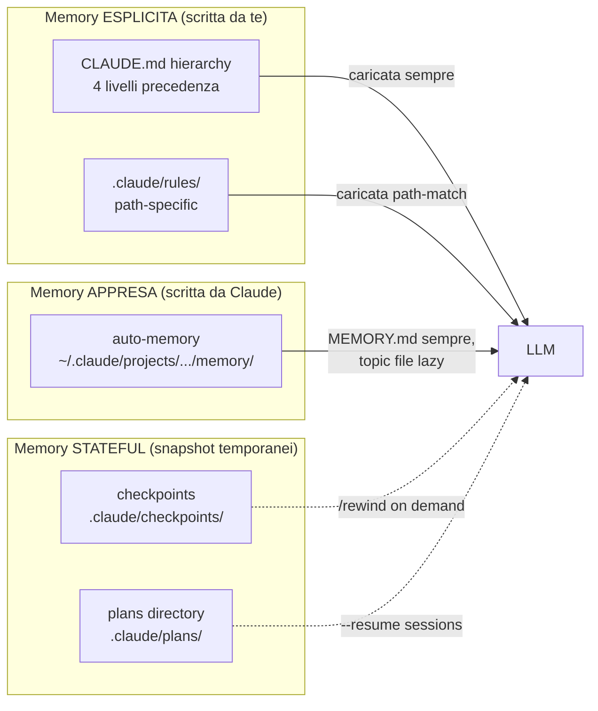

# 06b — Memory architecture

> 📍 [README](../README.md) → [Concetti foundation](../README.md#concetti-foundation) → **06b Memory architecture**
> 📘 Concettuale · 🟡 Intermediate

> **Tesi del capitolo**: l'LLM e' amnesico per default — ogni nuova sessione ricomincia da zero. Un harness completo deve **dare al modello una memoria stratificata**: cosa ricorda sempre (CLAUDE.md), cosa apprende (auto-memory), cosa snapshotta per ripristino (checkpoints), cosa condivide col team (`.claude/rules/`). Capire i layer e quando usarli e' la differenza tra agent che impara e agent che ripete gli stessi errori.

---

## 06b.1 Perche' "Memory" e' un componente IMPACT

Senza Memory esplicita:
- Ogni sessione l'agent rilegge l'intera codebase
- Ogni nuovo dev rispiega le convenzioni
- Ogni bug-fix non lascia traccia per il futuro
- Ogni `/compact` perde context appena guadagnato

Con Memory stratificata:
- L'agent "conosce" il progetto al primo turn
- Le convenzioni sono auto-applicate
- Pattern di debug ricorrenti sono ricordati
- Il rollback e' chirurgico via checkpoints

---

## 06b.2 4 layer di Memory in Claude Code



### Layer 1 — CLAUDE.md hierarchy (esplicita, statica)
**Chi scrive**: tu (a mano o `/init`).

**Cosa contiene**: regole non negoziabili, naming, architettura, anti-pattern.

**Quando si carica**: ogni sessione, sempre.

**Precedenza** (locale prima):
1. Managed policy (`/Library/Application Support/ClaudeCode/CLAUDE.md`)
2. Project shared (`./CLAUDE.md` o `./.claude/CLAUDE.md`)
3. User globale (`~/.claude/CLAUDE.md`)
4. Local privato (`./CLAUDE.local.md`, gitignored)

> Tutti **concatenati** (non override). Vedi [06 — CLAUDE.md & memory](./06-claude-md-memory.md) sez. 6.2.

### Layer 2 — `.claude/rules/` (esplicita, path-specific)
**Chi scrive**: tu.

**Cosa contiene**: regole attivate solo quando file matchanti vengono toccati.

```yaml
---
paths:
  - "src/api/**/*.ts"
  - "tests/**/*.test.ts"
---
# API rules
- Validate input
- Use standard error format
```

**Quando si carica**: solo quando l'agent legge file matchanti il `paths` glob.

**Use case**: regole di sicurezza per `auth/`, regole di style per `frontend/`, deprecation rules per `legacy/`.

### Layer 3 — Auto-memory (appresa, dinamica)
**Chi scrive**: Claude (al volo durante sessioni).

**Cosa contiene**: pattern del progetto, build commands, debugging insights, learnings.

**Storage**:
```
~/.claude/projects/<sanitized-cwd>/memory/
├── MEMORY.md           ← entry index (auto-loaded, cap 25KB)
├── architecture.md     ← topic file (lazy)
├── debugging.md        ← topic file (lazy)
└── ...
```

**Caricamento**:
- `MEMORY.md` first 200 lines / 25KB → caricato **ogni sessione**
- Topic file → caricati **on-demand** quando rilevanti

**Toggle**:
```json
{ "autoMemoryEnabled": true }
```
Env: `CLAUDE_CODE_DISABLE_AUTO_MEMORY=1`. Default: ON da v2.1.59+.

**Memory tightening (mar 2026, v2.1.79/80)**: il system prompt e' stato aggiornato per **trattare le memorie come storiche**: prima di assumere, Claude verifica contro file/risorse correnti. Questo previene drift quando il codice cambia ma la memory no.

### Layer 4 — Checkpoints (stateful, temporanea)
**Chi scrive**: Claude Code automaticamente ad ogni edit.

**Cosa contiene**: snapshot del filesystem + conversation prima di ogni modifica.

**Recovery**:
- `Esc Esc` o `/rewind` (alias `/checkpoint`, `/undo`)
- Opzioni: Restore code+conversation / solo code / solo conversation / Summarize from here

**Persistence**: cross-session. Cleanup default 30 giorni (`cleanupPeriodDays`).

**Limite**: NON traccia bash file mods (`rm`, `mv`, `cp`). Usa git per quelli.

### Layer 5 — Plans directory (stateful, esplicita)
**Chi scrive**: Claude (durante plan mode / ultraplan).

**Cosa contiene**: file `.md` con il piano approvato (es. `fix-auth-race-snug-otter.md`).

**Storage**: `.claude/plans/<auto-generated-name>.md` (configurable via `plansDirectory`).

**Recovery**: `claude --resume <session-id>` riprende sessione + plan file associato.

**Use case**: pianifichi al mattino, esegui al pomeriggio, riprendi domani. Plan persiste.

---

## 06b.3 Quando usare quale layer

| Caso d'uso | Layer | Esempio |
|---|---|---|
| "Ogni dev del team deve sapere che usiamo conventional commits" | Layer 1 (project CLAUDE.md) | `# Convenzioni\n- Conventional commits...` |
| "Nei file `auth/*` non usare mai `eval()`" | Layer 2 (`.claude/rules/auth.md`) | `paths: ["auth/**"]` |
| "Voglio che Claude impari come fare debug del nostro stack" | Layer 3 (auto-memory) | Lascia on, fai sessioni di debug |
| "Ho fatto cambio sbagliato, voglio tornare indietro" | Layer 4 (checkpoint `/rewind`) | Esc Esc → restore |
| "Il piano dell'autenticazione lo riprendiamo lunedi" | Layer 5 (plans directory) | `claude --resume <id>` |
| "Le credenziali AWS sono solo per il mio laptop" | Layer 1 (`CLAUDE.local.md`) | gitignored |
| "Policy di sicurezza enterprise non sovrascrivibili" | Layer 1 (managed policy) | `/Library/Application Support/...` |

---

## 06b.4 Anti-pattern di memory

| Anti-pattern | Conseguenza | Fix |
|---|---|---|
| Auto-memory disabilitata "per privacy" | Claude rilegge tutto ogni volta | Lascia on; sandbox/path mount controlla cosa puo' leggere |
| CLAUDE.md monolitico 1000 righe | Token waste, drift fra sezioni | Split + `@import` per dominio |
| Memorie esplicite duplicate fra CLAUDE.md e auto-memory | Conflitti, drift | Convenzione: regole non negoziabili in CLAUDE.md, learning operativi in auto-memory |
| Mai pulire auto-memory stale | Pattern superati ancora applicati | Trim periodico `~/.claude/projects/*/memory/MEMORY.md` |
| Affidarsi solo a checkpoints invece che git | Cleanup default 30 giorni cancella | git per cambi importanti, checkpoints per esperimenti |
| Plans directory in `.gitignore` | Team non vede piani | Versionare `.claude/plans/*.md` se condiviso |

---

## 06b.5 Memory + altri componenti harness

| Componente | Interazione con Memory |
|---|---|
| **Intent (CLAUDE.md)** | Stesso file: Intent persistente = Memory persistente |
| **Planning (plan mode)** | Plans directory cattura intent → plan condiviso |
| **Authority (hooks)** | Hook `PostToolUse` puo' scrivere in auto-memory custom |
| **Control flow (`/loop`)** | `loop.md` (project / user) e' Memory di una routine |
| **Orchestration (teams)** | Task list condivisa = Memory del team in `~/.claude/teams/` |

---

## 06b.6 Pattern Anthropic interno (da Boris)

> "We have a BigQuery skill checked into the codebase, and everyone on the team uses it for analytics queries directly in Claude Code." — [@bcherny](https://x.com/bcherny/status/2017742757666902374)

Skill = Memory **eseguibile**. La skill BigQuery contiene:
- Schemi tabella (Memory)
- Query template (Intent)
- Tool autorizzati (Authority)
- Workflow (Control flow)

Vedi [09 — Skills](./09-skills.md).

---

## 06b.7 Letture di approfondimento

- [06 — CLAUDE.md & memory](./06-claude-md-memory.md) — reference operational
- [00 — Harness overview](./00-harness-overview.md) sez. 0.7 — Memory in IMPACT
- [00b — Context engineering](./00b-context-engineering.md) sez. 4 — auto-memory tecnica
- [04 — Modalita' permessi](./04-modalita-permessi.md) sez. 4.5 — checkpoints
- [12 — Agent teams](./12-agent-teams.md) — task list condivisa
- `_research/dossier-conceptual-context.md` — dossier interno

---

← [06 CLAUDE.md & memory](./06-claude-md-memory.md) · Successivo → [07 Hooks](./07-hooks.md)
