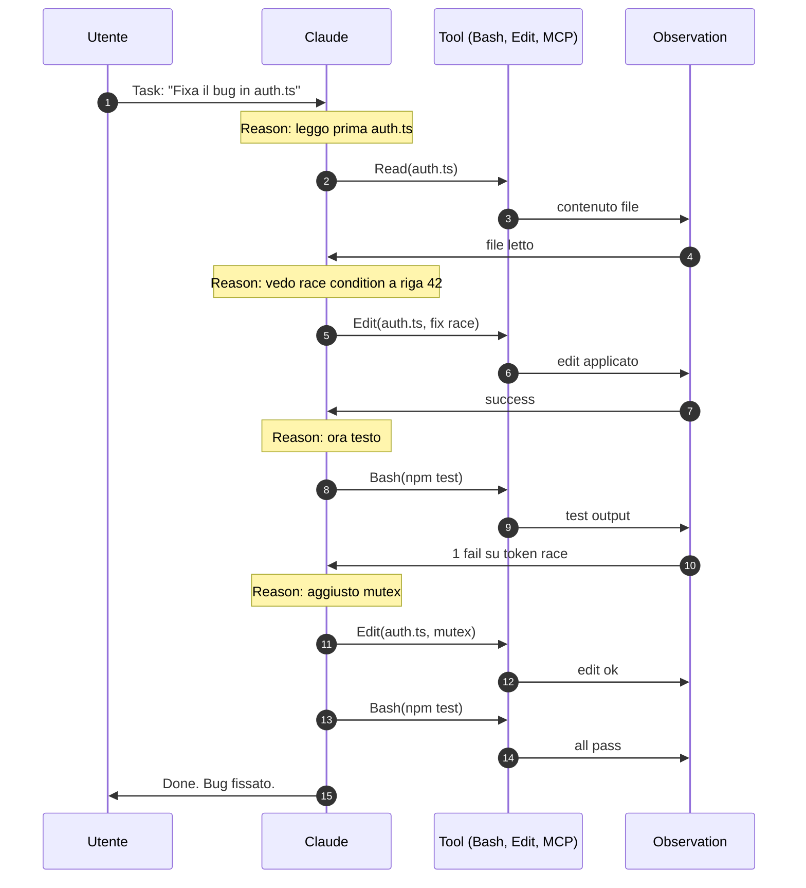

# 14b — Agent loop e ReAct pattern

> 📍 [README](../README.md) → [Concetti foundation](../README.md#concetti-foundation) → **14b Agent loop ReAct**
> 📘 Concettuale · 🟡 Intermediate

> **Tesi del capitolo**: ogni agent autonomo (incluso Claude Code) gira un **loop**: ragiona → agisce → osserva → ragiona di nuovo. Questo loop e' formalizzato nel paper **ReAct (Yao et al. 2022)**. Capire il pattern ReAct e' la chiave per leggere `/loop`, Monitor tool, plan mode, hooks come componenti dello stesso meccanismo, non come feature isolate.

---

## 14b.1 Origine: il paper ReAct (2022)

> "ReAct: Synergizing Reasoning and Acting in Language Models" — Yao et al., arXiv:2210.03629, ICLR 2023.
> Link: https://arxiv.org/abs/2210.03629

**Idea centrale**: gli LLM puri sono bravi a ragionare (Chain-of-Thought) o ad agire (function calling), ma se separi i due piedi le performance crollano. **ReAct le interleava**: il modello produce in sequenza Thought → Action → Observation, fino a Done.

> "ReAct is a simple but effective method that allows large language models (LLMs) to interleave reasoning traces and task-specific actions in an interleaved manner, allowing for greater synergy between the two."
> — Abstract paper Yao et al.

> Nota: la triade letterale "Thought / Action / Observation" e' formulazione community popolare; nel paper i termini sono leggermente diversi ma il concetto coincide. Vedi `_research/dossier-conceptual-react.md`.

---

## 14b.2 ReAct vs Chain-of-Thought

| Aspetto | Chain-of-Thought (Wei et al. 2022) | ReAct (Yao et al. 2022) |
|---|---|---|
| Output | Solo ragionamento testuale | Ragionamento + azione + osservazione |
| Tool | No | Si' |
| Feedback loop | No (solo intermediate steps) | Si' (l'observation chiude il loop) |
| Ideal per | Math, logic, riassunti | Coding agentic, task con strumenti |
| Esempio | "Per sommare 17+25 ragiono cosi'..." | "Penso di leggere il file. Eseguo Read. Osservo: contiene X. Modifico in Y." |

ReAct e' il **modello che Claude Code usa** ad ogni turn.

---

## 14b.3 L'agent loop generico



Componenti del loop:
| Step | Cosa fa | Nome ReAct |
|---|---|---|
| Reason | LLM ragiona sul next step | Thought |
| Act | LLM chiama un tool | Action |
| Observe | Output del tool torna nel context | Observation |
| Decide | LLM decide se continuare o terminare | (implicit) |

---

## 14b.4 Implementazione in Claude Code

Claude Code rende esplicito ogni componente del loop:

| Componente loop | Feature CC | Nota |
|---|---|---|
| **Reason explicit** | Plan mode, `/ultraplan` | Forza la separazione del Thought prima dell'Act |
| **Act with safety** | Permission rules, sandbox, hooks | Layer Authority sull'Act |
| **Observe push-based** | **Monitor tool** (v2.1.98) | Stdout streaming → notifica Claude |
| **Observe poll-based** | `/loop` (cron) | Periodic check |
| **Loop autonomous** | Auto mode + `/loop` self-pacing | Claude decide quando ri-eseguire |
| **Loop bounded** | `--max-turns N` | Hard cap sul loop |
| **Loop interrupted** | Esc, `/btw` side query | Side-chain mid-loop |

---

## 14b.5 Quote Thariq: "Claude Code is a small game engine"

> "Most people's mental model of Claude Code is that it's just a TUI but it should really be closer to a small game engine. For each frame our pipeline constructs a scene graph with React then -> layouts elements -> rasterizes them to a 2d screen -> diffs that against the..." — [@trq212](https://x.com/trq212/status/2014051501786931427) (gen 2026)

Analogia precisa: **ogni "frame" e' un turn del loop**. Lo "scene graph" e' il context. Il "diff" e' come la conversation history evolve. Il "rendering" e' l'output del tool. **Game engine**: nucleo loop + observation + action + state.

Thariq ha anche scritto la serie "Lessons from Building Claude Code":
- "Lessons: Prompt Caching Is Everything" (https://x.com/trq212/status/2024574133011673516)
- "Lessons: Seeing like an Agent" (https://x.com/trq212/status/2027463795355095314)
- "Lessons: How We Use Skills" (https://x.com/trq212/status/2033949937936085378)

---

## 14b.6 Pattern reali del loop in Claude Code

### Pattern 1 — `/loop /babysit` (Boris Cherny, mar 2026)
> "I have a bunch of loops running locally: /loop 5m /babysit, to auto-address code review, auto-rebase, and..." — [@bcherny](https://x.com/bcherny/status/2038454341884154269)

```
Frame ogni 5 min:
  Reason: ci sono PR comments da rispondere?
  Act: gh pr list, gh pr view comments
  Observe: 3 commenti, 1 CI failure
  Reason: rispondo + fix CI
  Act: edit + push
  Observe: CI green, comment resolved
```

### Pattern 2 — Monitor + dev server (Thariq, apr 2026)
> "start my dev server and use the MonitorTool to observe for errors" — [@trq212](https://x.com/trq212/status/2042335178388103559)

Il Monitor tool e' **observation push-based**: invece che polling il dev server, ogni stdout line risveglia Claude come notification. Riduce token e latenza.

### Pattern 3 — Monitor + kubectl (Alistair, apr 2026)
> "Use the monitor tool and kubectl logs -f | grep .. to listen for errors, make a pr to fix" — [@alistaiir](https://x.com/alistaiir/status/2042345049980362819)

Loop senza fine: Monitor osserva log Kubernetes, quando matcha pattern Claude apre PR di fix.

### Pattern 4 — Spec-based dev (Thariq, dic 2025)
> "start with a minimal spec or prompt and ask Claude to interview you using the AskUserQuestionTool. then make a new session to execute the spec" — [@trq212](https://x.com/trq212/status/2005315275026260309)

Loop a 2 livelli:
- Loop interno (sessione 1): Reason+Act per **costruire la spec** via interview
- Loop esterno (sessione 2): Reason+Act per **eseguire la spec**

### Pattern 5 — plan → ultraplan → ultrareview (workflow consigliato)
1. Plan mode locale (Reason puro)
2. `/ultraplan` cloud (Reason esteso multi-agent)
3. Implement con auto mode (Act + Observe)
4. `/ultrareview` (Reason post-Act sulla diff)
5. PR

5 step ognuno con loop ReAct interno. **Compound engineering** (vedi [22](./22-compound-engineering.md)).

---

## 14b.7 Limiti del modello ReAct (e mitigazioni in CC)

| Limite | Sintomo | Mitigazione in Claude Code |
|---|---|---|
| Loop infinito | LLM non capisce quando smettere | `--max-turns`, hooks `Stop`, plan mode boundary |
| Observation povera | Il modello non vede l'errore reale | Monitor tool (push), dev server con logging |
| Token cost esplode | History cresce | `/compact`, prompt caching 1h |
| Reason senza azione | Modello ragiona ma non agisce | Auto mode, prompt diretto "execute the plan" |
| Action senza reason | Modello esegue rapido senza pensare | Plan mode forzato, `/effort high` |
| Race conditions cross-loop | Multi-agent, conflict | git worktree per agent (Boris tip) |
| Drift dal goal | Il loop diverge | Hook `Stop` con check goal compliance |
| Hallucination osservazione | LLM inventa output tool | Tool reali (no mock), verification feedback (Boris tip 13) |
| Context corruption | History rovinata | `/rewind`, `--fork-session` |
| No recovery da error | Tool fail = loop morto | Hook `PostToolUseFailure`, `/loop` self-pacing |

---

## 14b.8 Quando usare quale variante del loop

```mermaid
flowchart TD
    Q{Tipo di task}
    Q -->|task one-shot| OS[Bash + auto mode]
    Q -->|maintenance ricorrente| LR[/loop cron 5m]
    Q -->|stato cambia in modo asincrono| MN[Monitor tool push]
    Q -->|esecuzione long-running automatica| AT[/loop self-paced]
    Q -->|24/7 senza laptop| RT[Routines cloud]
    Q -->|task complesso da pianificare| UP[/ultraplan + execute]
```

| Variante | Quando | Doc |
|---|---|---|
| Bash + auto mode | One-shot, tu sei al PC | [04](./04-modalita-permessi.md) |
| `/loop` cron | Ricorrente periodica | [14](./14-loop-monitor.md) |
| `/loop` self-paced | Claude decide cadenza | [14](./14-loop-monitor.md) |
| Monitor tool | Eventi async (logs, CI) | [14](./14-loop-monitor.md) |
| Routines | 24/7 cloud, no laptop | [13](./13-routines-cloud.md) |
| `/ultraplan` | Pianificazione cloud-scale | [15](./15-ultraplan-ultrareview.md) |

---

## 14b.10 Pattern community: Ralph Wiggum loop

> Pattern community emergente, originally dreamt up da Geoffrey Huntley e adottato dal team Claude Code come riferimento per loop autonomi overnight.

**Cos'e' Ralph Wiggum**: skill community che incarna il pattern "autonomous coding overnight" — un loop ReAct senza supervisione umana che lavora su task ben definiti mentre tu dormi.

**Perche' funziona**:
- Idempotenza forte (re-run su stato gia' raggiunto = no-op)
- Stop hook deterministico per check completion (`agent Stop` hook)
- Verification feedback loop esplicito ([Boris tip 13](https://x.com/bcherny/status/2007179861115511237))
- Boundary chiare nel prompt (no merge, no force push, no irreversible action)

**Pattern di base**:
```bash
# Pseudocodice ralph-wiggum loop
while not done:
    1. Read goal + current state
    2. Reason: prossimo step concreto
    3. Act: implementa
    4. Observe: verifica via test/lint/build
    5. If verified: done? continue? blocked? -> log
    6. If blocked > N volte: pausa, alert utente
```

**Riferimenti**:
- Citazione Boris: [@bcherny](https://x.com/bcherny/status/2007179858435281082) — "use the ralph-wiggum plugin (originally dreamt up by @GeoffreyHuntley)"
- Repo originale: https://github.com/GeoffreyHuntley (cercare `ralph-wiggum`)

**Quando usarlo**: progetti con suite test affidabile e linter strict (Ralph "verifica via test"); migrazioni step-by-step con criterio di stop chiaro; refactor di N file con pattern ripetitivo.

**Quando NON usarlo**: feature design, task creativi, cambi su shared infra prod (blast radius alto + verification debole). Per quelli, [`/ultraplan`](./15-ultraplan-ultrareview.md) e' la scelta giusta.

---

## 14b.9 Letture di approfondimento

- Paper originale ReAct: https://arxiv.org/abs/2210.03629
- [14 — `/loop` e Monitor tool](./14-loop-monitor.md) — reference operational
- [13 — Routines cloud](./13-routines-cloud.md) — loop in cloud
- [15 — Ultraplan & Ultrareview](./15-ultraplan-ultrareview.md) — loop multi-agent
- [00 — Harness overview](./00-harness-overview.md) sez. 0.4 — Control flow in IMPACT
- [22 — Compound engineering](./22-compound-engineering.md) — composizione di loop
- `_research/dossier-conceptual-react.md` — dossier interno

---

← [14 `/loop` & Monitor](./14-loop-monitor.md) · Successivo → [15 Ultraplan & Ultrareview](./15-ultraplan-ultrareview.md)
